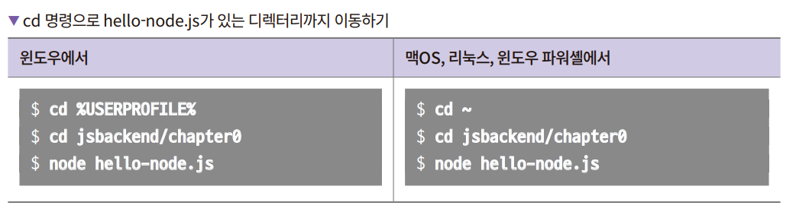

# **개발환경 구축하기**  
노드 설치 / 깃허브 설치 / vscode 설치  
  
# **VSCode로 내려받은 소스 코드 실행하기**  
1. VSCode 메뉴에서 File -> Open Folder를 클릭 후 내려받은 예제 소스의 디렉터리를 선택한다.   
2. hello-node.js 파일을 확인한다.  
3. Ctrl + F5를 눌러 실행한다. 환경을 선택하는 창이 뜨는데 여기서 Node.js를 선택한다. 아래에 있는 디버그 콘솔창에 Hello Node.js라고 나오면 
성공이다.  
  
# **코드 실행하기**  
VSCode에서 Node.js 코드를 실행하는 메뉴는 따로 없으며 터미널에서 실행해야 한다. VSCode에서는 터미널 기능도 제공한다. 메뉴의 View -> Terminal로 
터미널을 열거나 단축키인 Ctrl + F5 나 Ctrl + `을 사용해서 터미널을 볼 수 있다. 바로 앞에서 다룬 hello-node.js 파일을 실행하려면 다음과 같이 
명령을 입력해야 한다.  
  
  
  

