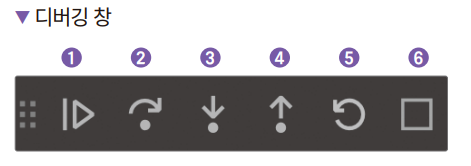
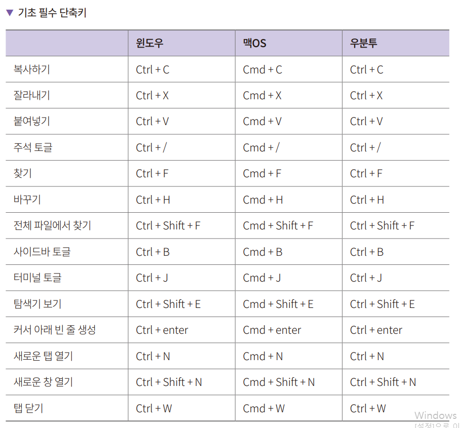
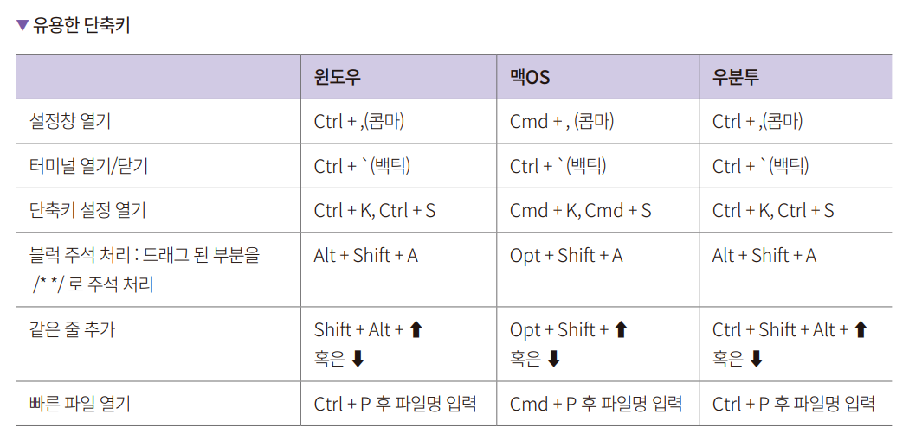
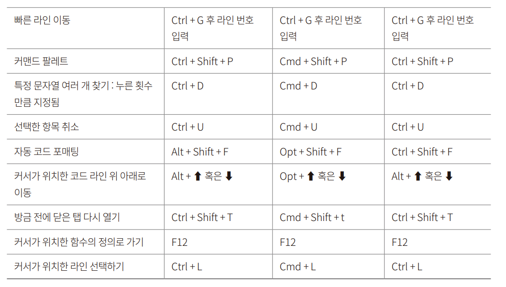

# **개발환경 구축하기**  
노드 설치 / 깃허브 설치 / vscode 설치  
  
# **VSCode로 내려받은 소스 코드 실행하기**  
1. VSCode 메뉴에서 File -> Open Folder를 클릭 후 내려받은 예제 소스의 디렉터리를 선택한다.   
2. hello-node.js 파일을 확인한다.  
3. Ctrl + F5를 눌러 실행한다. 환경을 선택하는 창이 뜨는데 여기서 Node.js를 선택한다. 아래에 있는 디버그 콘솔창에 Hello Node.js라고 나오면 
성공이다.  
  
# **코드 실행하기**  
VSCode에서 Node.js 코드를 실행하는 메뉴는 따로 없으며 터미널에서 실행해야 한다. VSCode에서는 터미널 기능도 제공한다. 메뉴의 View -> Terminal로 
터미널을 열거나 단축키인 Ctrl + F5 나 Ctrl + `을 사용해서 터미널을 볼 수 있다. 바로 앞에서 다룬 hello-node.js 파일을 실행하려면 다음과 같이 
명령을 입력해야 한다.  
  
  
  
# **디버깅하기**  
Ctrl + F5를 누르면 실행 모드로, F5를 누르면 디버그 모드로 실행된다. 개발하는 입장에서 두 모드의 가장 큰 차이는 브레이크 포인트다. 디버그 모드로 실행할 
때 브레이크 포인트가 지정된 곳은 코드 실행이 일시정지된다. 그러면 멈춘 순간의 변수의 값이나 로그들을 확인해볼 수 있다.  
  
브레이크 포인트를 지정하는 방법은 두 가지다. 커서가 있는 곳에서 F9를 누르거나, 코드 라인을 알려주는 숫자 왼쪽에 있는 빨간점을 마우스로 클릭한다. 
그러면 빨간점이 진해지면서 브레이크 포인트가 활성화된다.  
  
1. hello-node.js 파일의 6번 라인에 브레이크 포인트를 설정한다.  
2. 이 상태에서 F5를 눌러서 디버그 모드로 서버를 킨다. 그리고 브라우저에서 http://localhost:8000으로 접속한다. 그러면 사이트에 연결할 수 없음 
페이지가 보이게 된다. 그리고 브레이크 포인트를 설정한 6번 라인의 빨간 점에 노란 화살표가 생긴다. 왼쪽 메뉴 중 벌레와 재생 표시가 함께 있는 부분이 
활성화된다. VARIABLES를 보면 현재 사용하는 변수들이 보인다. 우리가 설정한 count 변수의 값이 보인다.  
  
  
  
디버깅 창도 새로 뜨게 된다. 디버깅 작업창은 코드 실행이 브레이크 포인트로 인해 중단된 상황에서 어떻게 진행할지 정할 수 있다. 1은 다음 브레이크 
포인트까지 진행한다. 2는 다음 라인으로 넘어가기, 3은 함수 안으로 들어가기, 4는 함수 밖으로 나오기, 5는 서버 재실행하기, 6인 서버 종료하기다.  
  
# **VSCode 단축키**  
  
  
  
  

