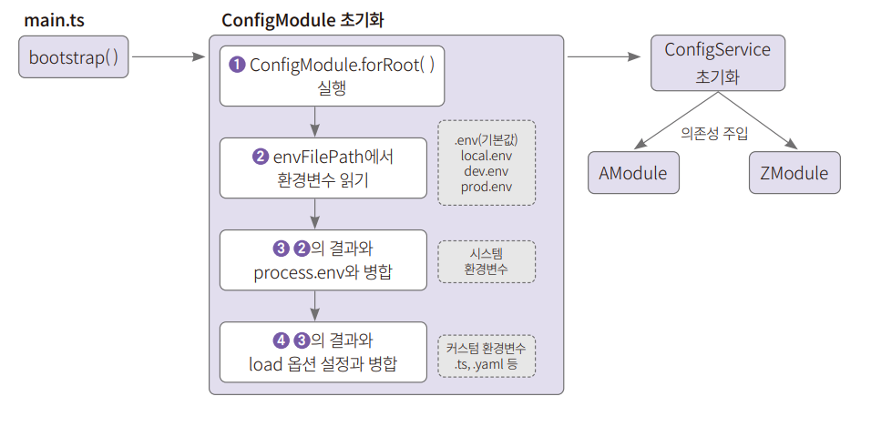
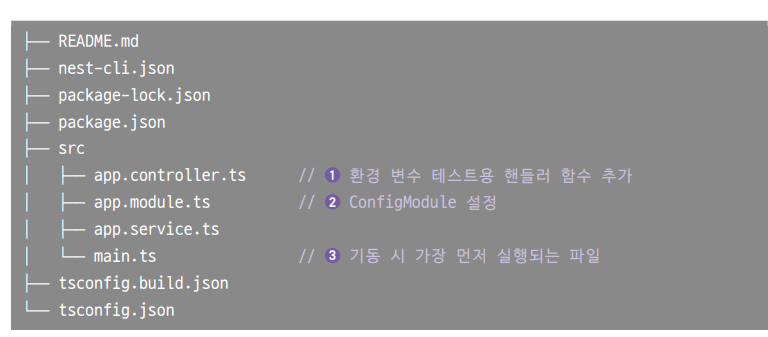
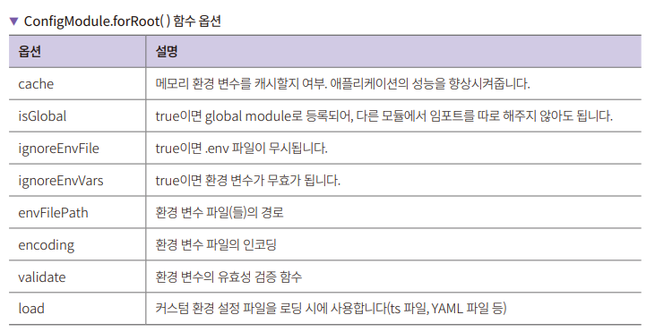

# **NestJS 환경 변수 설정하기**  
# **환경 변수 소개**  
우리가 작성하는 서버 애플리케이션은 다양한 환경의 외부 애플리케이션과 연동을 하게 된다. 정말 최소한의 설정만 넣는다고 가정하더라도 데이터베이스 
설정은 필요하다. 여기서 배포를 어떤 환경에 하느냐에 따라서 테스트용, 프로덕션용을 나누어주어야 한다. QA를 거친다면 QA 환경도 필요하다. 이외에도 
소스 코드에는 들어가면 안 되는 민감한 값이 있을 수 있는데 이런 부분은 최소한 환경 변수로 설정하거나 vault 같은 소스 코드 이외의 외부 저장소에 두어야 한다. 
이러한 작업들은 코드로 제어해서는 안된다. 별도의 파일로 두거나 외부의 서버에 설정해서 읽어올 수 있도록 해야 한다. 그렇지 않으면 설정이 복잡해질수록 
환경 변수를 제어하는 코드가 복잡해지기 떄문이다.  
  
NestJS에서 환경 변수 설정은 ConfigModule에서 할 수 있으며 설정된 환경 변수를 다른 모듈에서 가져다 쓰려면 ConfigService를 주입받아서 사용해야 
한다.  
  
  
  
ConfigModule은 초기화를 해야 하는데 ConfigModule.forRoot() 함수로 초기화가 가능하다. 보통 app.module.ts에서 해당 코드를 실행한다. ConfigModule을 
초기화할 때 envFilePath 설정에서 환경 변수를 읽은 뒤 process.env에 설정되어 있는 환경 변수화 합친다. 마지막으로 커스텀 환경 변수를 설정한 load 
옵션의 설정과 병합한 뒤 ConfigService를 초기화한다. ConfigService는 각 모듈에 의존성 주입을 해서 별다른 추가 설정 없이 사용할 수 있다. 
ConfigService를 사용하는 방법은 쉽고 직관적이다. 반면 설정은 더 신경 쓸 것이 많다.  
  
# **프로젝트 생성 및 설정하기**  
1. 환경 설정 파일 테스트용으로 사용할 config-test라는 이름으로 NestJS 프로젝트를 생성하고 의존성 패키지를 설치한다. 다음과 같이 nest-cli를 
사용해 프로젝트를 생성한다.  
  
nest new config-test  
cd config-test  
npm i @nestjs/config  
  
@nestjs/config는 내부적으로 dotenv를 사용한다. dotenv는 .env라는 이름의 파일에 환경 변수를 설정하고 불러올 수 있게 하는 자바스크립트로 만든 
라이브러리다. 생성된 프로젝트의 폴더 구조는 다음과 같다.  
  
  
  
app.contoller.ts에는 AppController 클래스가 있다. 해당 클래스에 환경 변수를 테스트할 핸들러 함수를 추가한다. app.module.ts는 기본적으로 생성되는 
모듈 파일이다. 여기에 환경 변수 설정에 필요한 모듈인 ConfigModule 설정을 한다. main.ts는 NestJS 서버 기동 시 가장 먼저 실행되는 파일이다. 프로바이더 
설정 없이 환경 변수를 설정하는 방법을 알아본다.  
  
# **NestJS 설정 및 테스트하기**  
app.module.ts에 설치한 @nestjs/config에 있는 ConfigModule 설정 추가 -> .env 파일 생성 -> app.contoller.ts에 테스트 라우팅 함수 추가 
순서로 진행된다. 먼저 ConfigModule 설정부터 한다.  
  
# **app.module.ts에 ConfigModule 설정하기**  
ConfigModule은 환경 설정에 특화된 기능을 하는 모듈이다. @nestjs/config 패키지에 포함되어 있는 클래스이며 모든 환경 변수 설정은 ConfigModule로부터 
시작한다고 생각하면 된다. app.module.ts에 ConfigModule을 설정한다.  
  
config-test/src/app.module.ts  
  
ConfigModule.forRoot() 함수는 많은 옵션이 존재한다. 예제 코드에는 아무런 옵션을 추가하지 않았는데 이는 NestJS에서 환경 변수를 사용하는 데 필요한 
최소한의 설정이다.  
  
  
  
isGlobal, cache, envFilePath는 자주 사용한다.  
  
