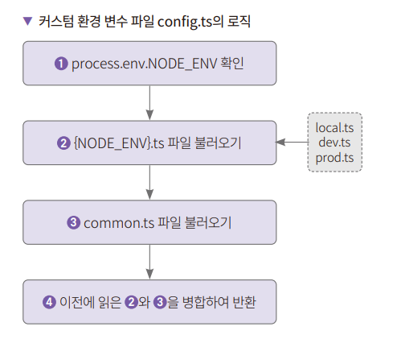
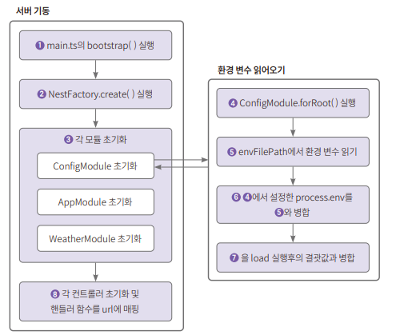

# **NestJS 환경 변수 설정하기**  
# **환경 변수 소개**  
우리가 작성하는 서버 애플리케이션은 다양한 환경의 외부 애플리케이션과 연동을 하게 된다. 정말 최소한의 설정만 넣는다고 가정하더라도 데이터베이스 
설정은 필요하다. 여기서 배포를 어떤 환경에 하느냐에 따라서 테스트용, 프로덕션용을 나누어주어야 한다. QA를 거친다면 QA 환경도 필요하다. 이외에도 
소스 코드에는 들어가면 안 되는 민감한 값이 있을 수 있는데 이런 부분은 최소한 환경 변수로 설정하거나 vault 같은 소스 코드 이외의 외부 저장소에 두어야 한다. 
이러한 작업들은 코드로 제어해서는 안된다. 별도의 파일로 두거나 외부의 서버에 설정해서 읽어올 수 있도록 해야 한다. 그렇지 않으면 설정이 복잡해질수록 
환경 변수를 제어하는 코드가 복잡해지기 떄문이다.  
  
NestJS에서 환경 변수 설정은 ConfigModule에서 할 수 있으며 설정된 환경 변수를 다른 모듈에서 가져다 쓰려면 ConfigService를 주입받아서 사용해야 
한다.  
  
  
  
ConfigModule은 초기화를 해야 하는데 ConfigModule.forRoot() 함수로 초기화가 가능하다. 보통 app.module.ts에서 해당 코드를 실행한다. ConfigModule을 
초기화할 때 envFilePath 설정에서 환경 변수를 읽은 뒤 process.env에 설정되어 있는 환경 변수화 합친다. 마지막으로 커스텀 환경 변수를 설정한 load 
옵션의 설정과 병합한 뒤 ConfigService를 초기화한다. ConfigService는 각 모듈에 의존성 주입을 해서 별다른 추가 설정 없이 사용할 수 있다. 
ConfigService를 사용하는 방법은 쉽고 직관적이다. 반면 설정은 더 신경 쓸 것이 많다.  
  
# **프로젝트 생성 및 설정하기**  
1. 환경 설정 파일 테스트용으로 사용할 config-test라는 이름으로 NestJS 프로젝트를 생성하고 의존성 패키지를 설치한다. 다음과 같이 nest-cli를 
사용해 프로젝트를 생성한다.  
  
nest new config-test  
cd config-test  
npm i @nestjs/config  
  
@nestjs/config는 내부적으로 dotenv를 사용한다. dotenv는 .env라는 이름의 파일에 환경 변수를 설정하고 불러올 수 있게 하는 자바스크립트로 만든 
라이브러리다. 생성된 프로젝트의 폴더 구조는 다음과 같다.  
  
  
  
app.contoller.ts에는 AppController 클래스가 있다. 해당 클래스에 환경 변수를 테스트할 핸들러 함수를 추가한다. app.module.ts는 기본적으로 생성되는 
모듈 파일이다. 여기에 환경 변수 설정에 필요한 모듈인 ConfigModule 설정을 한다. main.ts는 NestJS 서버 기동 시 가장 먼저 실행되는 파일이다. 프로바이더 
설정 없이 환경 변수를 설정하는 방법을 알아본다.  
  
# **NestJS 설정 및 테스트하기**  
app.module.ts에 설치한 @nestjs/config에 있는 ConfigModule 설정 추가 -> .env 파일 생성 -> app.contoller.ts에 테스트 라우팅 함수 추가 
순서로 진행된다. 먼저 ConfigModule 설정부터 한다.  
  
# **app.module.ts에 ConfigModule 설정하기**  
ConfigModule은 환경 설정에 특화된 기능을 하는 모듈이다. @nestjs/config 패키지에 포함되어 있는 클래스이며 모든 환경 변수 설정은 ConfigModule로부터 
시작한다고 생각하면 된다. app.module.ts에 ConfigModule을 설정한다.  
  
config-test/src/app.module.ts  
  
ConfigModule.forRoot() 함수는 많은 옵션이 존재한다. 예제 코드에는 아무런 옵션을 추가하지 않았는데 이는 NestJS에서 환경 변수를 사용하는 데 필요한 
최소한의 설정이다.  
  
  
  
isGlobal, cache, envFilePath는 자주 사용한다.  
  
# **.env 파일 생성하기**  
1. .env 파일은 @nestjs/config 내부에서 사용하는 dotenv 라이브러리에서 환경 변수 파일을 읽어올 때 사용하는 파일이다. dotenv는 기본적으로 .env 
확장자인 파일을 읽어온다. 환경 변수 설정을 가장 간단하게 하는 방법은 .env 파일만 만드는 것이다. 그러므로 프로젝트 루트 디렉터리에 .env 파일을 생성하고 
다음과 같이 작성한다. 환경 변수를 키/값으로 저장하는 파일이다.  
  
config-test/.env  
  
MESSAGE가 키이고 hello nestjs가 값이다. .env 파일의 형태는 키=값의 형태로 되어 있다. =과 값 사이에 있는 공백은 무시된다. 환경 변수의 키는 보통 
대문자로 되어 있으므로 대문자로 작성한다. 리눅스 또는 맥OS 기반 운영체제에서는 env 명령어를 실행하면 시스템 환경 변수를 확인해볼 수 있다. 윈도우에서는 
set 명령어를 터미널에서 실행하면 된다.  
  
# **app.controller.ts에 코드 추가하기**  
1. app.controller.ts는 nest-cli로 프로젝트를 생서하면 기본적으로 만들어지는 파일이다. 내부에는 AppController 클래스가 있는데 이 클래스에 핸들러 
함수 getHello()가 있다. getHello() 함수를 수정해 .env에 있는 환경 변수를 사용한다.  
  
config-test/src/app.controller.ts  
  
@nestjs/config에 있는 ConfigService를 임포트한다. 생성자에서 ConfigService를 주입하고 getHello() 함수 내에서 configService.get("환경 변수명")을 
호출해 값을 message에 할당한다.  
  
# **테스트하기**  
1. npm run start:dev를 실행해 서버를 기동 후 http://localhost:3000으로 접속해 테스트한다.  
  
# **ConfigModule을 전역 모듈로 설정하기**  
1. 환경 변수를 읽어오려면 ConfigService를 사용할 수 있어야 한다. 그러려면 ConfigModule을 해당 모듈에 설정해야 한다. 이전에 작성한 코드로는 
AppModule에서만 ConfigService를 사용할 수 있다. 만약에 다른 모듈을 추가한다면 추가한 모듈에도 ConfigService를 설정해야 한다. 모듈이 몇 개 
안 된다면 별 문제가 없지만 큰 프로젝트는 모듈을 수백 개 사용하므로 효율적인 방법이 필요하다. 이럴 때 isGlobal 옵션을 사용하면 다른 모듈에 ConfigModule을 
일일이 임포트하지 않아도 된다. isGlobal 옵션을 사용하도록 app.module.ts의 ConfigModule의 설정을 수정한다.  
  
config-test/src/app.module.ts  
  
isGlobal 옵션을 주면 모듈로 등록되어 다른 모듈에서는 임포트하지 않아도 된다.  
  
# **.env에 환경 변수 설정하기**  
1. .env에 다음과 같이 변수를 추가한다.  
config-test/.env  
  
잘 동작하는 날씨 모듈이 있다고 가정하고 WEATHER_API_URL과 WEATHER_API_KEY 변수를 각각 추가했고 값도 넣어두었다.  
  
# **weather 모듈 만들기**  
1. 전역 모듈 설정이 잘 동작하는지 확인하는 데 사용할 weather 모듈을 만든다. Nest CLI에서 다음과 같이 실행하면 weather 모듈과 컨트롤러 클래스가 
각각 생성된다.  
  
실행에 실패하면 nest 대신 npx @nestjs/cli 명령으로 실행한다.
nest g module weather  
nest g controller weather --no-spec  
  
# **날씨 API 테스트용 핸들러 함수로 테스트하기**  
모듈을 만들고 컨트롤러 클래스도 추가했으니 컨트롤러에 날씨 API를 테스트할 핸들러 함수를 추가한다.  
  
1. 날씨 API 테스트용 핸들러 함수를 다음과 같이 작성한다.  
config-test/weather/weather.controller.ts  
  
2. npm run start:dev 명령어로 서버를 기동하고 테스트한다.  
  
weather 모듈에서 configService를 사용하려면 ConfigModule을 따로 임포트해야 하지만 AppModule에서 ConfigModule을 전역 모듈로 설정했으므로 따로 
임포트하지 않아도 configService를 사용할 수 있다.  
  
# **여러 환경 변수 파일 사용하기**  
기본 설정으로는 .env 파일을 사용할 수 있지만 현업에서는 dev, qa, beta, prod 등 여러 가지 환경 변수를 사용한다. Node.js에서는 일반적으로 
NODE_ENV 환경 변수에 용도별 환경 변수를 정의해 사용한다. 서버 기동 시 사용하는 명령어를 수정해 NODE_ENV에 값을 할당해 환경별로 서버 설정을 
다르게 적용한다.  
  
# **환경별로 서버가 기동되도록 스크립트 수정하기**  
1. local, dev, prod 환경에서 서버를 기동하려면 package.json의 scripts 항목에 스크립트를 추가해야 한다. 각각 start, start:dev, start:prod를 
수정해 환경별로 기동하게 스크립트를 수정한다.  
config-test/package.json  
  
NODE_ENV={환경명} 형식으로 서버 기동 시에 NODE_ENV에 값을 할당한다.  
  
2. 서버 기동 시에 값이 올바르게 나오는지 console.log()를 추가해 확인한다.  
config-test/src/app.module.ts  
  
Node.js에서 환경 변수는 process.env.{환경 변수명} 형식을 사용한다. process는 내장 객체이므로 따로 import문을 사용하지 않아도 된다.  
  
3. npm run start:dev로 서버를 기동해 env:dev의 환경 변수가 출력되는지 확인한다.  
  
# **local, dev, prod 환경 변수 생성**  
1. 프로젝트 root에 envs라는 디렉터리를 생성한다.  
  
2. config-test 서비스 URL이 환경별로 각각 local : http://localhost:3000, dev : http://dev.config-test.com, prod : http://config-test.com 이라고 
가정하고 local.env, dev.env, prod.env 파일을 생성해 환경 변수를 추가한다.  
  
config-test/envs/local.env  
config-test/envs/dev.env  
config-test/envs/prod.env  
  
# **환경 변수에 따라서 다른 환경 변수 파일을 사용하도록 설정 수정하기**  
1. 환경 변수에 따라서 다른 환경 변수 파일을 사용하는 envFilePath를 적용할 수 있게 app.module.ts를 수정한다. envFilePath는 환경 변수 파일의 
경로를 지정하는 옵션이다.  
config-test/src/app.module.ts  
  
process.cwd()는 현재 디렉터리의 절대 경로를 출력해준다. 이 값을 envFilePath에서 사용한다.  
  
${process.cwd()}은 경로이고 뒤에 환경 변수값을 읽어오므로 결국 env 파일의 경로가 된다.  
  
# **테스트용 핸들러 함수로 테스트하기**  
1. 이제 환경 변숫값을 확인하는 핸들러 함수를 만든다. 브라우저에서 http://localhost:3000/service-url에 접속해 각 환경별로 추가한 SERVICE_URL 
환경 변수가 화면에 잘 표시되게 만든다.  
config-test/src/app.controller.ts  
  
2. npm run start, npm run start:dev, npm run start:prod를 각각 실행하고 테스트해본다.  
  
# **커스컴 환경 설정 파일 사용하기**  
.env 확장자를 가지는 환경 설정 파일 이외에 .ts를 확장자로 가지는 파일도 환경 설정 파일로 사용할 수 있다. 일반적으로는 .env만으로도 충분하지만 
복잡한 설정이 필요할 때 .ts 환경 설정 파일을 사용한다. 환경 설정 파일로 .ts 파일을 사용하면 커스텀한 환경 설정을 할 수 있다. 예를 들어 환경 
변수 파일에 공통적으로 넣을 환경 변수 설정하기, YAML 파일을 환경 변수로 사용하기, 설정에 대한 유효성 검증하기 등을 할 수 있다.  
  
핵심은 config.ts파일이다. config.ts는 개발자가 환경 변수를 구성하는 로직을 작성할 수 있다. 다음과 같은 로직을 구현하는 파일을 만든다.  
  
  
  
process.env.NODE_ENV 환경 변수를 확인해 어떤 환경에서 서버가 실행되고 있는지 확인한다. process.env.NODE_ENV에는 local, dev, prod가 값으로 
들어갈 수 있으며 local일 때는 local.ts 파일을 읽는다. 공통 환경 변수 파일인 common.ts 파일을 읽어온다. 이전에 읽은 설정들을 병합한 설정값을 
반환한다.  
  
# **환경 변수 파일 생성하기**  
1. 실행 시 logLevel, apiVersion, MESSAGE 등 공통으로 사용할 환경 변수를 정의하는 파일을 정의한다.  
config-test/src/configs/common.ts  
  
2. 로컬 개발 환경의 환경 변수를 반환하는 파일을 만든다.  
config-test/src/configs/local.ts  
  
3. 개발 환경의 환경 변수를 반환하는 파일을 정의한다.  
config-test/src/configs/dev.ts  
  
4. 프로덕션 환경의 환경 변수를 반환하는 파일을 정의한다.  
config-test/src/configs/prod.ts  
  
5. 이제 common.ts와 각 환경 변수를 합쳐주는 config.ts 파일을 만든다.  
config-test/src/configs/config.ts  
  
스프레드 연산자 ...을 사용해 common과 conf를 합쳐준다. load 옵션에서는 () => ({}) 형태로 값을 주어야 하므로 () => ()로 객체를 한 번 
감싸준다. Record는 객체를 결괏값으로 받는 함수 타입을 의미한다.  

# **ConfigModule에 load 옵션 추가하기**  
1. 커스텀 파일 설정을 하려면 load 옵션을 추가해야 한다. app.module.ts의 ConfigModule 설정에 load 옵션을 추가한다.  
config-test/src/app.module.ts  
  
# **커스텀 환경 변수 읽기 테스트하기**  
1. 이제 커스텀 환경 변수 읽기 테스트를 위해 app.controller.ts에 테스트용 함수를 추가한다.  
config-test/src/app.controller.ts  
  
2. npm run start, npm run start:dev, npm run start:prod로 서버를 기동해 각각 테스트해본다.  
  
# **서버 기동과 환경 설정 파일 초기화 순서 알아보기**  
config-test 프로젝트를 기준으로 서버 기동 시 초기화되는 순서를 알아보고 환경 변수는 어떤 순서로 반영되는지 알아본다.  
  
서버 기동 시의 초기화 순서는 다음과 같다.  
  
  
  
npm run start 명령어를 사용해 서버를 기동할 때 먼저 실행되는 파일은 main.ts다. main.ts에는 bootstrap() 함수가 있으며 해당 함수를 실행하는 것으로 
시작한다. bootstrap() 함수에서는 NestFactory.create()를 실행한다. NestFactory.create()는 설정되어 있는 모듈을 초기화하는 작업을 진행한다.  
  
그 후 각 모듈이 초기화될 때 의존성 주입을 해야 하는 부분들을 초기화하고 주입하도록 인스턴스를 생성하는 일을 한다. 실습 프로젝트 기준으로는 
ConfigModule을 먼저 초기화해 환경 변수를 어떤 모듈에서든지 읽을 수 있는 준비를 해준다. 다음으로 AppModule을 초기화하고 AppModule 하위에 있는 
WeatherModule을 초기화한다. 모듈 초기화 순서는 프로젝트에 따라 다를 수 있다.  
  
AppModule에 설정되어 있는 ConfigModule.forRoot()를 실행해 설정 파일을 읽는다. 아무런 설정이 없으면 .env 파일에서 설정을 읽어온다. envFilePath 
설정이 있다면 리스트에 담겨 있는 순서대로 설정을 읽어서 저장한다. 다음으로 시스템의 환경 변수인 process.env에 있는 환경 변수를 병합한다. 
load옵션이 있다면 load에 있는 환경 변수를 시스템의 환경 변수와 합치게 된다.  
  
모듈이 모두 초기화되었다면 컨트롤러의 인스턴스를 생성하고 컨트롤러에 있는 핸들러 함수를 URL과 매핑하는 작업을 진행한다. 이 작업이 끝나면 서버는 
성공적으로 시작된다는 메시지를 보내준다.  
  
# **YAML 파일을 사용해 환경 변수 설정하기**  
최근에는 환경 변수를 설정할 때 YAML을 사용하는 경우가 많다. 예를 들어 쿠버네티스, 스프링, 앤서블(Ansible)등에서 지원하고 있으니 사용하지 않더라도 
알아두는 것이 좋다. YAML은 문법이 간결하며 JSON에서 표현하는 모든 데이터를 표현할 수 있다. 또한 JSON에서 불가능한 주석도 지원한다. ConfigModule이 
YAML 파일을 읽으려면 커스텀 환경 설정 파일에 YAML 파일을 읽어오도록 코드를 작성해야 한다. 즉 config.ts를 수정해야 한다.  
  
# **js-yaml 설치하기**  
1. npm install 혹은 npm i를 사용해 설치한다. 타입 정보를 저장할 수 있게 @types/js-yaml도 함께 설치해준다. 타입 정보가 있으면 IDE에서 타입 
정보를 확인해 자동 완성과 컴파일 타임의 타입 체크 등의 기능을 지원해주므로 편리하다.  
  
npm i js-yaml  
npm i -D @types/js-yaml  
  
# **config.yaml 파일 생성하기**  
1. js-yaml을 설치했으니 js-yaml에서 읽어올 파일을 생성한다. config-test/envs 디렉터리 아래에 config.ts에서 읽어올 config.yaml 파일을 만들고 
다음과 같이 생성한다.  
config-test/src/envs/config.yaml  
  
# **config.ts 수정하기**  
1. YAML 파일은 커스텀 설정 파일로 취급하므로 이전에 만든 config.ts에 설정을 추가한다.  
config-test/src/configs/config.ts  
  
yaml.load를 사용해 config.yaml 파일을 읽어온다. 이때 반환하는 타입은 Record<string, any>다. 기존의 환경 설정에 yaml.load로 읽어온 설정을 
덧붙인다.
  
# **테스트용 핸들러 함수로 테스트하기**  
1. 설정 파일 추가 및 설정을 완료했으므로 테스트용 핸들러 함수를 추가하고 브라우저에서 테스트를 진행한다.  
config-test/src/app.controller.ts  
  
# **캐시 옵션 사용하기**  
1. 설정 파일을 읽고 내용을 파싱해 메모리에 키와 값으로 저장해야 사용할 수 있다. 설정 파일은 서버가 한 번 기동된 뒤에는 변경되지 않으므로 캐시를 사용하면 
성능에서 이득이다. 캐시를 사용할 수 있게 옵션을 수정한다.  
config-test/src/app.module.ts  
  
cache:true 옵션을 사용하면 COnfigService의 get() 함수를 사용할 때 캐시에서 먼저 불러오게 되므로 성능상의 이점이 있다.  
  
# **확장 변수 사용하기**  
1. 확장 변수(expandable variables)는 이미 선언된 변수를 다른 변수에 ${변수명}으로 할당하는 기능이다. 확장 변수 설정을 추가한다.  
config-test/envs/local.env  
  
환경 변수 SERVER_DOMAIN과 SERVER_PORT의 값을 새로운 변수 SERVER_URL에 할당했다.  
확장 변수는 내부적으로는 dotenv-expand 패키지를 사용한다.  
  

