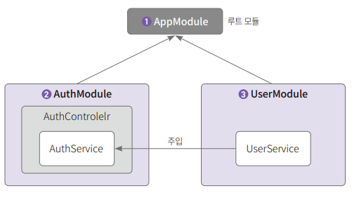
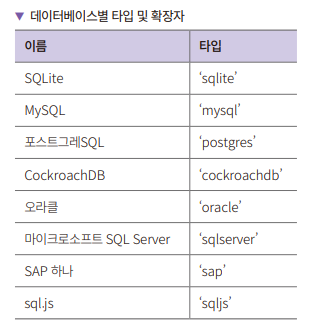
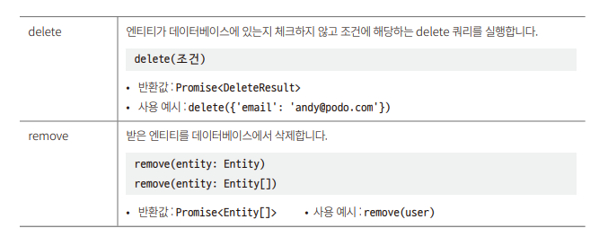
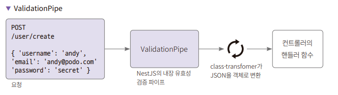
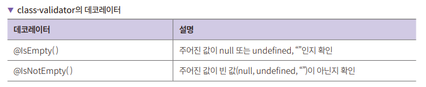
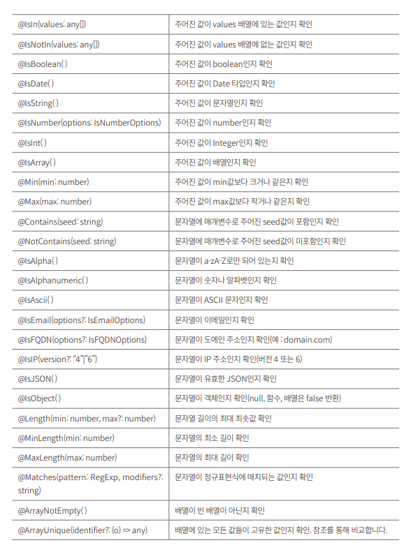
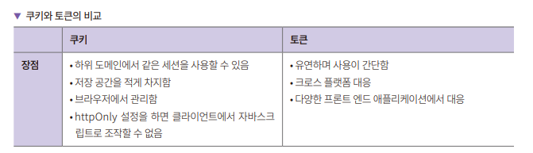
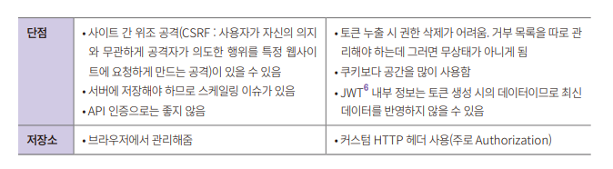
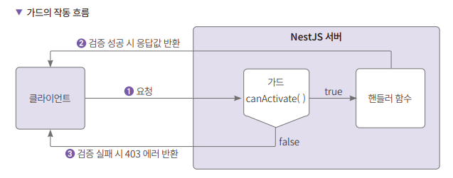
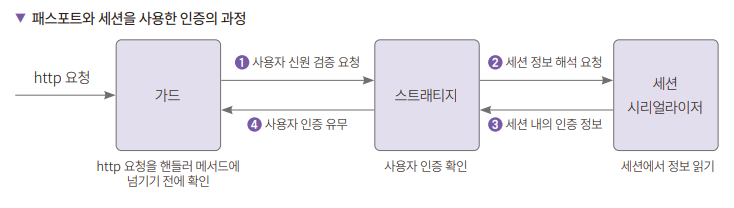

# **회원 가입과 인증하기**  
# **실습용 프로젝트 설정하기**  
# **nest-cli로 프로젝트 생성하기**  
1. nest-cli에서 다음 명령을 입력해 프로젝트를 생성한다.  
nest new nest-auth-test  
  
이번에는 더 복잡한 구조의 프로그램을 만들게 되므로 AuthModule과 UserModule을 추가로 만들어 사용한다. AppModule에는 전체 애플리케이션 관련 설정을, 
AutModule에는 인증 관련 기능을, UserModule 모듈에는 유저 데이터를 다루는 기능을 구현한다. 다음과 같이 AppModule의 하위에 AuthModule과 UserModule을 
둔다.  
  
  
  
인증을 담당하는 AuthModule은 AuthController, AuthService 클래스로 구성된다. AuthController에는 인증에 필요한 핸들러 메서드를 설정한다. 
AuthService에는 회원 가입과 회원 유효성을 검증하는 메서드를 추가한다. AuthService의 회원 가입 메서드에서 UserService를 주입해 사용한다. UserService에는 
회원정보 추가, 수정, 삭제 등의 메서드가 있다.  
  
# **User 모듈 생성하기**  
1. 다음 명령을 차례대로 입력하면 nest-cli가 자동으로 기본 코드를 만들어준다.  
nest g module user  
nest g controller user --no-spec  
nest g service user --no-spec  
  
이렇게 하면 src 디렉터리 아래에 user 디렉터리가 생기고 user 디렉터리는 명령어로 생성한 module, controller, service 파일이 있다. 유저 정보를 
저장하려면 리포지토리가 필요하다. 리포지토리는 생성하지 않고 ORM 라이브러리로 TypeORM 라이브러리에서 지원하는 Repository 클래스를 사용한다. 데이터베이스로 SQLite를 
사용한다.  
  
# **SQLite 데이터베이스 설정하기**  
1. 먼저 필요한 패키지부터 설치한다. sqlite3와 typeorm 그리고 typeorm을 nest에서 편하게 사용하려면 @nestjs/typeorm이 필요하니 설치한다.  
  
npm install sqlite3 typeorm @nestjs/typeorm  
  
2. 설치를 완료하고 app.module.ts에 설정을 한다.  
nest-auth-test/src/app.module.ts  
  
TypeOrmModule.forRoot() 메서드는 매우 많은 속성을 가지고 있지만 type, database, entities만 설정해주면 동작한다. type은 데이터베이스의 타입이고 
database는 데이터베이스 파일명이다. SQLite는 확장자로 sqlite를 사용한다.  
  
  
  
entities에는 엔티티로 만드는 객체를 넣어주면 된다. synchronize를 true로 하면 서버 기동 시 서버가 엔티티 객체를 읽어서 데이터베이스 스키마를 만들거나 
변경해준다. synchronize 옵션은 꼭 개발용으로만 사용해야 한다. 프로덕션 서버에서 사용하면 서버 기동 시 의도치 않게 데이터베이스 스키마를 변경할 수도 
있기 때문이다. logging은 true로 설정 시 SQL 실행 로그를 확인할 수 있다.  
  
# **유저 모듈의 엔티티, 서비스, 컨트롤러 생성하기**  
# **엔티티 만들기**  
1. 유저 엔티티는 데이터베이스 테이블과 1:1로 매칭되는 객체다. 작성할 유저 엔티티는 id, email, username, password, createDt 속성을 가지고 있다.  
nest-auth/src/user/user.entity.ts  
  
엔티티 객체를 만들기 위한 데코레이터들은 typeorm에서 가져와서 사용한다. 엔티티 객체는 @Entity 데코레이터를 붙여줘야 다른 곳에 의존성 주입을 할 수 있다. 
@PrimaryGeneratedColumn이 붙은 필드는 기본키이면서 자동 증가하는 컬럼이 된다. id 뒤에 있는 ?는 객체 생성 시 필수값이 아닌 선택적인 값임을 표시해준다. 
자동 증가하는 값이므로 데이터 생성 시에는 필요하지 않기 때문이다. @Column이 붙으면 데이터베이스의 컬럼으로 인식한다. unique:true를 붙여주면 중복 
데이터가 존재하는 경우 저장되지 않고 에러가 난다. 생성일 데이터는 기본값을 넣도록 default: true 설정을 추가해준다.  
  
2. 엔티티를 만들었으니 유저 서비스를 만든다.  
nest-auth-test/src/user/user.service.ts  
  
InjectRepository는 레포짙리 의존성을 주입하는 데코레이터다. Repository는 typeorm의 레포지토리다. 저장, 읽기 같은 기본적인 메서드들을 제공한다. 
사용 시에는 Repository<User>와 같이 엔티티 객체를 타입으로 추가해야 한다. <> 안에는 엔티티 객체 타입을 넣어주면 된다. 생성자 안에는 레포지토리를 주입하는 
코드를 작성한다. @InjectRepository(User)로 User 타입의 리포지토리를 주입한다고 알려준다. 다음으로 private userRepository로 변수를 선언한다. 
해당 변수의 타입은 Repository<User> 타입이다.  
  
  
  
  
# **컨트롤러 만들기**
1. 유저 컨트롤러는 유저가 요청을 보냈을 때 실행되는 핸들러 메서드를 정의한다. 컨트롤러 코드를 작성한다.  
nest-auth-test/src/user/user.controller.ts  
  
@Controller는 컨트롤러임을 나타내는 데코레이터다. 'user' 문자열은 주소가 user로 시작된다는 것을 말한다. 생성자에서 유저 서비스를 주입받아서 
userService 객체에 할당한다.  
  
# **서비스 만들기**  
1. 서비스는 컨트롤러와 레포지토리를 이어주는 역할을 한다. 컨트롤러를 작성한다.  
nest-auth-test/src/user/user.service.ts  
  
@Injectable() 데코레이터가 있으면 프로바이더가 된다. 모듈에 설정을 하면 다른 객체에 주입할 수 있다. userRepository.save() 메서드는 업데이트에도 사용한다. 
getUser()는 유저 한 명을 찾는데 userRepository.findOne() 메서드를 사용한다. where 조건에 email을 넣었으므로 email로 찾는다.  
  
2. 추가로 서비스에서 사용하는 레포지토리를 모듈에 등록해주어야 한다. 레포지토리를 모듈에 등록하지 않으면 서비스에서 레포지토리를 찾을 수 없어서 서버 
기동 시 에러가 나게 된다.  
nest-auth-test/src/user/user.module.ts  
  
3. 엔티티가 등록이 되어 있어야만 typeorm에서 해당 엔티티에 대한 메타 데이터를 읽을 수 있다. app.module.ts의 TypeOrmModule 설정에 User 엔티티를 
추가한다.  
nest-auth-test/src/app.module.ts  
  
# **테스트하기**  
1. 테스트용 HTTP 파일을 만들어 생성, 유저 정보 읽기, 업데이트, 삭제가 모두 잘 동작하는지 확인한다.  
nest-auth-test/src/user/user.http  
  
# **파이프로 유효성 검증하기**    
익스프레스에서는 컨트롤러 역할을 하는 곳 또는 별도의 라이브러리를 사용해 검증을 진행하지만 NestJS에서는 파이프(pipe)를 사용해서 유효성 검증을 한다.  
  
  
  
다양한 파이프들이 있으며 직접 만들 수도 있지만 여기서는 가장 사용하기 간편한 ValidationPipe를 사용한다. ValidationPipe를 사용하려면 class-validator와 
class-transformer를 설치해야 한다.  
  
class-transformer는 JSON 정보를 클래스 객체로 변경한다. 받은 요청(payload)을 변환한 클래스가 컨트롤러의 핸들러 메서드의 매개변수에 선언되어 있는 
클래스와 같다면 유효성 검증을 한다. class-validator는 데코레이터를 사용해 간편하게 유효성 검증을 하는 라이브러리다. 유저 관련 로직을 작성할 때는 타입을 
User 엔티티로 바로 사용했지만 클라이언트와 데이터를 주고받을 때는 보통 데이터 전송 객체(DTO)를 따로 만들어 사용한다.  
  
유효성 검증으로 @UsePipes 데코레이터와 Joi 라이브러리를 사용하는 방법도 있지만 스키마를 만들어야 하고 메서드마다 @UsePipes 데코레이터를 일일이 
붙여야 한다. 프로젝트 전체에서 유효성 검증을 제어할 떄는 ValidationPipe + class-transformer를 사용한 방법이 조금 더 유용하다. 반면 개별 메서드에서 
상세한 유효성 검증 로직이 필요할 때는 @UsePipe와 Joi 라이브러리를 이용하는 방법이 유용하다.  
  
# **전역 ValidationPipe 설정하기**  
1. 유효성 검증을 하려면 ValidationPipe를 main.ts에 설정해야 한다. ValidationPipe 추가는 간단하다. 의존성을 설치하고 임포트를 하고 전역 파이프 
설정에 ValidationPipe 객체를 생성해 넣으면 끝이다.  
  
ValidationPipe 의존성 설치  
npm install class-validator class-transformer  
  
ValidationPipe 설정  
nest-auth-test/src/main.ts  
  
# **UserDto 만들기**  
1. 유저 디렉터리에 UserDto 객체를 만든다. 생성 시와 수정 시 검사 항목이 다르기 때문에 CreateUserDto와 UpdateUserDto를 따로 만든다.  
nest-auth-test/src/user/user.dto.ts  
  
email 필드에는 @IsEmail을 붙여서 이메일인지 검증하고 그 외에는 IsString을 붙여서 문자열이 들어갈 수 있게 해준다.  
  
  
  
  
# **인증 모듈 생성 및 회원 가입하기**  
인증을 만드는 방법은 2가지다. 쿠키를 기반으로 만들거나 토큰 기반으로 만들 수 있다. 쿠키가 없는 토큰 기반을 쿠키리스(cookieless)라고 부른다. 쿠키는 
서버에서 보내준 쿠키를 클라이언트(주로 브라우저)에 저장해 관리한다. 토큰은 서버에 상태를 저장할 필요가 없다. 쿠키와 토큰은 서로 장단점이 있으므로 
요구사항에 따라 선택하면 된다.  
  
  
  
  
토큰은 OAuth를 사용한 소셜 로그인에서 사용할 예정이므로 먼저 쿠키를 사용해 인증을 구현한다.  
  
# **인증 모듈 만들기 및 설정하기**  
1. 인증 모듈을 만든다. 다음의 명령어를 nest-auth-test 디렉터리에서 실행해 인증 모듈 및 service와 controller를 만든다.  
nest g module auth  
nest g service auth --no-spec  
nest g controller auth --no-spec  
  
--no-spec은 테스트 파일을 만들지 않는다는 의미다.  
  
2. UserService를 AuthService에서 주입받을 수 있도록 user.module.ts에 exports 설정을 추가한다.  
nest-auth-test/src/user/user.module.ts  
  
인증 모듈의 AuthService에서는 회원 가입이나 로그인/로그아웃 처리에 UserService를 이용한다. @Injectable()이 붙어 있는 프로바이더의 경우 같은 
모듈의 다른 클래스에서 주입해 사용할 수 있다. 다만 다른 모듈에서 사용하려면 @Module 데코레이터의 속성으로 exports에 프로바이더를 넣어주어야 한다.  
  
3. 다음으로 AuthModule에 UserModule의 import 설정을 추가한다.  
nest-auth-test/src/auth/auth.module.ts  
  
# **회원 가입 메서드 만들기**  
1. UserService 클래스의 createUser를 사용해도 되지만 비밀번호 같은 민감 정보는 무조건 암호화해야 한다. 기존 코드로는 패스워드가 암호화되어서 
저장되지 않으므로 암호화 코드를 추가한다. 암호화 모듈로 bcrypt를 사용한다. bcrypt를 설치한다.  
  
npm install bcrypt  
npm install -D @types/bcrypt  
  
2. auth.service.ts에 코드를 작성한다.  
nest-auth-test/src/auth/auth.service.ts  
  
bcrypt를 사용해 패스워드를 암호화한다. hashSync의 첫 번째 매개변수는 암호화할 문자열이고 뒤에 있는 10은 암호화 처리를 10번 하곘다는 의미다. 숫자가 
올라갈수록 해시값(암호화된 문자열)을 얻는 데 시간이 오래 걸린다.  
  
3. 다음으로 controller를 만든다.  
nest-auth-test/src/auth/auth.controller.ts  
  
# **테스트하기**  
1. src/auth 아래에 auth.http 파일을 만들어서 테스트한다.  
nest-auth-test/src/auth/auth.http  
  
npm run start:dev로 서버를 기동시키고 테스트를 진행한다.  
  
# **SQLite 익스텐션으로 테이블 확인하기**  
1. SQLite를 사용해 데이터베이스(ser/nest-auth-test.sqlite 파일)에 저장했으니 SQLite 클라이언트를 사용해 테이블 내용을 확인한다. VSCode의 
커맨드 팔레트(Ctrl + Shift + P)에서 SQLite를 입력하면 Open Database가 보인다. 여기서 SQLite: Open Database를 선택한다.  
  
2. 다음으로 nest-auth-test.sqlite 파일을 선택한다.  
  
3. 그러면 왼쪽 아래에 SQLite EXPLORE가 나온다. 재생 버튼을 클릭하면 테이블의 내용을 확인할 수 있다.  
  
# **쿠키를 사용한 인증 구현하기**  
먼저 AuthController에 login 핸들러 메서드가 필요하다. 두 번째로는 AuthService에 email, password를 넘겨주면 해당 정보의 유저가 있는지 유효성 
검증을 하는 로직이 필요하다. 유저 정보의 유효성 검증이 끝나면 응답값에 쿠키 정보를 추가해 반환한다.  
  
NestJS에서 인증을 구현할 때는 보통 인증용 미들웨어인 가드(Guard)를 함께 사용한다. 가드는 특정 상황(권한, 롤, 액세스 컨트롤)에서 받은 요청을 가드를 추가한 
라우트 메서드에서 처리할지 말지를 결정하는 역할을 한다.  
  
# **AuthService에 이메일과 패스워드 검증 로직 만들기**  
1. 쿠키에 데이터를 추가히 전에 유저의 데이터가 맞는지 검증하는 로직이 필요하다. 그래서 쿠키 정보를 저장하는 로직보다 유저의 이메일과 패스워드 검증 
로직을 먼저 만든다.  
nest-auth-test/src/auth/auth.service.ts  
  
bycrept.compareSync(data, encrypted) 함수에서 data는 입력받은 패스워드값을 넣고 두 번째에는 패스워드 해시값을 넣어주면 바르게 암호화된 경우 
userInfo를 반환한다.  
  
2. validateUser() 메서드를 AuthController에서 사용해 인증 결과를 쿠키에 추가한다.  
nest-auth-test/src/auth/auth.controller.ts  
  
login() 메서드는 Request와 Response를 모두 사용해야 하므로 @Body나 @Param이 아닌 @Request를 직접 사용한다. httpOnly를 true로 설정하면 브라우저에서 
쿠키를 읽지 못한다. 브라우저에서 쿠키를 읽을 수 있다면 XSS(Cross Site Scripting)등의 공격으로 쿠키가 탈취되는 상황이 발생한다. 쿠키 정보를 
브라우저에서 읽지 않아도 된다면(자바스크립트의 Document.cookie API를 통해 쿠키를 사용하는 것이 아니라면) true로 설정하는 편이 보안에 더 유리하다.  
  
# **테스트하기**  
1. auth.http에 쿠키 정보가 원하는 대로 반환되는지 테스트해본다.  
nest-auth-test/src/auth/auth.http  
  
# **가드를 사용해 인증됐는지 검사하기**  
Nest.js에는 인증할 때 가드라는 미들웨어를 보편적으로 사용한다. 가드는 @Injectable() 데코레이터가 붙어 있고 CanActivate 인터페이스를 구현한 클래스다. 
@UserGuard 데코레이터로 가드를 사용할 수 있다. 클라이언트의 요청을 @Get, @Post 등이 붙어 있는 핸드러 메서드에 넘기기 전에 인증에 관련된 처리를 
할 수 있다. CanActivate 인터페이스를 구현하려면 canActivate() 메서드를 구현해야 한다.canActivate() 메서드는 boolean 또는 Promise<boolean>을 
반환하며 true인 경우 핸들러 메서드를 실행하고 false이면 403 Forbidden 에러를 준다.  
  
  
  
1. 서버 측에는 HTTP 요청의 헤더이 있는 쿠키를 읽는 코드가 필요하다. 쿠키를 읽어 유저의 인증 정보를 확인한다. HTTP 헤더에서 쿠키를 읽으려면 cookie-parser 
패키지를 설치하고 설정을 해야 한다. 먼저 cookie-parser 패키지를 설치한다.  
npm install cookie-parser  
  
2. 이번에는 HTTP 요청의 헤더에서 쿠키를 읽어올 수 있도록 NestApplication의 설정을 변경한다.  
nest-auth-test/src/main.ts  
  
쿠키 파서는 쿠키를 Request 객체에서 읽어오는 데 사용하는 미들웨어다. cookieParser()로 추가한다. NestFactory.create로 만든 NestApplication의 
객체인 app에서 use() 함수를 사용해 미들웨어를 사용하도록 한 줄만 추가하면 끝이다.  
  
3. 다음으로 authService의 validateUser를 사용해 가드를 만든다. src/auth 아래에 auth.guard.ts 파일을 생성하고 작성한다.  
nest-auth/src/auth/auth.guard.ts  
  
CanActivate를 구현했으므로 가드다. canActivate() 메서드는 CanActivate의 추상 메서드이므로 사용할 클래스에서 구현해야 한다. 반환 타입으로 boolean 
또는 Promise<boolean>을 줘야 하는데 async await 구문을 사용하므로 여기서는 Promise<boolean>을 반환 타입으로 사용한다. true이면 인증이 됐다는 
의미고 false는 인증이 되지 않았다는 의미다. false에는 403 에러를 보내준다. context는 ExecuteContext 타입으로 주로 Request나 Response 객체를 
얻어오는 데 사용한다.  
  
주의할 점으로 가드 내에서 응답에 쿠키를 설정할 수 없다. 또한 가드는 모든 미들웨어의 실행이 끝난 다음 실행되며 filter나 pipe보다는 먼저 실행된다.  
  
4. 컨트롤러에 LoginGuard 로직을 붙인다.  
nest-auth-test/src/auth/auth.controller.ts  
  
가드를 사용 시에는 @UseGuards 데코레이터를 사용한다. 괄호 안에 만들어둔 LoginGuard를 넣어주면 된다. LoginGuard에서 인증에 성공 시 request.user에 
user 정보를 할당했다. 쿠키 정보가 없으나 user 정보가 있는 경우 로그인 프로세스를 진행한 것으로 보고 쿠키를 설정한다.  
  
# **테스트하기**  
1. auth.http에 다른 유저로 로그인과 가드 로직 테스트 두 가지 항목을 더 추가해 테스트를 진행한다.  
nest-auth-test/src/auth/auth.http  
  
# **패스포트와 세션을 사용한 인증 구현하기**  
쿠키만으로 인증하면 위변조와 탈취의 위험에서 자유롭지 못하다. 좋은 방법은 서버에서 인증을 하고 해당 정보를 서버의 특정 공간에 저장해두는 방법이다. 
이때 사용하는 것이 세션이다. 세션을 사용할 때도 쿠키를 사용하지만 쿠키는 세션을 찾는 정보만 저장(예: 세션의 아이디값)하고 중요 정보는 세션에 모두 넣어 
두는 것이 좋다. 세션은 서버의 자원을 사용하는 것이므로 서버에 부하를 주는 단점이 있지만 위조, 변조, 탈취가 불가능하므로 보안적으로는 더 안전하다고 할 수 있다.  
  
이번에는 가드 두 개와 인증을 처리하기 위한 파일 여러 개를 만든다. 먼저 로그인에 사용할 가드가 필요하다. 인증 로직 구현 부분은 패스포트라는 인증 로직을 쉽게 
분리해서 개발하는 라이브러리를 사용한다. 패스포트(passport) 사용 시 인증 로직은 스트래티지(strategy) 파일을 생성해서 사용한다. 스트래티지는 패스포트에서는 
인증 로직 수행을 담당하는 클래스를 의미한다. 직접 구현해도 되지만 다양한 인증을 위한 스트래티지 패키지를 같이 설치해 인증을 쉽게 구현할 수 있다. 
기존처럼 가드 안에 인증 로직을 두는 것이 아니라 인증 로직을 처리하는 별도의 스트래티지 파일이 필요하다. 또한 세션 사용 시 세션에서 데이터를 읽어오고 
저장하므로 세션에 데이터를 저장하고 읽어올 세션 시리얼라이저(session serializer) 파일도 필요하다. 조금 복잡하지만 각자 역할 분담이 잘되어 있어서 윶보수에 
유리하다.  
  
  
  
가드를 통과한 요청은 스트래티지에 전달되어 사용자 신원 검증을 한다. 스트래티지는 세션 정보를 읽기 위해 세션 시리얼라이저 세션에 있는 인증 정보를 요청한다. 
세션 시리얼라이저는 세션에 있는 인증 정보를 스트래티지에 돌려준다. 스트래티지는 세션에 있는 인증 정보를 확인해 사용자 인증 유무를 가드에 결괏값으로 반환한다.  
  
# **라이브러리 설치 및 설정하기**  
1. passport 라이브러리를 설치한다. 유저 아이디와 패스워드로 인증할 때 스트래티지는 passport-local을 사용한다. passport-local은 username과 
password로 인증할 수 있는 전략을 사용하는 모듈이다. 세션 저장에는 express-session을 사용한다. @types/passport-local @types/express-session은 
타입스크립트의 타입 정보를 담고 있는 라이브러리들이다. 개발할 때 유용하므로 개발 환경 패키지를 설치하는 -D 옵션을 주어 설치한다.  
  
npm i @nestjs/passport passport passport-local express-session  
npm i -D @types/passport-local @types/express-session  
  
2. 세션을 사용하려면 main.ts 파일에 설정을 추가해야 한다.  
nest-auth-test/src/main.ts  
  
내부적으로 secret은 암호화를 하는 데 사용하는 키다. 절대 유출되지 않도록 관리해야 한다. resave는 세션을 항상 저장할지 여부를 나타낸다. HTTP 요청이 
올 때마다 세션을 새로 저장하면 효율이 떨어질 수 있으므로 false로 해둔다. saveUninitialized 옵션은 세션이 저장되기 전에 빈 값을 저장할지 여부를 
나타낸다. 인증이 되지 않은 사용자 정보도 빈 값으로 저장하므로 false로 설정해 불필요한 공간을 차지하지 않게 한다. 쿠키 설정은 세션을 찾는 데 사용할 
키값을 쿠키에 설정한다. 마지막으로 패스포트 초기화 및 세션 저장소를 초기화한다. 세션의 저장소를 따로 지정하지 않았으므로 서버의 메모리에 저장된다.  
  

  

  

