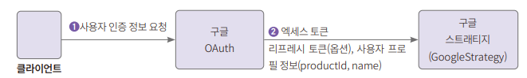
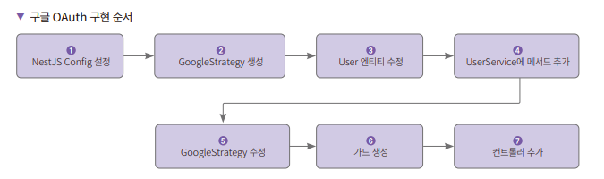
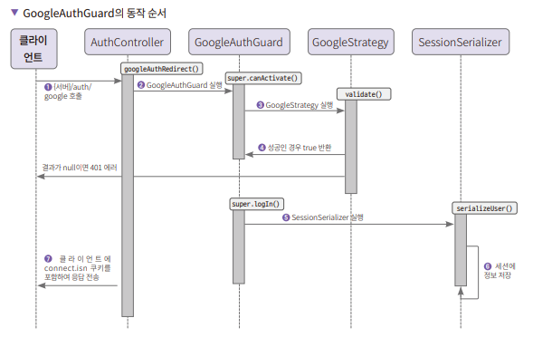

# **OAuth를 사용한 구글 로그인 인증하기**  
# **OAuth 소개**  
OAuth는 Open Authorization의 약자로서 2006년에 구글과 트위터가 만든 개방형 인가의 표준이다. 최근의 웹사이트들은 네이버, 구글, 페이스북, 카카오톡 
로그인을 지원하는 경우가 많다. 소셜 로그인 기능이다. 소셜 로그인은 유저가 해당 웹사이트에 가입한 ID와 패스워드 대신 다른 사이트에 있는 유저 정보를 사용해 
인증하는 기능이다.  
  
인증을 구현하기 위해 OAuth를 많이 사용하지만 OAuth는 인증이 아니라 인가의 관점에서 보아야 한다.  
  
OAuth는 1.0, 2.0, 2.1 버전이 있으며 현재 2.0 버전을 가장 많이 사용한다. Oauth 2.0 OAuth2로 표기해 사용하기도 한다. 정확한 사양은 RFC 6749에 
정리되어 있다.  
  
- 인증: 리소스에 접근 자격이 있는지 검증하는 과정. OAuth에서 리소스는 보호된 정보를 의미한다.  
- 인가: 자원에 접근할 권한을 부여하는 과정. 인가가 완료되면 리소스의 접근 권한 정보가 있는 액세스 토큰을 클라이언트에게 보내준다.  
- 액세스 토큰: 리소스 서버에서 리소스 소유자의 보호된 정보를 획득할 때 사용하는 만료 기간이 있는 토큰  
- 리프레시 토큰: 액세스 토큰이 만료되었을 때 갱신하는 용도로 사용하는 토큰. 액세스 토큰보다 만료 기간을 길게 가져간다.  
- 리소스 소유자: 리소스는 사용자의 보호된 정보를 말하며 이런 정보에 접근하도록 자격을 부여하는 사람. OAuth에서는 사용자가 리소스 소유자다 라고 생각하면 된다.  
- 클라이언트: 리소스를 사용하려고 접근을 요청하는 애플리케이션을 의미한다.  
- 리소스 서버: 사용자의 보호된 자원을 가지고 있는 서버  
- 인가 서버: 인증/인가를 수행하는 서버로 클라이언트의 접근 자격을 확인하고 액세스 토큰을 발급해 권한을 부여한다.  
  
인가 서버와 리소스 서버의 조합을 OAuth2 프로바이더라고 부르기도 한다.  
  
# **OAuth 프로토콜 흐름**  
  
  
클라이언트가 리소스 소유자에게 권한 부여를 요청한다. 클라이언트는 권한을 부여받는다. 권한 부여 유형은 다음과 같이 4가지이다.  
  
- 인증 코드(Authorization Code) 사용하기  
- 암묵적인(Implicit) 방법  
- 리소스 소유자의 암호 자격증명(Resource Owner Password Credentials)  
- 클라이언트 자격증명(Client Credentials)  
  
구글 인증에는 인증 코드 방법을 사용한다. 클라이언트는 인가 승인 요청에서 받은 정보를 통해 액세스 토큰을 인가 서버에 요구한다. 인가 서버에서는 클라이언트를 
인증하고 유효성 검사를 한다. 유효한 경우 액세스 토큰을 발급한다. 클라이언트가 리소스 서버에 보호된 리소스를 요청한다. 요청 시에는 액세스 토큰을 사용한다. 
리소스 서버는 액세스 토큰의 유효성을 검사하고 유효한 경우 보호된 자원 정보를 보내준다.  
  
# **액세스 토큰을 재발행하는 흐름**  
  
  
클라이언트는 인가 서버에 인증을 하고 액세스 토큰을 요청한다. 인가 서버는 클라이언트를 인증하고 유효성 검증을 한 후에 문제가 없으면 액세스 토큰과 
리프레시 토큰을 발급한다. 클라이언트가 리소스 서버에 액세스 토큰을 보내면서 보호된 리소스를 요청한다. 리소스 서버가 액세스 토큰의 유효성을 검증하고 
유효한 경우 리소스를 내려준다. 위 단계는 액세스 토큰이 만료될 때까지 반복된다. 액세스 토큰 만료 시에도 클라이언트는 액세스 토큰을 리소스 서버에 전달하기도 
한다. 클라이언트가 액세스 토큰이 만료된 것을 알고 있다면 바로 리프레시 토큰 전달 단계로 가고 모른다면 만료된 액세스 토큰을 전달한다. 리소스 서버에서는 
액세스 토큰이 만료되었으므로 잘못된 토큰 에러를 발생시킨다.  
  
클라이언트에서는 액세스 토큰이 만료되어 에러가 발생했으므로 리프레시 토큰을 인가 서버로 전달해 새 액세스 토큰을 요청한다. 인가 서버는 리프레시 토큰이 
유효한 경우 새로운 액세스 토큰을 발급해준다. 선택적으로 리프레시 토큰도 재발급한다.  
  
# **구글 OAuth를 사용하기 위한 준비**  
클라이언트에서 구글의 OAuth 인가 서버에 접속하려면 OAuth 클라이언트 ID와 비밀번호가 필요하다. 이를 위해서는 구글 클라우드에서 프로젝트를 생성하고 
OAuth 동의 화면을 생성하고 클라이언트 ID를 생성해야 한다.  
  
구글 OAuth 발급 과정은 이미 알아서 생략  
  
# **구글 OAuth 구현 순서**  
구글 OAuth를 사용해 구글에 사용자 정보를 요청하면 이메일과 프로필 정보를 구글 OAuth 스트래티지 파일(이하 GoogleStrategy)의 validate() 메서드에 
콜백으로 받는다. 이때 넘어오는 데이터는 액세스 토큰, (때에 따라) 리프레시 토큰, 프로필 정보다. 프로필에는 식별자로 사용되는 ID가 있으며 providerId로 
부른다. 또한 name 객체도 넘어오는데 성과 이름 속성을 가지고 있다. 프로젝트에서 유저 정보의 키로 사용하는 이메일 정보도 가지고 있다.  
  
  
  
구글 OAuth 인증 시 구글에 데이터를 요청하지만 해당 데이터를 어떻게 다룰지는 애플리케이션마다 다르다. 이번은 세션에 저장해서 인증하는 방법으로 사용한다.  
  
구글 OAuth로 가입한 유저는 패스워드가 없으므로 구글 OAuth로 가입한 유저라는 것을 알 수 있도록 구글 OAuth의 식별자인 providerId를 같이 저장하는 
것이 좋다.  
  
GoogleStrategy의 validate() 메서드에서는 인증 시 유저 데이터가 있으면 가져오고 없으면 저장하는 로직이 필요하다.  
  
Auth 컨트롤러의 테스트에 사용할 메서드 두 개를 추가한다. 하나는 OAuth 로그인 화면을 띄울 메서드이고 다른 하나는 OAuth 리다이렉트에 사용할 메서드다. 
컨트롤러에는 가드가 필요하다. GoogleAuthGuard도 만든다. 리다리엑트 시 GoogleStrategy의 validate 메서드가 실행된다.  
  
GoogleStrategy 설정 시 민감한 정보가 들어가므로 NestJS config도 설정을 해야 한다.  
  
  
  
# **NestJS 환경 설정 파일 추가하기**  
1. 의존성 패키지를 설치한다. 다음의 명령어를 입력해 @nestjs/config를 설치한다.  
npm i @nestjs/config  
  
2. 구글 OAuth용 환경 설정 파일을 만들고 값을 설정한다.  
nest-auth-test/.env  
  
3. NestJS config를 활성화하려면 ConfigModule을 설정해야 한다. app.module.ts에 설정을 추가한다.  
nest-auth-test/src/app.module.ts  
  
@nestjs/config를 설정하고 .env 설정 파일을 만들어도 ConfigModule.forRoot()를 임포트하지 않으면 활성화되지 않는다.  
  
# **구글 OAuth 스트래티지 만들기**  
구글 OAuth 스트래티지를 만든다. 스트래티지는 구글 OAuth 인증의 핵심 로직을 추가하는 곳이다. 구글에서 인증을 마치고 콜백을 받는 메서드를 작성한다.  
  
1. 구글 OAuth 스트래티지를 지원하는 의존성 패키지 passport-google-oauth20을 설치한다.  
npm i passport-google-oauth20  
npm i -D @types/passport-google-oauth20  
  
2. 다음으로 strategy 클래스를 만든다. src/auth 디렉터리 아래에 google.strategy.ts를 다음과 같이 작성한다.  
nest-auth-test/src/auth/google.strategy.ts  
  
Strategy 클래스는 인증 시에 사용하는 로직을 추가하는 메서드다. 구글 OAuth 인증을 지원하는 클래스는 passport-google-oauth20 패키지에 있다. 
여기서는 Strategy에 @nestjs/passport의 클래스인 PassportStrategy의 메서드 validate()를 추가할 목적으로 사용했다. PassportStrategy는 
NestJS에서 패스포트를 사용하는 방법을 일원화하는 데 사용하는 믹스인이다. 인증의 유효성 검증 시 validate() 메서드를 사용할 것이라는 것을 쉽게 유추할 
수 있다.  
  
부모 클래스의 생성자를 호출하여 매개변수로 clientID, clientSecret, callbackURL, scope를 받는다.  
  
구글 인증이 끝나고 콜백 URL 에서는 access_token, refresh_token, profile을 받는다. 최초 인증 시 유저 데이터를 데이터베이스에 저장하기 때문에 
이후에는 구글의 리소스 서버에 인증을 요청하지 않아도 된다. profile은 passport-google-oauth20에 있는 Profile 타입의 인스턴스다. Profile에는 
id, name, emails 속성이 있다. id는 프로바이더 ID로서 해당 프로바이더 내에서 유일한 값이다.  
  
3. Strategy는 프로바이더이므로 등록을 해야 한다. AuthModule에 등록을 해준다.  
nest-auth-test/src/auth/auth.module.ts  
  
# **GoogleAuthGuard 만들기**  
1. auth.guard.ts에 GoogleAuthGuard 클래스를 추가한다.  
nest-auth-test/src/auth/auth.guard.ts  
  
AuthGuard는 @nestjs/passport의 클래스다. passport의 Strategy를 쉽게 사용하기 위한 클래스로 생성자의 매개변수에 사용할 스트래티지를 문자열로 
넣으면 된다. 이름으로 구분하므로 이름을 잘 넣어주어야 한다. super.canActivate() 메서드에서 GoogleStrategy의 validate() 메서드를 실행한다. 
실행 결과가 null 혹은 false이면 401 에러가 난다.  
  
nestjs에서는 context에서 리퀘스트 객체를 꺼낼 수 있다.  
  
  
  
클라이언트가 /auth/to-google을 호출하면 구글로 리다이렉트된다. 로그인을 하면 /auth/google이 호출된다. /auth/google 호출 시 GooglaAuthGuard가 
실행된다. GoogleAuthGuard의 canActivate() 메서드가 실행되며 내부 로직에서 GoogleStrategy를 실행한다. GoogleStrategy의 validate() 메서드에서 
인증이 문제가 없는 경우 true를 반환한다. GoogleAuthGuard의 canActivate() 메서드에서 SessionSerializer를 실행한다.  
  
SessionSerializer는 세션에 유저의 인증 정보를 저장한다. 인증 및 세션 저장이 완료되면 클라이언트에 세션 정보 조회를 위한 쿠키를 포함해 응답을 
전송한다.  
  
# **컨트롤러에 핸들러 메서드 추가하기**  
1. 스트래티지와 가드를 만들었으면 유저의 요청을 받아줄 컨트롤러의 핸들러 메서드가 필요하다. Auth 컨트롤러에 구글 OAuth 확인(인증)에 사용할 
핸들러 메서드를 추가한다.  
nest-auth-test/src/auth/auth.controller.ts  
  
googleAuthRedirect() 메서드는 구글 로그인 성공 시 실행하는 라우터 메서드다. GoogleAuthGuard에서 GoogleStrategy의 validate() 메서드를 실행한 
다음에 googleAuthRedirect() 메서드를 실행한다. googleAuthRedirect() 메서드에서는 request에서 user 정보를 뽑아낸 다음 res.send() 메서드를 실행해 
화면에 뿌리는 역할을 한다.  
  
# **테스트하기**  
1. npm run start:dev를 실행해 서버를 기동한다. 서버가 기동되었으면 브라우저에서 http://localhost:3000/auth/to-google에 접속한다.  
  
2. 본인의 계정을 선택해 로그인한다. 로그인 후에는 구글 콘솔에서 입력한 URL인 http://localhost:3000/auth/google로 이동하며 Profile 정보가 나온다.  
  
# **User 엔티티 파일 수정하기**  
1. user.entity.ts 파일에서는 두 가지 수정을 진행한다. password가 없는 떄도 데이터를 저장하는 기능과 구글 인증 시의 식별자인 providerId를 
추가한다.  
nest-auth-test/src/user/user.entity.ts  
  
{nullable: true}로 설정하면 빈 값을 허용한다는 뜻이다.  
  
# **UserService에 구글 유저 검색 및 저장 메서드 추가하기**  
1. 구글 OAuth 인증의 정보를 기반으로 회원 가입을 시켜주는 메서드가 필요하다. 동시에 이미 회원 정보가 있다면 회원 정보를 반환하는 메서드도 필요하다. 
구글은 providerId로 찾지만 우리가 만드는 애플리케이션에서는 이메일이 회원을 구분하는 단위다. 따라서 이메일로 기존 가입 여부를 확인해 가입되어 있으면 
유저 정보를 반환하고 아니면 회원 정보를 유저 테이블에 저장하는 코드를 작성한다.  
nest-auth-test/src/user/user.service.ts  
  
# **GoogleStrategy에 구글 유저 저장하는 메서드 적용하기**  
1. GoogleStrategy의 validate() 메서드에서 구글 유저 정보가 있다면 정보를 데이터베이스에서 가져오고 없다면 저장해야 하므로 findByEmailOrSave() 
메서드를 GoogleStrategy에 적용한다. validate() 메서드에서 profile 정보의 id, name, email을 디비에 저장하도록 User 엔티티에 맞춰서 넘겨준다.  
nest-auth-test/src/auth/google.strategy.ts

현재 세션에서 유저 정보를 다룰 때 userEntity를 사용한다. OAuth 정보를 담은 User 엔티티를 사용하도록 수정했으므로 이제 세션을 사용할 수 있다.  
  
# **GoogleAuthGuard에 세션을 사용하도록 변경하기**  
1. 지금까지 구현한 코드들은 클라이언트에서 HTTP 요청 시마다 구글 OAuth 인증을 해야 한다. 유저의 로그인 상태를 파악하는 쿠키나 세션 같은 장치가 
없기 떄문이다. 로그인 시에만 구글 OAuth 요청을 하고 그 뒤로는 세션에 저장된 데이터로 인증을 확인하도록 코드를 변경한다.  
nest-auth-test/src/auth/auth.guard.ts  
  
부모 클래스의 login(request)를 실행한다. 세션 기능이 활성화되어 있다면 SessionSerializer를 실행해 request.user의 값을 세션에 저장한다.  
  
# **테스트하기**  
1. http://localhost:3000/auth/to-google로 가서 구글 로그인을 진행한다.  
2. 세션이 잘 동작하는지 확인하기 위해 http://localhost:3000/auth/test-guard2로 이동한다.  
  
# **학습 마무리**  
# **용어 설명**  
1. OAuth는 2006년에 구글과 트위터가 만든 개방형 인가의 표준이다. 소셜 로그인 구현에 많이 사용한다. 1.0, 2.0, 2.1 버전이 있으며 2.0이 가장 많이 
사용된다.  
2. providerId는 리소스 소유자, 즉 유저의 자원을 소유한 리소스 서버의 고유한 식별자를 뜻한다.  
  

  

