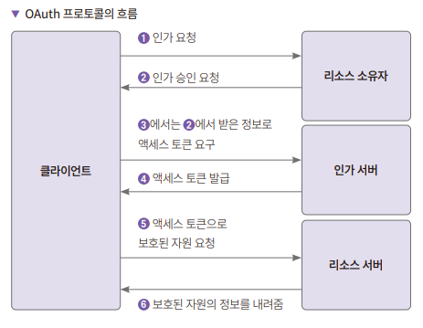
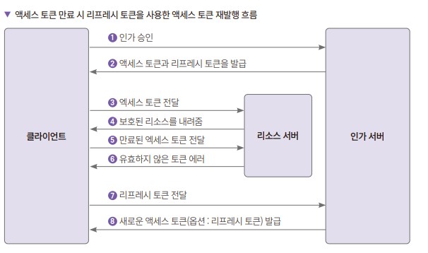

# **OAuth를 사용한 구글 로그인 인증하기**  
# **OAuth 소개**  
OAuth는 Open Authorization의 약자로서 2006년에 구글과 트위터가 만든 개방형 인가의 표준이다. 최근의 웹사이트들은 네이버, 구글, 페이스북, 카카오톡 
로그인을 지원하는 경우가 많다. 소셜 로그인 기능이다. 소셜 로그인은 유저가 해당 웹사이트에 가입한 ID와 패스워드 대신 다른 사이트에 있는 유저 정보를 사용해 
인증하는 기능이다.  
  
인증을 구현하기 위해 OAuth를 많이 사용하지만 OAuth는 인증이 아니라 인가의 관점에서 보아야 한다.  
  
OAuth는 1.0, 2.0, 2.1 버전이 있으며 현재 2.0 버전을 가장 많이 사용한다. Oauth 2.0 OAuth2로 표기해 사용하기도 한다. 정확한 사양은 RFC 6749에 
정리되어 있다.  
  
- 인증: 리소스에 접근 자격이 있는지 검증하는 과정. OAuth에서 리소스는 보호된 정보를 의미한다.  
- 인가: 자원에 접근할 권한을 부여하는 과정. 인가가 완료되면 리소스의 접근 권한 정보가 있는 액세스 토큰을 클라이언트에게 보내준다.  
- 액세스 토큰: 리소스 서버에서 리소스 소유자의 보호된 정보를 획득할 때 사용하는 만료 기간이 있는 토큰  
- 리프레시 토큰: 액세스 토큰이 만료되었을 때 갱신하는 용도로 사용하는 토큰. 액세스 토큰보다 만료 기간을 길게 가져간다.  
- 리소스 소유자: 리소스는 사용자의 보호된 정보를 말하며 이런 정보에 접근하도록 자격을 부여하는 사람. OAuth에서는 사용자가 리소스 소유자다 라고 생각하면 된다.  
- 클라이언트: 리소스를 사용하려고 접근을 요청하는 애플리케이션을 의미한다.  
- 리소스 서버: 사용자의 보호된 자원을 가지고 있는 서버  
- 인가 서버: 인증/인가를 수행하는 서버로 클라이언트의 접근 자격을 확인하고 액세스 토큰을 발급해 권한을 부여한다.  
  
인가 서버와 리소스 서버의 조합을 OAuth2 프로바이더라고 부르기도 한다.  
  
# **OAuth 프로토콜 흐름**  
  
  
클라이언트가 리소스 소유자에게 권한 부여를 요청한다. 클라이언트는 권한을 부여받는다. 권한 부여 유형은 다음과 같이 4가지이다.  
  
- 인증 코드(Authorization Code) 사용하기  
- 암묵적인(Implicit) 방법  
- 리소스 소유자의 암호 자격증명(Resource Owner Password Credentials)  
- 클라이언트 자격증명(Client Credentials)  
  
구글 인증에는 인증 코드 방법을 사용한다. 클라이언트는 인가 승인 요청에서 받은 정보를 통해 액세스 토큰을 인가 서버에 요구한다. 인가 서버에서는 클라이언트를 
인증하고 유효성 검사를 한다. 유효한 경우 액세스 토큰을 발급한다. 클라이언트가 리소스 서버에 보호된 리소스를 요청한다. 요청 시에는 액세스 토큰을 사용한다. 
리소스 서버는 액세스 토큰의 유효성을 검사하고 유효한 경우 보호된 자원 정보를 보내준다.  
  
# **액세스 토큰을 재발행하는 흐름**  
  
  
클라이언트는 인가 서버에 인증을 하고 액세스 토큰을 요청한다. 인가 서버는 클라이언트를 인증하고 유효성 검증을 한 후에 문제가 없으면 액세스 토큰과 
리프레시 토큰을 발급한다. 클라이언트가 리소스 서버에 액세스 토큰을 보내면서 보호된 리소스를 요청한다. 리소스 서버가 액세스 토큰의 유효성을 검증하고 
유효한 경우 리소스를 내려준다. 위 단계는 액세스 토큰이 만료될 때까지 반복된다. 액세스 토큰 만료 시에도 클라이언트는 액세스 토큰을 리소스 서버에 전달하기도 
한다. 클라이언트가 액세스 토큰이 만료된 것을 알고 있다면 바로 리프레시 토큰 전달 단계로 가고 모른다면 만료된 액세스 토큰을 전달한다. 리소스 서버에서는 
액세스 토큰이 만료되었으므로 잘못된 토큰 에러를 발생시킨다.  
  
클라이언트에서는 액세스 토큰이 만료되어 에러가 발생했으므로 리프레시 토큰을 인가 서버로 전달해 새 액세스 토큰을 요청한다. 인가 서버는 리프레시 토큰이 
유효한 경우 새로운 액세스 토큰을 발급해준다. 선택적으로 리프레시 토큰도 재발급한다.  
  
# **구글 OAuth를 사용하기 위한 준비**  
클라이언트에서 구글의 OAuth 인가 서버에 접속하려면 OAuth 클라이언트 ID와 비밀번호가 필요하다. 이를 위해서는 구글 클라우드에서 프로젝트를 생성하고 
OAuth 동의 화면을 생성하고 클라이언트 ID를 생성해야 한다.  
  
구글 OAuth 발급 과정은 이미 알아서 생략  
  
