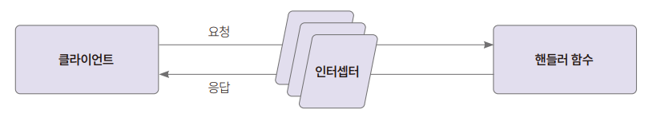

# **파일 업로드 기능 구현하기**  
# **프로젝트 생성 및 의존성 설치하기**  
1. 먼저 nest-cli를 사용해 실습에 사용할 프로젝트를 생성한다.  
nest new nest-file-upload --skip-git  
  
2. NestJS에서는 파일 업로드에 multer라는 패키지를 사용한다. multer는 파일 업로드에 사용되는 multipart/form-data를 다루는 Node.js 라이브러리다. 
multer는 nset-file-upload에 이미 포함되어 있다. 타입 정보가 있다면 더욱 안전한 코딩이 가능하니 타입 정보를 제공하는 @types/multer 패키지를 추가한다.  
npm i -D @types/multer  
  
# **파일 업로드 API를 만들고 테스트하기**  
1. app.controller.ts 파일에 컨트롤러 코드를 작성한다. 다음과 같이 file-upload 핸들러 함수를 추가한다.  
nest-file-upload/src/app.controller.ts  
  
인터셉터는 클라이언트와 서버 간의 요청과 응답 간에 로직을 추가하는 미들웨어다. FileIntercepter()는 클라이언트의 요청에 따라 파일명이 file인 
파일이 있는지 확인한다. 함수의 인수로 넘겨준다.  
  
  
  
@UploadedFile() 데코레이터는 핸들러 함수의 매개변수 데코레이터다. 인수로 넘겨진 값 중 file 객체를 지정해 꺼내는 역할을 한다. 여러 파일을 업로드할 
때 사용하는 @UploadFiles() 데코레이터도 있다. 각 파일의 타입은 Express.Multer.File 타입이다.  
  
텍스트 파일은 버퍼에 바이너리값으로 저장되어 있다. toString('utf-8')을 사용해 읽을 수 있는 문자열로 변환해준다.  
  
3. 업로드 테스트를 진행한다.  
nest-file-upload/src/file-upload.http  
  
boundary는 각 매개변수를 구분지어주는 구분자의 역할을 하며 7비트의 US-ASCII만 허용한다. 70자가 넘어서는 안된다.  
  
--에 설정한 바운더리값을 같이 주면 데이터가 여러 개일 때 구분할 수 있다. 파일 업로드 테스트 코드에는 데이터가 파일 하나만 있으므로 바운더리가 하나만 
있다.  
  
Content-Disposition은 전송하려는 매개변수가 어떤 데이터인지 정의하는 공간이다. form-data이고 이름은 file이며 파일의 이름은 text.txt로 되어 있다. 
이번에는 실제로 텍스트 파일을 전송하지는 않고 아래에 텍스트 내용을 채운다. 아래에 빈 줄이 필수다.  
  
--{바운더리 문자}--는 폼 전송을 위한 내용을 종료한다는 의미다.  
  
# **테스트하기**  
1. npm run start:dev로 서버를 기동하고 Send Request를 눌러서 실행한다.  
  
2. 이번에는 기존에 있는 파일을 업로드한다.  
src 디렉터리 아래에 test.txt를 만들고 임의의 문자열을 입력해준다.  
  
3. file-upload.http에 파일 업로드 테스트용 요청을 더 추가한다.  
nest-file-upload/src/file-upload.http  
  
실제 파일의 상대 경로 혹은 절대 경로를 지정해 파일을 지정할 수 있다. 파일명 앞에 < 문자가 먼저 나오는 것에 주의하자.  
  
4. 방금 작성한 http 코드를 실행한다.  
  
# **업로드한 파일을 특정한 경로에 저장하기**  
FileInterceptor에는 첫 번째 인수로 폼 필드의 이름을 넣는다. 두 번째 인수에는 어디에 저장할지, 어떤 파일의 형식을 허용할지, 파일명은 변경할지, 
크기는 얼마까지 허용할지 등의 옵션을 제공한다. 해당 옵션은 NestJS의 기능은 아니고 multer에서 제공하는 기능이다.  
  
  
  
1. 디스크에 파일을 저장해야 하므로 storage를 사용해야 한다. storage의 타입에는 디스크에 저장하는 diskStorage()와 메모리에 저장하는 memoryStorage()가 
있다. 아무것도 설정하지 않은 상태에서는 memoryStorage()를 사용하며 이떄 파일 속성은 buffer다. 따라서 메모리가 기본값이다. 디스크를 사용하는 
diskStorage()를 사용해야 한다. diskStorage()는 buffer 속성을 가지고 있지 않으므로 제거해야 한다. 디스크에 저장하는 옵션을 활성화하고 메모리를 
사용하는 코드를 핸들러 함수에서 빼둔다.  
nest-file-upload-src/app.controller.ts  
  
# **업로드한 파일을 특정한 경로에 저장하기**  
FileInterceptor에는 첫 번째 인수로 폼 필드의 이름을 넣는다. 이전에는 첫 번째 인수만 사용했지만 두 번째 인수에는 어디에 저장할지, 어떤 파일의 형식을 
허용할지, 파일명은 변경할지, 크기는 얼마까지 혀용할지 등의 옵션을 제공한다. 해당 옵션은 NestJS의 기능은 아니고 multer에서 제공하는 기능이다.  
  
  
  
1. 디스크에 파일을 저장해야 하므로 storage를 사용해야 한다. storage의 타입에는 디스크에 저장하는 diskStorage()와 메모리에 저장하는 memoryStorage()가 
있다. 아무것도 설정하지 않은 상태에서는 memoryStorage()를 사용하며 이때 파일 속성은 buffer다. 따라서 메모리가 기본값이다. 디스크를 사용하는 
diskStorage()를 사용해야 한다. diskStorage()는 buffer 속성을 가지고 있지 않으므로 제거해야 한다. 디스크에 저장하는 옵션을 활성화하고 메모리를 사용하는 
코드를 핸들러 함수에서 뺀다.  
nest-file-upload/src/app.controller.ts  
  
2. diskStorage()의 옵션으로는 destination(문자열 속성)과 filename(함수)이 있다. destination은 파일이 저장될 장소를 지정하는 것이며 filename은 
destination에 저장될 때의 파일명을 말한다. 보안을 위해서 파일을 저장할 때는 랜덤한 값으로 변경해 저장하는 것이 좋다. src 디렉터리 아래에 multer.options.ts라는 
파일을 생성하고 옵션을 설정한다.  
nest-file-upload/src/multer.options.ts  
  
multer의 옵션은 객체 형태로 만들어준다. 디스크에 파일을 저장하도록 diskStorage 타입의 객체를 만든다. 파일의 저장 경로는 최상단 경로의 uploads 디렉터리다. 
파일명은 randomUUID() 함수로 랜덤한 이름을 지어주고 extname() 함수를 사용해 파일의 확장자를 붙여준다.  
  
파일을 업로드할 디렉터리인 uploads를 해당 디렉터리에 생성한다.  
  
로컬에서 빌드 시 dist에 소스가 들어갈 것이므로 최상단의 바로 아래에 디렉터리를 만들어주어야 경로를 찾아가기가 쉽다.  
  
# **테스트하기**  
1. npm run start:dev를 실행해 서버를 재시작하고 다시 파일 업로드 테스트를 진행한다.  
  
# **정적 파일 서비스하기**  
1. 한 번 저장되면 변경되지 않는 파일을 정적 파일(static file)이라고 부른다. NestJS에서 정적 파일을 서비스하려면 @nestjs/serve-static을 설치하고 
설정해야 한다.  
npm i @nsetjs/serve-static  
  
2. 설치한 @nestjs/serve-static에는 ServeStaticModule이 있다. 해당 모듈을 초기화하면 정적 파일 서비스가 가능하다. 초기화 시에는 forRoot() 
함수를 사용해 초기화하면 된다. app.module.ts에 설정을 추가한다.  
nest-file-upload/src/app.module.ts  
  
ServeStaticModule.forRoot() 함수를 실행하면 정적 파일을 서비스하는 ServeStaticModule이 초기화된다. app.module.ts의 @Module 데코레이터 내의 
imports 옵션에 추가한다.  
  
rootPath 옵션은 업로드한 파일이 저장되어 있는 경로를 설정한다.  
  
serveRoot 옵션이 없으면 업로드한 파일에 localhost:3000/{파일명}으로 접근할 수 있다. 이 경우 파일명과 API의 경로가 같다면 문제가 발생할 수 있다. 
serveRoot 옵션에 경로명을 추가해 localhost:3000/uploads/{파일명}으로 접근하도록 한다.  
  
3. file-upload.http에 코드를 추가한다. 테스트를 위해 nest-file-upload/src 디렉터리 아래에 cat.jpg 이미지 파일을 저장한다.  
nest-file-upload/src/file-upload.http  
  
# **HTML 폼으로 업로드하기**  
NestJS에서 HTML 파일을 볼 수 있게 하려면 스태틱 에셋 설정이 필요하다. main.ts 파일을 수정해 정적 파일을 서비스할 수 있게 한다. HTML 파일을 
생성 후 컨트롤러를 수정한 다음 테스트를 진행한다.  
  
1. main.ts 파일은 다음과 같이 수정한다.  
nest-file-upload/src/main.ts  
  
useStaticAssets()에 경로만 지정해주면 NestJS에서 정적 파일 서비스가 가능하다. useStaticAssets() 미들웨어는 익스프레스에 있기 떄문에 NestExpressApplication 
타입으로 app 인스턴스를 생성한다. 익스프레스의 미들웨어를 사용하려면 app 인스턴스를 만들 때 제네릭 타입으로 NestExpressApplication을 선언해 주어야 
한다. nest-file-upload 바로 아래에 static 디렉터리에 정적 파일을 위치시키면 된다.  
  
2. static 디렉터리를 생성한다.  
  
3. HTML 파일을 만들고 코드를 작성한다.  
nest-file-upload/static/form.html  
  
4. 다음으로 컨트롤러를 조금만 수정한다.  
nest-file-upload/src/app.controller.ts  
  
5. 서버를 재기동하고 테스트를 진행한다.  
  
# **학습 마무리**  
# **핵심 용어 설명**  
1. multer는 파일 업로드에 사용되는 multipart/form-data를 다루는 Node.js 라이브러리다.  
2. 인터셉터는 클라이언트와 서버 사이의 통신에 로직을 추가할 수 있는 미들웨어다.  
3. Content-Disposition은 multipart/form-data로 데이터를 전송할 때 각 하위 부분에 대한 정보를 제공하는 헤더값이다. 본문에서는 필드명과 파일 
이름을 사용했다.  
  

