# **웹소켓을 사용한 실시간 채팅 구현하기**  
# **웹소켓 소개**  
지금까지는 서버에 요청을 보내서 응답을 받는 애플리케이션을 만들었다. 사용자가 직접 화면을 갱신하지 않아도 자동으로 화면을 갱신하는 애플리케이션도 있다. 
주식이나 채팅 애플리케이션이 그 예이다. 이러한 일을 하려면 서버에 주기적으로 요청을 보내서 받아오거나 서버에서 데이터를 보내주어야 한다.  
  
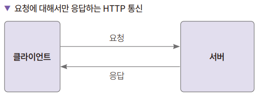  
  
웹은 HTTP 프로토콜 위에서 동작하고 있기 때문에 요청을 보내야지만 서버가 응답을 주게 된다. 즉 양방향 통신을 지원하지 않는다. 그렇다고 주기적으로 
받아오는 것은 매우 비효율적이다. 몇 초에 한 번씩 서버가 알아서 응답을 주면 좋은데 단방향 통신이므로 클라이언트에서 주기적으로 의미없는 요청을 
보내야 하기 때문이다.  
  
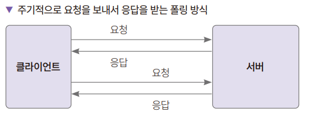  
  
이럴 때 웹소켓(WebSocket)을 사용한다. 웹소켓 이전에는 폴링 또는 롱폴링이라는 방법을 사용했다. 폴링은 주기적으로 요청을 보내는 방식이고 롱폴링은 
클라이언트와 서버 간의 커넥션을 유지한 상태로 응답을 주고받는 방식이다. 클라이언트가 서버로 요청을 보내면 서버는 클라이언트의 요청을 기다린다. 
그리고 요청한 데이터에 변화가 있을 때 응답을 보낸다. 폴링이나 롱폴링은 둘 다 클라이언트가 서버에 요청을 보내야 한다.  
  
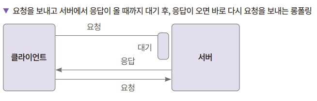  
  
웹소켓은 하나의 TCP 커넥션으로 서버와 클라이언트 간에 양방향 통신을 할 수 있게 만든 프로토콜이다. 2023년 기준 거의 대부분의 웹브라우저에서 안정적으로 
사용할 수 있다. 오래된 브라우저를 지원하려면 socket.io 같은 라이브러리를 사용해 폴링이나 롱폴링을 사용해 기능을 구현해야 한다. 웹소켓은 양방향 
통신을 지원하므로 브라우저 상에서 리프레시 없이 실시간성을 요구하는 애플리케이션을 구현할 수 있다.  
  
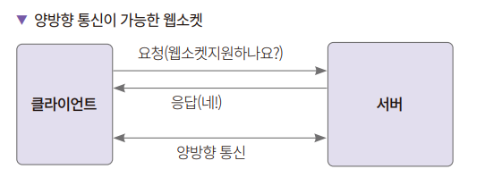  
  
웹소켓의 특징은 크게 두 가지다. 첫 번째 특징은 양방향 통신이다. 이는 데이터의 송수신을 동시에 처리한다는 뜻이며 클라이언트와 서버가 원하는 때 
데이터를 주고받을 수 있다는 의미다. 통상적인 HTTP 통신은 클라이언트가 요청하는 때만 서버가 응답하는 단방향 통신이었다. 두 번째 특징으로는 실시간 
네트워킹을 구현하는 것이 용이하다는 것이다. 웹 환경에서 연속된 데이터를 빠르게 노출하고 싶은 때 (채팅, 주식) 적합하다. 또한 브로드캐스팅을 지원하므로 
여러 클라이언트와 빠르게 데이터를 교환할 수 있어 편리하다.  
  
# **웹소켓의 동작 방법**  
웹소켓 프로토콜은 크게 핸드 쉐이크와 데이터 전송으로 나눌 수 있다. 핸드 쉐이크는 서버와 클라이언트가 커넥션을 맺는 과정으로써 최초 한 번만 일어난다. 
이떄는 HTTP 1.1 프로토콜을 사용하고 헤더에 Upgrade: websocket과 Connection: Upgrade를 추가해서 웹소켓 프로토콜을 사용하도록 해준다.  
  
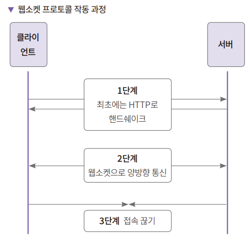  
  
1단계에서는 HTTP 핸드쉐이크를 수행해 연결을 맺는다. 클라이언트가 다음과 같은 데이터를 서버로 보낸다.  
  
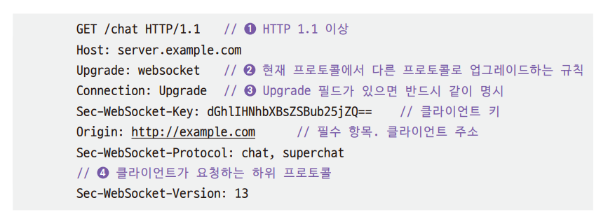  
  
핸드쉐이킹은 GET으로 보내야 하며 HTTP 1.1 이상이 필수다. Upgrade 필드는 HTTP 프로토콜에서 웹소켓 프로토콜로 변경에 필요한 값이다. 프로토콜을 
업그레이드하려면 반드시 명시해야 한다. Connection: Upgrade 는 Upgrade 필드가 있으면 반드시 같이 명시해야 한다. 없으면 연결이 되지 않는다. 
Sec-WebSocket-Protocol은 클라이언트가 요청하는 하위 프로토콜이다. 순서에 따라서 우선순위를 부여하며 서버에서 여러 프로토콜이나 프로토콜 버전을 나눠서 
서비스할 때 필요한 정보다.  
  
그러면 서버는 핸드쉐이크의 응답으로 다음과 같은 데이터를 보내준다.  
  
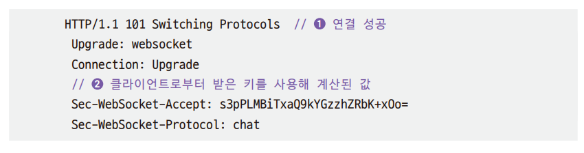  
  
101 Switching Protocols로 응답이 오면 웹소켓 프로토콜로 전환되어 연결이 잘된다는 것을 의미한다. 이제부터는 양방향 송수신을 할 수 있다. 
Sec-WebSocket-Accept는 클라이언트로부터 받은 키를 사용해 계산한 값이다. 해당 값은 클라이언트와 서버 간 인증에 사용된다. 핸드쉐이크가 완료되면 
프로토콜이 HTTP에서 ws로, HTTPS라면 wss로 변경되어 데이터를 전송할 수 있는 2단계로 접어든다. 데이터는 메시지(message)라 부르며 메시지는 프레임(frame)
의 모음이다. 프레임은 바이트의 배열이며 다음과 같은 형태를 가진다.  
  
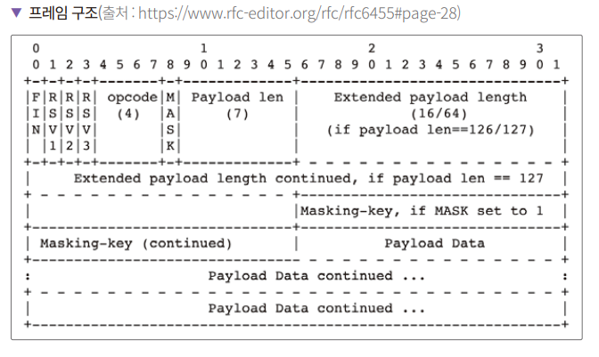  
  
프레임은 헤더와 페이로드(Payload)로 이루어져 있다. 헤더는 FIN, RSV1~3, 오프코드(opcode), 마스크(MASK), 페이로드 길이, 마스킹 키가 있다.  
  
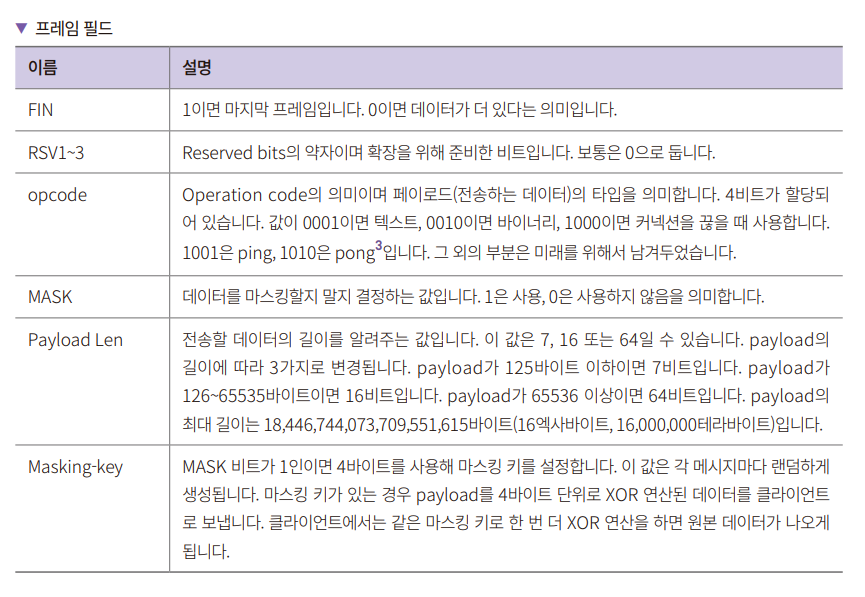  
  
마지막 3단계에서는 접속을 끊는다. 접속은 클라이언트와 서버 양쪽에서 모두 끊을 수 있으며 opcode에 1000을 담아서 보내면 된다.  
  
웹소켓은 데이터를 전송하는 것만 지원할 뿐 전송되는 데이터를 가지고 무엇을 할지는 개발자의 몫이다. socket.io를 사용하면 추가로 이런 부분들을 
지원해주므로 웹소켓보다는 코드 작성의 부담이 적다.  
  
# **메아리 애플리케이션 만들기: 웹소켓**  
클라이언트에서 메시지를 보내면 서버에서 같은 메시지를 반환하는 프로그램이다.  
  
# **ws 패키지 설치하기**  
1. ws는 Node.js에서 웹소켓 서버를 구동하는 라이브러리다. 먼저 프로젝트 디렉터리를 생성하고 패키지를 설치한다. echo-websocket 디렉터리를 프로젝트 
디렉터리로 생성한다.  
npm install ws  
  
echo-websocket 디렉터리 아래에 package.json과 package-lock.json 파일, node_modules 디렉터리가 생성된다.  
  
# **서버 측 구축하기: server.js 파일 작성 및 서버 구동**  
ws 패키지를 설치했으니 이제 웹소켓 서버를 Node.js를 사용해 구동할 수 있다. 웹소켓은 서버와 클라이언트가 양방향으로 통신하는 프로토콜이므로 서버와 
클라이언트를 모두 작성해야 한다. 서버는 Node.js를, 클라이언트는 웹브라우저를 사용한다.  
  
1. 먼저 서버를 구동하기 위해 server.js 파일을 생성하고 다음과 같이 작성한다.  
echo-websocket/server.js  
  
ws의 Server() 함수를 사용해 서버 인스턴스를 생성하고 server 변수에 저장한다. server는 WebSocketServer 클래스의 인스턴스다. 웹소켓 서버(server 변수)의 
on() 함수는 이벤트를 받는 함수다. 첫 번째 인수로 이벤트 유형을 받는다. connection은 클라이언트가 접속 시 발생하는 이벤트다. 두 번째 인수로 
이벤트 발생 시 실행할 콜백 함수를 인수로 설정한다. 콜백 함수의 인수로 ws를 받는데 WebSocket 클래스의 인스턴스다.  
  
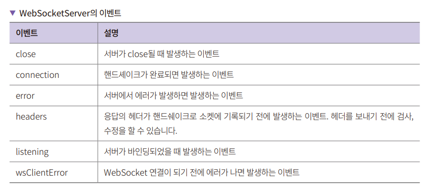  
  
ws.on() 함수는 클라이언트에서 이벤트가 발생할 때 실행하는 함수다. WebSocketServer의 on() 함수처럼 첫 번째는 이벤트 타입, 두 번째는 콜백 함수를 
인수로 사용한다. ws.on('message')는 클라이언트로부터 메시지가 서버로 발송되었을 때 실행한다.  
  
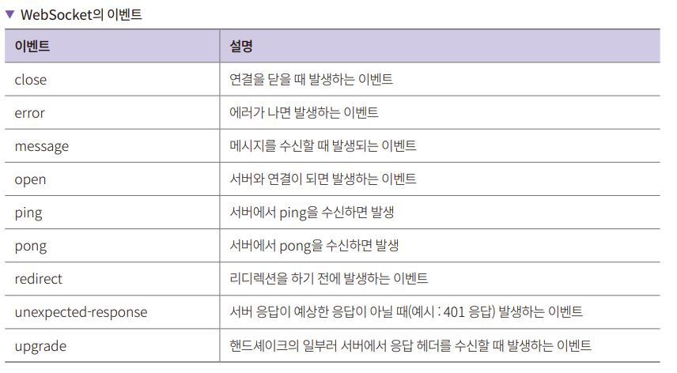  
  
ws.on('close', 콜백 함수)는 클라이언트가 접속을 종료했을 때 실행한다.  
  
# **클라이언트 측 구현하기: client.html 파일 작성**  
1. 클라이언트로 사용할 index.html 파일에 웹소켓 연결을 하고 메시지를 주고받을 수 있도록 작성한다.  
echo-websocket/client.html  
  
웹소켓 연결은 new WebSocket(서버 주소)를 하면 맺어진다. 웹브라우저에는 웹소켓 기능이 이미 있기 때문에 별도로 라이브러리를 추가하지 않아도 된다. 
반환값으로 WebSocket의 인스턴스가 돌아오는데 해당 값을 ws 변수에 저장한다.  
  
send()는 메시지를 서버로 발송하는 함수다. 서버에서는 웹소켓의 message 이벤트가 발생한다.  
  
close()는 웹소켓 연결 종료 시 사용하는 함수다.  
  
onopen()은 서버와 연결되면 발생하는 이벤트인 open의 이벤트 핸들러다. 서버와 연동되면 실행한다.  
  
onmessage()는 서버에서 메시지를 수신하면 발생하는 이벤트의 핸들러다.  
  
# **테스트하기**  
1. 우선 서버를 띄운다.  
node server.js  
  
터미널에 아무 값도 안 올라오지만 에러가 나면서 종료되는 게 아니라면 성공이다.  
  
2. 다음으로 브라우저에서 client.html을 실행해서 서버에 접속한다.  
  
3. 개발자 도구의 네트워크 탭으로 들어가면 client.html이 있고 localhost가 있다. localhost를 선택하면 데이터가 출력된다. 아래 화살표는 서버에서부터 
메시지를 받았다는 의미다. 위쪽 화살표는 서버로 메시지를 보낸다는 의미다.  
  
4. 텍스트 영역에 입력 후 전송 버튼을 클릭해 서버로 메시지를 보낸다.  
  
5. 종료 버튼을 눌러서 연결을 끊는다.  
  
# **향후 과제 확인**  
브라우저를 두 개 띄워서 테스트를 해보면 메세지를 공유하는게 아닌 따로따로 동작한다. 이는 웹소켓의 경우 메시지를 브로드캐스팅(접속한 클라이언트에 각각 
보내주는 것) 기능을 따로 구현해야 하기 떄문이다. 웹소켓은 데이터를 주고받을 수 있게 하는 것뿐이라서 웹소켓을 사용하는 경우 데이터 전송 이외의 부분은 
모두 개발자가 개발해야 한다.  
  
그래서 웹소켓으로 된 애플리케이션을 만들 때 도움을 주는 sockjs, socket.io 같은 라이브러리 구현체들이 있다. 이 중 대표적인 것이 socket.io이고 
채팅방 기능이나 연결이 끊어졌을 때 재접속, 브로드캐스팅 기능을 제공해준다.  
  
# **간단한 채팅 애플리케이션 만들기: socket.io**  
이전에는 프레임워크의 도움 없이 웹소켓을 사용했다. 이번에는 NestJS로 채팅 애플리케이션을 구현한다. 채팅을 만들려면 채팅방도 만들어야 하고 접속한 
유저 모두에게 메시지를 발송하는 브로드캐스팅 기능도 필요하고 접속이 의도치 않게 끊어졌을 때 재접속하는 방법도 필요하다. 웹소켓은 프로토콜이기 떄문에 
이렇게 특화된 기능은 제공하지 않고 메시지 전송만을 제공해주고 있어서 개발자가 모든 것을 다 만들어야 한다.  
  
socket.io는 웹소켓을 기반으로 서버와 클라이언트의 양방향 통신을 지원하는 라이브러리다. 기본적으로 웹소켓을 지원한다. 웹소켓을 지원하지 않는 브라우저에서는 
롱폴링 방식을 사용한 통신을 지원한다. 또한 재접속, 브로드캐스팅, 멀티플렉싱(채팅방) 기능도 제공한다.  
  
NestJS에서는 웹소켓과 socket.io 기반의 실시간 애플리케이션 제작을 모두 지원한다.  
  
# **socket.io 프로젝트 생성하기**  
nest new nest-chat --skip-git  
  
test 디렉터리와 src/app.controller.spec.ts는 사용하지 않으므로 삭제한다.  
  
# **패키지 설치하기**  
양방향 통신 애플리케이션을 작성하려면 @nestjs/websockets과 @nestjs/platform-socket.io 패키지가 필요하다. 첫 번째 @nestjs/websockets 패키지는 
웹소켓 프로토콜 기반의 프로그램 작성 시에는 꼭 필요하다. @nestjs/platform-socket.io는 @nestjs/platform-ws로 변경할 수도 있다. @nestjs/platform-ws를 
사용하면 socket.io가 아닌 웹소켓을 사용한다. 우리는 socket.io를 사용하므로 @nestjs/platform-socket.io를 설치한다. 또한 개발 시 타입 정보를 편하게 
가져오기 위해 @types/socket.io도 개발용 패키지로 설치한다.  
  
npm i @nestjs/websockets @nestjs/platform-socket.io  
npm i -D @types/socket.io  
  
# **html 파일을 불러오도록 main.ts 설정하기**  
프레임워크를 사용하지 않았을 때는 .html 파일을 직접 열어서 테스트했다. NestJS에서는 정적 파일을 불러오는 기능을 제공한다. 이전에는 server-static 패키지를 
설치했지만 이번에는 익스프레스를 사용해서 정적 파일을 서비스할 수 있게 설정을 추가한다. 설정이 간단할 때는 익스프레스, 정밀한 설정을 원할 때는 server-static을 
사용하면 된다.  
nest-chat/src/main.ts  
  
NestFactory.create() 메서드에 NestExpressApplication으로 반환값의 타입을 지정했다. NestExpressApplication에는 useStaticAssets() 
메서드가 있다. 해당 메서드는 정적 파일의 경로를 지정하는 데 사용한다.  
  
useStaticAssets()에 정적 파일의 경로를 지정한다.  
  
다음으로 static 디렉터리 아래에 index.html 파일을 생성한다. index.html로 하면 URL 경로와 파일명을 모두 적지 않고 경로만 적어도 index.html을 
불러오기 떄문에 테스트가 편하다. 잘 불러오는지만 테스트하는 용도이므로 간단히 코드를 작성한다.  
nest-chat/static/index.html  
  
# **서버 측 작업을 위한 게이트웨이 만들기**  
NestJS에서는 웹소켓을 사용한 통신을 받아주는 클래스를 게이트웨이라고 부른다. 컨트롤러 클래스와 같은 개념이라고 생각하면 된다. 게이트웨이를 사용하면 
의존성 주입, 데코레이터, 필터, 가드 등의 NestJS 기능을 사용할 수 있다. 단순하게 말하자면 프로토콜이 HTTP라면 컨트롤러로부터 요청을 받고 프로토콜이 
ws라면 게이트웨이로부터 요청을 받는 차이다. 진입점이 다르고 사용하는 데코레이터가 약간 달라진다.  
  
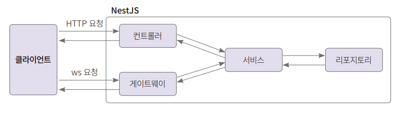  
  
게이트웨이를 만드는 방법은 쉽다. @WebSocketGateway() 데코레이터를 클래스에 붙이면 해당 클래스는 게이트웨이 역할을 한다. nest-cli 명령어로 만들 
수 있지만 불필요한 디렉터리가 생성된다. 그러므로 수동으로 작성한다.  
cli -> nest g gateway chat -> src/chat/chat.gateway.ts  
  
게이트웨이 파일을 다음과 같이 작성한다.  
nest-chat/src/app.gateway.ts  
  
@WebSocketGateway() 데코레이터는 게이트웨이 설정을 위한 데코레이터다. 내부적으로는 socket.io 서버를 생성하는 것과 같고 생성 시의 옵션도 동일하게 
줄 수 있다. socket.io 서버 옵션 중 자주 사용하는 옵션은 네임스페이스(namespace)가 있다. 다른 옵션들은 저수준의 옵션이 많으니 크게 사용할 일이 
많지는 않다.  
  
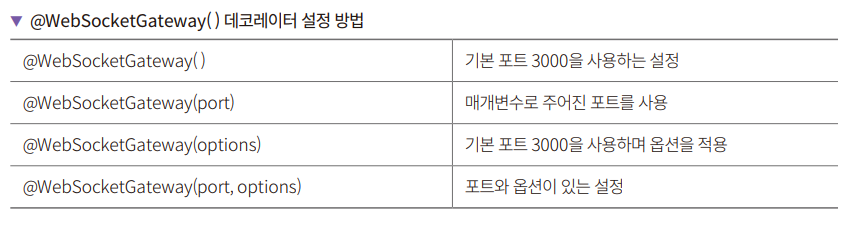  
  
@WebSocketServer()는 웹소켓 서버 인스턴스에 접근하는 데코레이터다. 직접 웹소켓 서버의 인스턴스를 생성하는 것이 아니기에 웹소켓 인스턴스 접근은 
@WebSocketServer() 데코레이터를 사용해야 한다.  
  
@SubscribeMessage('message')는 'message'라는 이벤트를 구독하는 리스너다. 클라이언트에서 message라는 이벤트로 데이터가 전송되는 경우 data 인수에 
데이터가 담겨 있다. socket: Socket은 하나의 웹소켓 연결에 대한 인스턴스다. @SubcribeMessage() 데코레이터가 붙어 있는 메서드는 socket과 data 
두 가지 인수를 사용할 수 있는데 필요 없는 떄는 생략할 수 있다. 다만 생략하면 매개변수의 순서를 변경할 때 별도의 데코레이터를 붙여주어야 한다. 
data는 @MessageBody() 데코레이터가 필요하며 socket에는 @ConnectedSocket() 데코레이터가 필요하다. socket이 필요 없는 함수라면 handleMessage(@MessageBody() data)와 
같은 형태로 사용할 수 있다.  
  
웹소켓 서버 인스턴스의 emit() 메서드를 사용해 클라이언트 전체에 메시지를 보낸다. 첫 번쨰 인수인 message는 이벤트명, 두 번째 인수는 보내주는 
데이터다. socket.io에서는 모든 클라이언트 인스턴스에 임의의 id 값을 준다. id에는 무작위 문자열이 저장되어 있다.  
  
# **게이트웨이를 모듈에 등록하기**  
1. 작성한 게이트웨이를 사용하려면 모듈에 등록해야 한다. app module에 있는 클래스이므로 app.module.ts에 등록을 해준다.  
nest-chat/src/app.module.ts  
  
게이트웨이는 컨트롤러가 아니라 다른 클래스에 주입해서 사용할 수 있는 프로바이더이므로 프로바이더에 등록한다.  
  
# **클라이언트를 위한 index.html 수정하기**  
웹소켓은 클라이언트인 브라우저에서 따로 라이브러리를 사용할 필요가 없었다. 이유는 표준 프로토콜이라서 브라우저 자체적으로 웹소켓을 지원하기 떄문이다. 
반면 socket.io는 브라우저에서 따로 지원해주지 않으므로 클라이언트에서 socket.io를 사용하도록 라이브러리 설정도 필요하다. src/static/index.html 파일을 
다음과 같이 수정한다.  
nest-chat/static/index.html  
  
emit 함수를 실행하면 message 이벤트로 설정해 놓은 이벤트에 message 값을 실어서 보낸다. emit() 함수는 특정 이벤트로 데이터를 보내는 데 사용한다. 
socket.on() 함수로 데이터를 받는다. connect는 socket.io에서 제공하는 이벤트다. 최초로 서버 접속이 성공했을 때 실행된다.  
  
# **테스트하기**  
1. npm run start:dev로 서버를 기동시키고 브라우저 3개를 켜서 모두 http://localhost:3000에 접속한다.  
  
2. 3개의 브라우저에서 각각 입력 메시지를 적어 전송 버튼을 누른다. 채팅이 잘되면 성공이다.  
  
# **채팅방 기능이 있는 채팅 애플리케이션 만들기**  
socket.io은 채팅방을 만드는 room 기능을 제공한다. 채팅방별로 메시지를 통신해야 하므로 네임스페이스도 같이 사용한다. 네임스페이스는 네임스페이스로 
지정된 곳에만 이벤트를 발생시키고 메시지를 전송하는 개념이다.(다른 말로 멀티플렉싱이라고도 한다) 슬랙의 워크스페이스나 게임의 채널 개념과 비슷하다. 
네임스페이스 안에 룸을 만들 수도 있다. 네임스페이스와 룸을 같이 사용함으로써 조금 더 정교하게 메시지 송수신을 제어할 수 있다.  
  
# **네임스페이스 사용하기**  
서버와 클라이언트는 실제적으로는 하나의 연결(HTTP 혹은 웹소켓)만을 사용한다. 하나의 연결을 로직으로 나누어서 사용할 수 있게 한 것이 네임스페이스다. 
예를 들어 사용자가 채팅방에 입장하기 전에 메시지를 주고받는 내용은 chat 네임스페이스의 message 이벤트를 사용하고 채팅방에 입장 후에는 room 
네임스페이스의 message 이벤트를 사용하게 할 수 있다.  
  
1. 기존 채팅 애플리케이션을 조금 수정해 기본값 대신 chat 네임스페이스를 할당한다. gateway를 수정한다.  
nest-chat/src/app.gateway.ts  
  
게이트웨이 설정을 위한 데코레이터에 옵션값으로 네임스페이스를 지정해주면 된다.  
  
2. index.html에서 자바스크리브 코드를 분리 후 수정하는 작업을 진행한다.  
nest-chat/static/index.html  
  
3. 자바스크립트 부분은 따로 떼어서 src/static/script.js 파일로 새로 생성한다.  
nest-chat/static/script.js  
  
클라이언트 측에서 네임스페이스를 추가하는 방법은 socket.io 객체 생성 시의 주소값 뒤에 네임스페이스를 붙여주면 된다.  
  
복잡한 프로그램을 만들면 네임스페이스는 반드시 필요하다.  
  
# **닉네임 추가하기**  
1. 웹페이지 진입 시 입력한 닉네임을 사용하도록 변경한다.  
nest-chat/static/script.js  
  
서버에 전송한 메시지는 내 화면에 표시되지 않고 다른 사람 화면에만 표시되도록 브로드캐스팅을 한다. 닉네임을 저장했으므로 닉네임도 같이 전송한다.  
  
2. 다음으로 케이트웨이를 수정한다.  
nest-chat/src/app.gateway.ts  
  
데이터를 다시 클라이언트에 전송할 때 기존에는 server.emit() 함수를 사용했지만 server.emit()은 나를 포함한 모든 클라이언트에게 전송한다. 
socket.broadcast.emit() 함수를 사용하면 전송을 요청한 클라이언트를 제외하고 다른 클라이언트들에게 데이터를 전송하므로 채팅할 때 내 메시지와 
상대방 메시지를 구분하기 용이하다.  
  
이후 같은 방식으로 테스트를 진행한다.  
  
# **채팅방 생성하기**  
socket.io의 room 기능을 사용해 채팅방을 구현할 수 있다. 채팅방 생성 및 입장 기능을 만든다.  
  
1. index.html을 수정한다. 채팅방 목록을 보여주는 기능과 채팅방 추가 기능을 구현한다. 채팅방 추가 버튼을 클릭하면 동작하는 함수는 script.js에 
작성한다.  
nest-chat/static/index.html  
  
2. createRoom() 함수는 script.js에 추가한다.  
nest-chat/static/script.js  
  
room이라는 채팅방용 네임스페이스를 하나 더 만들어서 채팅방용 이벤트만 처리하는 용도로 사용한다. 서버 측에서는 게이트웨이 클래스를 하나 더 추가해야 
한다. 채팅방 생성 버튼 클릭 시 방 이름과 nickname을 createRoom 이벤트로 보내준다. roomSocket.on("rooms")는 서버에서 createRoom 이벤트 처리 후 다시 
클라이언트로 데이터를 송신할 때 해당 데이터를 받아주는 이벤트 핸들러다.  
  
3. 게이트웨이 추가 및 추가한 게이트웨이를 프로바이더로 모듈에 등록한다.  
nest-chat/src/app.gateway.ts  
  
room 이라는 네임스페이스를 사용하는 RoomGateway 클래스를 새로 추가한다. @WebSocketServer() 데코레이터는 서버 인스턴스 접근을 위해 사용한다. 
server 변수를 통해 socket.io 서버 인스턴스에 접근해 서버의 메서드를 사용할 수 있다. createRoom 이벤트를 처리하는 핸들러 메서드는 소켓을 따로 
사용하지 않으므로 data만 있다. 그러므로 @MessageBody() 데코레이터가 필요하다.  
  
게이트웨이를 프로바이더로 등록  
src/app.module.ts  
  
# **공지 영역과 채팅방 입장 구현하기**  
1. index.html에는 공지 영역만 추가하면 된다.  
nest-chat/static/index.html  
  
2. 다음으로 script.js에서는 채팅방 입장 시 실행하는 함수인 joinRoom() 함수를 추가로 구현한다.  
nest-chat/static/script.js  
  
joinRoom 함수에서는 room 네임스페이스에 joinRoom 이벤트를 발생시킨다. 특정 방에 소속되어 있으면 반드시 나가기를 해줘야 방이 바뀌므로 입장 전에 
현재 방에서 나가야 한다. 그러므로 현재 속한 방 값을 나가야 하는 방 값으로 변경해서 서버로 보내준다.  
  
3. 클라이언트에서 보낸 값을 처리할 서버 측 게이트웨이 클래스를 수정해준다. 공지사항과 채팅방 입장 기능을 같이 구현한다.  
nest-chat/src/app.gateway.ts  
  
게이트웨이는 프로바이더다. 즉 다른 곳에 의존성을 주입해 사용할 수 있다. 이는 게이트웨이 클래스 간에도 동일하게 적용할 수 있다. 이미 만들어둔 
ChatGateway를 RoomGateway에 의존성을 주입해 사용할 수 있게 했다. ChatGateway의 인스턴스는 공지를 처리하는 데 사용한다.  
  
handleJoinRoom() 메서드는 joinRoom 이벤트를 처리하는 이벤트 핸들러 메서드다. 기존의 방에서 나가야만 다른 방에 입장이 가능하므로 다른 방에 입장 시 
먼저 나가는 함수를 실행한다. 채팅방에 입장하는 법은 socket.join(채팅방)을 사용하면 되며 나가는 방법은 socket.leave(채팅방)을 사용하면 된다.
  
# **채팅방에서 대화 나누기 구현하기**  
1. 전송 버튼 클릭 시에 채팅방으로 메시지가 가도록 script.js 파일과 RoomGateway에 핸들러 함수를 추가해야 한다.  
nest-chat/static/sciprt.js  
  
