# **알아두면 좋은백엔드 개발자를 위한 지식**  
# **백엔드 개발자가 알아야 하는 것**  
백엔드 개발자가 알아야 하는 지식 로드맵  
  
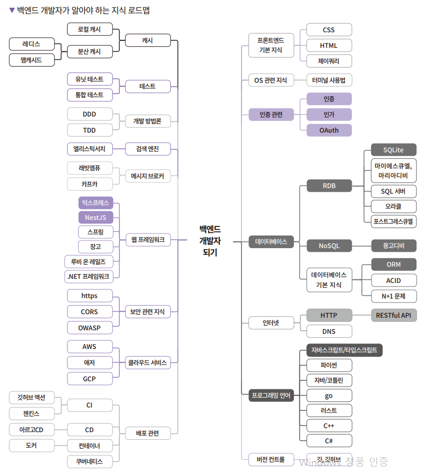  
  
백엔드는 시스템의 뒷단을 의미한다.  
  
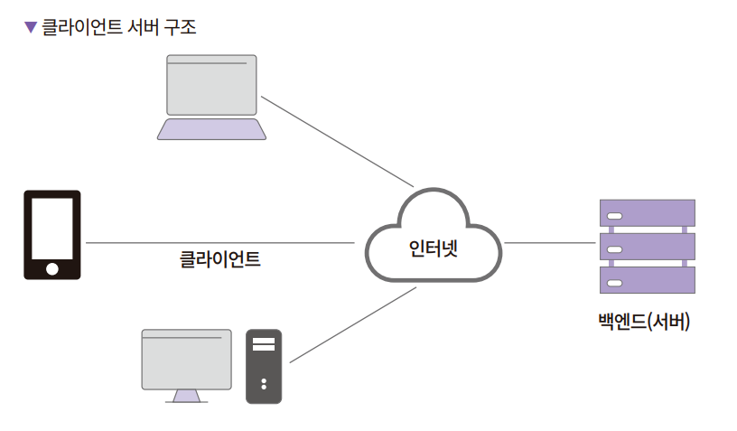  
  
백엔드 개발자가 만드는 프로그램인 서버는 1년 365일 24시간 내내 꺼지지 않는 컴퓨터에서 돌아간다. 주로 리눅스나 서버용 윈도우를 운영체제로 사용한다. 
그러므로 서버에 대한 이해가 필요하고 서버 운영체제에 대한 학습이 필요하다.  
  
또한 대부분의 리눅스 서버에서는 마우스를 사용하지 않고 오직 키보드로 명령을 내려서 프로그램을 조작한다. 서버의 컴퓨팅 자원을 최대한으로 활용하고 
빠르게 명령어를 실행하려면 명령줄 인터페이스(Command Line Interface, CLI) 환경에서 서버를 운영하는 것이 유리하기 때문이다 (GUI에는 컴퓨팅 리소스가 
소모됨). 그러므로 리눅스 명령이나 윈도우의 CLI 명령어를 익혀서 자유자재로 명령을 내릴 수 있어야 한다. 콘솔창에서 사용하는 에디터도 하나 정도는 
익혀두는 것이 좋다. 빔(vim)과 이맥스(emacs)가 대표적이다.  
  
클라이언트는 서버로 요청을 보낸다. 이때 미리 정해놓은 약속인 프로토콜을 사용한다. 프로토콜은 네트워크라는 큰 범주의 일부다. 네트워크 지식으로는 
HTTP, TCP/UDP, 라우팅, NAT, OSI 7 계층 등이 있다.  
  
HTTP와 더불어 함께 알아야 하는 것이 DNS(Domain Name System)다. IP는 총 32비트로 이루어진 IPv4와 128비트로 이루어진 IPv6가 있다. 보통 이런 
주소값을 외우지는 않기 때문에 사람이 외우기 편한 언어로 된 주소를 사용하는데 이것이 도메인이고 이런 도메인 주소를 IP주소로 변경하는 것이 DNS다.  
  
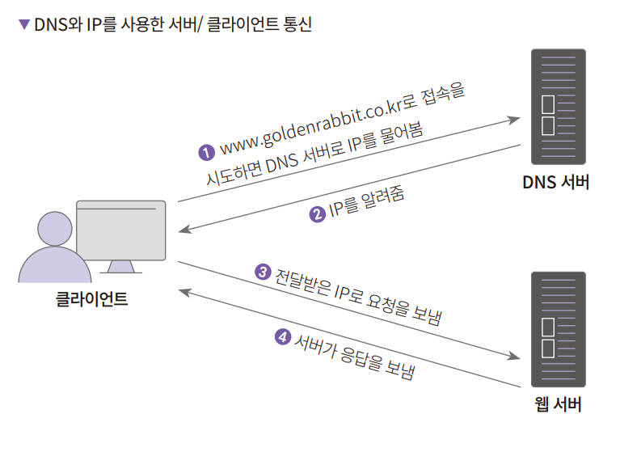  
  
서버에서는 HTTP 요청을 받아서 다양한 처리를 할 수 있는 프로그램을 실행시켜야 한다. 클라이언트의 요청은 이미지 같은 파일일 수도 있고 데이터 처리 
작업일 수도 있다. 백엔드에서는 파일이나 이미지 같은 정적인 파일을 서비스하는 서버를 웹 서버, 데이터를 처리하는 서버를 WAS(Web Application Server)라고 
부른다. 대표적인 웹 서버로 아파치와 엔진엑스가 있으며 WAS로는 톰캣, 웹스피어가 있다.  
  
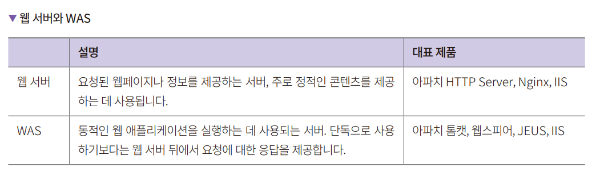  
  
WAS도 정적 파일(클라이언트가 요청할 때 변하는 내용 없이 응답을 주는 파일들)을 처리할 수는 있지만 이런 일은 Nginx 같은 웹 서버가 훨씬 더 잘하는 
일이다. 반면에 WAS는 스프링이나 장고 같은 웹 프레임워크를 실행싴서 요청받은 데이터를 처리하는 역할을 잘한다. 데이터는 보통 데이터베이스에 저장하게 
되며 클라이언트가 자주 요청하는 데이터는 캐시에 둔다. 캐시는 디스크가 아니라 메모리에 데이터를 저장해서 읽는 속도를 높이는 방식을 말한다.  
  
데이터의 저장소로 데이터베이스를 주로 이용한다.  
  
WAS에 사용하는 프로그램을 자체적으로 만들기보다는 대부분은 프레임워크를 사용한다. 프레임워크는 개발에 필요한 예외 처리, 데이터베이스 연결, 외부 
라이브러리 연동 등의 기능을 추상화해 제공해주어 코드 구조의 일관성을 지키는 데 도움을 준다. 덕분에 개발자는 비즈니스 로직 개발에 더 집중할 수 있다.  
  
백엔드 개발자가 코딩을 한다고 말할 때는 보통 프레임워크를 기반으로 요구사항에 필요한 코드들을 추가한다는 의미다. 코드를 작성하려면 프로그래밍 언어를 
알아야 한다. 백엔드 프로그래밍 언어로는 자바스크립트, 타입스크립트, 자바, 코틀린, 파이썬, 고랭, 러스트, C#, C++ 등이 있다.  
  
코드를 작성하는 것이 매우 중요하지만 작성한 코드를 관리하는 것도 매우 중요하다. 최근에 대부분이 소스 코드 관리 시스템과 저장소로 깃과 깃허브를 사용한다.  
  
테스트는 사람이 수동으로 하는 테스트와 테스트 코드를 작성해서 하는 테스트가 있다. 개발 쪽에서 말하는 테스트는 대부분 테스트 코드로 실행하는 테스트를 
말한다. 단위 테스트는 하나의 작은 기능이 잘 동작하는지 테스트 코드를 작성하는 것을 말하고 통합 테스트는 함께 동작해야 하는 데이터베이스나 다른 
서버등과 의존성이 있는 상태에서 함께 테스트하는 것을 말한다.  
  
배포는 개발하고 테스트가 완료된 코드를 서버에 전달하고 실행하는 것을 의미한다. 영어 음차 그대로 디플로이라고도 부른다. 소스 코드를 배포해서 실행하는 
경우도 있고 자바처럼 jar와 같은 패키지 형태를 받아서 실행하는 경우도 있다. 컨테이너 환경(예: 도커)을 이용하면 개발과 실제 운영 서버의 환경을 
동일하게 맞추어 테스트할 수 있다. 배포는 스크립트를 만들어서 배포하는 경우도 있으며 컨테이너 환경의 경우 쿠버네티스라는 기술을 사용해 배포하기도 한다.  
  
# **백엔드 개발자의 업무**  
백엔드 개발자의 주된 업무는 서버 측 애플리케이션을 개발하는 일이다. 개발하면서 서버에 대한 지식과 프로그래밍 지식, 만든 프로그램을 배포하고 안전하게 
서비스할 수 있게 하는 지식을 활용한다. 백엔드 개발자의 업무는 조직마다 천차만별이지만 대개는 과제 할당 -> 과제 분석 -> 개발 -> 테스트(리뷰) -> 
QA 및 버그 수정 -> 배포 -> 유지보수 순서로 진행된다.  
  
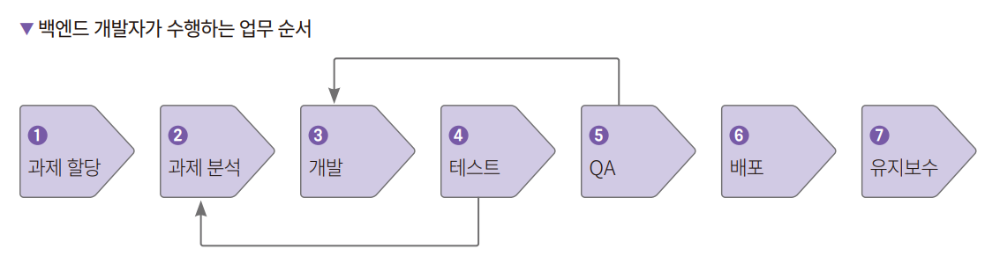  
  
시작은 주어진 과제를 분석하는 일이다. 사업무, 마케팅, 개발팀 등에서 개발 과제가 할당된다. 잘 정리된 과제는 어떻게 개발해야 하고 무엇을 해야 하는지도 
알려주지만 대부분에 구체적인 개발 관점 검토는 개발자가 직접 해야 한다.  
  
예를 들어 친구 초대 이벤트를 만들어주세요 라는 과제가 주어졌다고 하자.  
  
친구는 무엇인지, 초대는 무엇을 의미하는지, 이벤트에는 어떤 조건이 필요하고 초대를 한 친구와 초대된 친구에게 보상을 어떻게 줄지, 이벤트를 위해서 어떤 
데이터들을 저장하는지를 결정해야 한다. 또한 제공할 성능과 사용할 기술을 검토하고 문제가 있다면 해결 방법도 면밀하게 분석하고 정리해야 한다.  
  
오늘날 서비스는 복잡하므로 작은 기능에서 발생하는 문제 하나가 서비스 전체의 문제로 이어질 수 있다. 혼자 공부용으로 작성하는 예제 프로그램이 아니라면 
과제 분석은 필수다.  
  
과제 검토가 끝났으니 개발을 진행하면 된다. 늘 해본 일만 개발하는 것이 아니다. 그래서 개발 과제를 분석할 때 고려하지 않은 문제가 나타나기도 합니다. 
그리고 한 번 만큰 코드가 제대로 동작하는지도 테스트해야 한다. 그래서 개발은 분석 -> 개발 -> 테스트 사이클을 반복하면서 완성도를 높여가며 진행된다. 
개발한 코드는 깃허브 등의 프로그램을 사용해 동료의 리뷰를 받고 리뷰에 대한 내용을 반영해서 코드의 완성도를 높여 코드베이스에 추가한다.  
  
개발하면서 개발자 스스로 테스트를 해봐야 한다. 로직상 문제는 없는지, 성능적인 한계는 어느 정도인지, 만든 코드가 읽기 편한지, 내가 만든 클래스/메서드/
함수를 다른 사람이 간편하게 사용할 수 있는지 등을 검토하면서 테스트를 한다. 조직이나 개발자에 따라 단위 테스트를 작성하는 경우도 있다. 때로는 
코드보다 테스트를 먼저 작성하는 테스트 주도 개발 기법을 사용하기도 한다.  
  
개발과 테스트가 어느 정도 마무리됐다면 애플리케이션의 품질을 높이기 위해 QA를 신청한다. QA팀이 없는 회사라면 개발 조직에서 담당한다.  
  
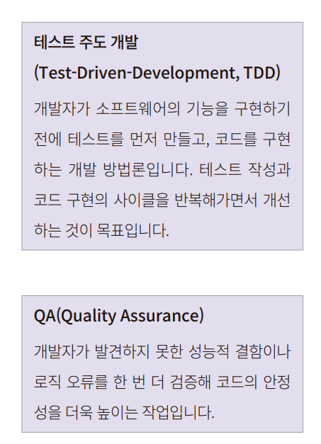  
  
QA가 완료되면 서버에 배포를 진행한다. 때에 따라서 여러 과제를 한 번에 병합(머지라고도 한다)해서 배포하거나, 새로운 기능이 추가될 떄마다 배포한다. 
애플리케이션을 쉽고 안전하게 배포하고 문제 발생 시 쉽게 롤백할 수 있게 준비해둬야 한다.  
  
배포 방법은 여러 가지다. 먼저 특정 개수의 서버들을 돌아가며 배포하는 롤링 배포, 똑같은 서버 인스턴스를 띄우고 로드밸런서 설정을 바꿔버리는 블루 
그린 배포, 전체 서버의 특정 비율만큼 배포해보고 문제없는 경우 점점 배포를 늘려가는 카나리 배포 등이 있다.  
  
토커 같은 컨테이너 기술이 등장하면서 배포가 더욱 쉬워졌다. 쿠버네티스를 사용하면 배포와 관리를 쉽게 할 수 있는 장점이 있다. 서버를 돌아가면서 배포하는 
롤링 배포도 앤서블(Ansible)을 잘 사용하면 손쉽게 구현할 수 있다.  
  
개발자는 코드의 개발부터 테스트, 배포, 모니터링까지 사실상 무한 반복을 한다. 이것을 두고 흔히 CI(Continuous Integration)/CD(Continuous Delivery & Continuous Deployment) 
라고 한다. CI는 지속적 통합이라는 뜻으로 새로운 코드 변경 사항이 정기적으로 빌드 및 테스트되어 저장소에 통합되는 것을 의미한다. CD는 지속적인 배포를 
말한다. CI는 저장소에 코드가 반영되는 것을 말하고 CD는 실제 프로덕션 환경까지 변경된 코드가 반영되는 것을 의미한다.  
  
CI/CD와 같은 업무를 전담하는 데브옵스(DevOps) 업무도 있다. 개발(Development)과 운영(Operations)의 합성어이지만 두 업무를 모두하는 것을 의미하는 
것은 아니다. 주로 클라우드 마이그레이션, 피크 타임의 트래픽을 다루기, 데이터 파이프라인 작성, 모니터링 시스템 구축, 네트워크 보안, 코드를 통한 
인프라 관리 등을 담당한다. CI/CD는 데브옵스 엔지니어의 업무 중 하나다.  
  
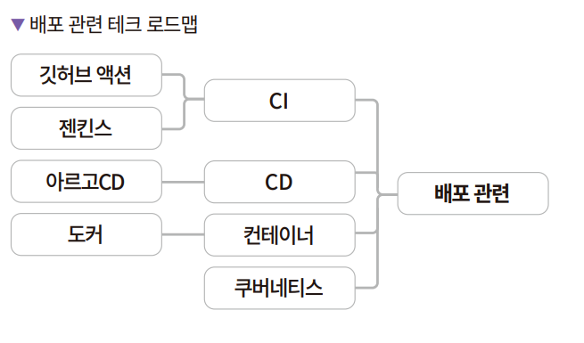  
  
개발과 배포가 끝났다면 이제 유지보수를 해야 한다. 배포 후에 실제 프로덕션 환경에서도 문제없이 돌아가는지 모니터링하면서 필요한 부분을 보충해나가야 한다. 
설계와 구현 문제로 성능이 부족하거나 서비스 이용자가 급증해 서버가 느려질 수도 있다. 또한 개발팀 외부에서 새로운 요청도 지속적으로 들어올 수 있다. 
기존 코드를 다듬거나 새로운 코드를 추가해야 할 수 있으며 테스트와 문서를 작성할 수도 있다. 다른 팀원들이 온다면 팀원들에게 코드와 시스템에 대한 
지식을 전달할 수도 있다.  
  
유지보수 시 서비스 모니터링 및 장애 대응을 위해서 온콜이라는 제도를 도입하는 회사도 있다. 온콜은 말 그대로 업무 시간 외에 문제 발생 시 전화를 받는 
담당자를 지정하는 제도이다. 문제 발생 시 혼자 처히라 수 있는 문제라면 처리하고 아니라면 다른 사람들에게 장애를 전파하는 역할을 담당한다.  
  
# **백엔드 아키텍처**  
오늘날 서비스는 동시에 많은 요청을 클라이언트에서 받아 다양한 응답을 제공한다. 이렇게 규모가 있는 서비스를 즉흥적으로 코딩해서 완성도 있게 만드는 
일은 불가능에 가깝다. 즉 계획을 잘 세워야 한다. 조직에 따라서 사람에 따라서 정의가 상이하나 일반적으로 계획을 작성하는 사람을 아키텍트라고 하고 
계획(종합적으로 분석, 계획, 정리한 것)은 아키텍처라고 한다. 조직에 따라서 아키텍트라는 직함이 별도로 있는 곳도 있지만 프로그래머에게 주어지는 
경우도 있다. 따라서 개발자라면 아키텍처를 알고 있는 편이 좋다. 아키텍처란 총체적이고 종합적이고 상세하게 개발을 준비하는 것이 바로 아키텍처다.  
  
소프트웨어 아키텍처를 수행하는 것은 쉬운 일은 아니다. 다행히도 소프트웨어 구축에 대한 경험이 계속 쌓이면서 다양한 패턴이 정리되었다. 패턴 중 자주 
사용하는 계층형 아키텍처와 이벤트 기반 아키텍처, 마이크로서비스 아키텍처 등이 있다. 실무에서 접하는 대부분의 아키텍처는 이 3가지의 조합으로 이루어진다. 
따라서 백엔드 프로그래머라면 기본적으로 알아두는 것이 좋다.  
  
# **계층형 아키텍처**  
계층형 아키텍처(layered architecture)는 레이어드 아키텍처라고도 하며 말그대로 소프트웨어를 몇 가지 계층으로 나누어서 만드는 방식이다. 가장 흔한 
아키텍처 형태로 단순하고 이해하기 쉽다. 게다가 각 계층이 논리적으로 분리되어 있기 때문에 소규모 애플리케이션에서 많이 채택한다. 각 계층에서는 
주어진 역할(프레젠테이션, 비즈니스 로직, 데이터 저장 등)을 수행하며 의존성이 단방햐잉어야 한다. 예를 들어 프레젠테이션 계층은 비즈니스 계층에만, 
비즈니스 계층은 영속성 계층에만 의존성을 가지게 되는 것을 의미한다. 계층이 분리 및 격리되어 있기 때문에 복잡도가 감소하며 계층 내에서는 관련된 코드의 
응집도가 높아진다. 더불어 테스트가 쉽다는 장점이 있다. 단점으로는 다른 아키텍처에 비해 애플리케이션의 규모가 커지게 되면 계층이 거대해지면서 유지보수가 
힘들어지고 개발 속도가 떨어진다는 점이다. 하나의 큰 덩어리를 여러 개 배포해야 하므로 배포도 쉽지 않다. TCP/IP 네트워크 계층은 계층형 아키텍처가 잘 
적용된 예이다.  
  
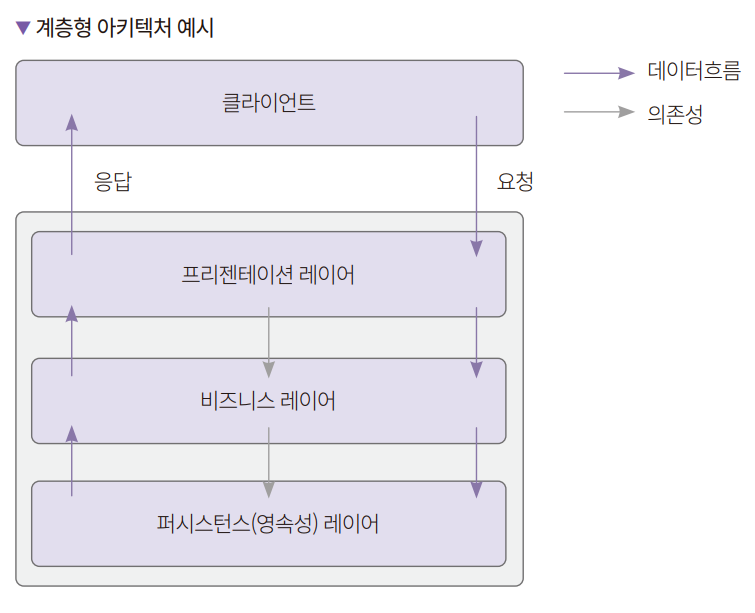  
  
# **이벤트 기반 아키텍처**  
이벤트 기반 아키텍처(event-driven architecture)는 말그대로 이벤트의 상태 변화에 대응하는 소프트웨어 설계 패턴이다. 이벤트는 시스템의 내부 또는 
외부에서 시스템에 영향을 주는 상황들을 의미한다. 예를 들어 사용자가 로그인 버튼을 눌렀을 때 로그인 이벤트가 발생한다. 웹툰 애플리케이션이라면 웹툰을 
열람하는 이벤트가 있을 것이고 전자상거래 애플리케이션이라면 구매라는 이벤트가 있다.  
  
이벤트 기반 아키텍처는 이벤트를 발생시키는 프로듀서(producer)와 이벤트를 전달하는 브로커(broker), 이벤트를 받는 컨슈머(consumer)로 구성된다. 
이벤트 기반 아키텍처는 모든 요청을 비동기로 처리한다. 그래서 확장성이 좋고 아키텍처 내 컴포넌트 간 의존성을 줄일 수 있다. 프로듀서, 브로커, 컨슈머 
각각 수평 확장이 용이하기 떄문이다. 반면에 이벤트를 비동기로 처리하므로 이벤트 순서를 보장하기 어렵다. 에러가 발생했을 때 이벤트를 새로 받을지, 
무시할지, 에러 처리를 할지 고려해야 한다.  
  
수평 확장(Scale Out)은 컴퓨팅 장비(서버, 메모리, CPU, 네트워크 등)를 추가해 시스템의 처리량을 늘리는 것을 의미한다.  
  
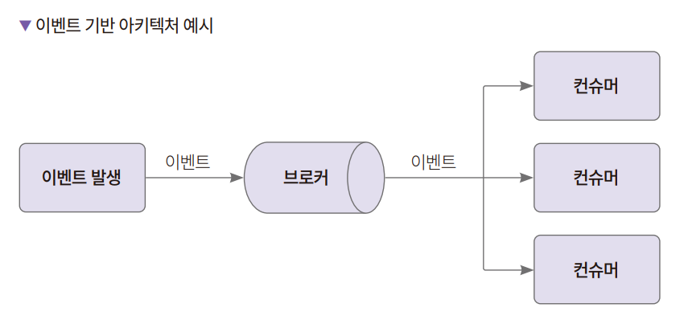  
  
# **마이크로서비스 아키텍처**  
마이크로서비스 아키텍처(microservices architecture)는 시스템을 여러 개의 작은 서비스로 나누어 관리하는 설계 방식이다. 이러한 서비스는 독립적으로 
개발, 배포, 운영되며, 서로 구조적으로 분리되어 있다. 이러한 분리 덕분에 각 서비스는 독립적으로 업데이트 및 스케일링이 가능하고 시스템 전체의 
구조는 더욱 간결해진다. 마이크로서비스 아키텍처는 대규모 시스템을 구축하는 데 유용하다.  
  
마이크로서비스 아키텍처 적용 시 주의할 점은 하나의 서비스를 너무 잘게 쪼개는 거다. 마이크로서비스 아키텍처 자체는 도메인 주도 설계(domain-driven design)에 
영향을 많이 받았는데 도메인은 사용자가 요구하는 문제 분야 내에서의 상황이나 내용을 말한다. 계정 관리, 쇼핑몰 상품 관리 등이 도메인에 속한다. 
마이크로서비스 아키텍처에서는 하나의 서비스가 하나의 도메인을 담당하는 것이 좋다.  
  
마이크로서비스 아키텍처는 확장성이 좋고 업그레이드가 용이하다. 각 서비스별로 확장하거나 서비스만 따로 업그레이드할 수 있기 떄문이다. 반면 트랜잭션을 
처리하려면 분산 트랜잭션등을 고려해야 하므로 난이도가 올라간다. 또한 이름은 마이크로서비스이지만 실제 하나의 서비스를 운영하는 모든 구성을 갖추어야 하므로 
유지보수하는 데 비용이 많이 들어간다. 소규모 팀에서 마이크로서비스 아키텍처를 도입하고자 할 때는 면밀한 검토가 필요하다.  
  
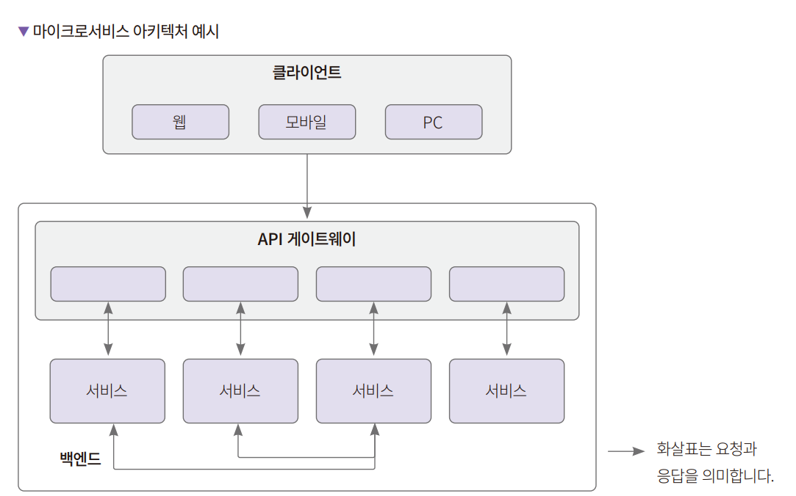  
  
소개한 아키텍처 외에도 파이프라인 아키텍처(pipeline architecture), 마이크로커널 아키텍처(microkernel architecture), 서비스 지향 아키텍처
(service oriented architecture), 공간 기반 아키텍처(Space-based architecture)등이 있다.  
  
# **백엔드 프로그래밍 언어**  
언어의 인기 순위를 매기는 지수인 TIOBE 인덱스에서는 2022년 기준으로 파이썬이 1위이다. 다음으로 C, C++, 자바, C#, 비주얼 베이직, 자바스크립트 
순서다. 이중에 백엔드에서 많이 사용하는 언어는 파이썬, C++, 자바, C#, 자바스크립트라고 할 수 있다.  
  
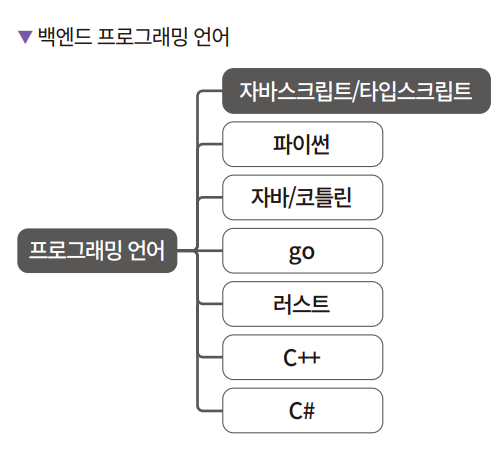  
  
데이터 분석 분야에서 인기가 많은 파이썬은 서버 개발에도 많이 사용한다. 대표적인 프레임워크로는 플라스크와 장고, FastAPI가 있다. C++는 성능이 
중요한 게임 서버 개발에서 많이 사용된다. 자바는 스프링이라는 매우 강력한 프레임워크를 기반으로 많은 곳에서 서버 개발에 사용되고 있다. C#은 국내보다는 
미국에서 많이 사용된다. 닷넬 프레임워크가 매우 강력하며 마이크로소프트 계열의 소프트웨어와 호환성이 좋은 편이다. 개발자가들이 자주 찾는 사이트 중 
하나인 스택오버플로가 C#을 기반으로 만들어졌다.  
  
자바스크립트는 프론트엔드에서뿐 아니라 백엔드에서도 많이 사용한다. 대표적인 웹 프레임워크로 익스프레스(Express)가 있으며 최근 NestJS의 인기가 오르는 
추세이다. 개발자가 소수인 회사라면 자바스크립트가 좋은 선택이 될 수 있다. 2023년의 자바스크립트는 프론트엔드와 백엔드를 아우르는 풀스택을 거의 
완벽하게 지원하는 언어이기 때문이다. 자바스크립트 하나로 프론트엔드, 벡엔드, 인프라 관리, 서버리스 지원, 앱 개발 등을 할 수 있어서 첫 시작으로도 
적합하다.  
  
개발자 규모가 커진다면 정적 타이핑을 지원하는 언어를 쓰는 것이 좋다. 타입스크립트를 도입하면 자바스크립트 문법을 사용하면서 정적 타이핑을 도입할 수 있다. 
타입이 미리 정해져 있어야 헙업 시에 코드를 읽는 것이 편하고 버그 수정 및 디버깅에 용이하기 떄문이다.  
  
# **데이터베이스**  
데이터베이스는 검색과 축적이 쉽도록 정리된 데이터의 모음이다. 대부분의 서버 애플리케이션은 클라이언트에서 받은 데이터를 어딘가에 저장한다. 그것이 
메모리일 수도 있고 텍스트 파일일 수도 있고 엑셀일 수도 있고 특정 프로토콜을 통해 생성된 바이너리 파일일 수도 있다. 검색을 지원하고 입력한 데이터 
수정 및 삭제도 가능해야 하며 수많은 읽기와 수정 삭제 요청이 동시다발로 이루어지는 상황을 생각해보자. 단순한 텍스트 파일로 그 모든 요구사항을 
충족시키기는 어렵다.  
  
일반적으로 현업에서 데이터베이스라고 말하면 데이터베이스 소프트웨어를 의미한다.  
  
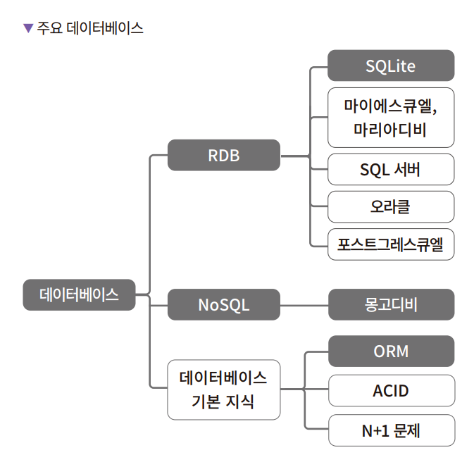  
  
유명한 데이터베이스로는 Oracle, MySQL / MariaDB, SQLServer, PostgreSQL, SQLite, MongoDB, Cassandra, NynamoDB, Neo4j, CockroachDB 등이 
있다. 앞서 열거한 것은 모두 국외에서 만든 데이터베이스다. 국산 데이터베이스 소프트웨어로는 알티베이스, 큐브리드, 티베로 등이 있다.  
  
# **RDB**  
데이터베이스는 여러 가지로 구분할 수 있는데 RDB와 RDB가 아닌 것으로 보통 구분한다. RDB는 Relational Database의 약자로 관계형 데이터베이스라는 뜻이다. 
RDB가 아닌 데이터베이스를 NoSQL 또는 NewSQL로 구분한다. 관계형 데이터베이스는 데이터를 행과 열로 이루어진 테이블로 관리하며 기본 키를 사용해 각 행을 
식별한다. 또한 각 테이블 간에 관계를 지을 수 있다.  
  
# **ACID 트랜잭션**  
RDB의 특징으로 ACID로 불리는 트랜잭션이 있다. ACID는 각각 원자성(Atomicity), 일관성(Consistency), 격리성(Isolation), 내구성(Durability)을 
의미한다. 원자성은 트랜잭션을 구성하는 명령이 하나의 묶음으로 처리되어서 함께 성공하거나 실패하는 것을 보장하는 기법이다. 일관성은 트랜잭션에서 
실행된 변경 사항이 데이터베이스의 무결성 조건을 만족하는 것이다. 격리성은 두 개의 트랜잭션이 서로에게 영향을 미칠 수 없는 성질을 의미한다. 내구성은 
트랜잭션이 성공적으로 끝나면 그 결과가 데이터베이스에 계속 유지되는 성질을 말한다. ACID 트랜잭션은 데이터베이스에서 데이터의 일관성을 유지하도록 
해준다. 또한 문제가 생긴 때에는 이전의 상태로 되돌릴 수 있게 해준다. 최근에는 NoSQL 데이터베이스에서도 트랜잭션을 지원하는 경우가 많다. 다만 
NoSQL은 보통 분산 데이터베이스를 가정하는 경우가 많아서 RDB보다는 추가적인 제약사항이 있다.  
  
# **SQL**  
SQL은 Structured Query Language의 약자로 말그대로 쿼리(데이터 검색)를 하는 프로그래밍 언어이다. SQL도 하나만 있는 것이 아니라 ANSI 표준 SQL이 
있고 각 RDB별로 방언이 있다. 데이터베이스 전문가가 아니라면 ANSI 표준 SQL을 익혀 두고 때에 맞게 활용해도 무방하다. SQL도 사실 데이터 질의를 
의한 언어이므로 RDB 전용이라고 보기는 힘들다. NoSQL에도 SQL 엔진을 도입해서 데이터를 조금 더 편하게 질의하도록 지원하는 경우가 많다.  
  
# **NoSQL(Not Only SQL)**  
NoSQL의 뜻이 SQL을 안 쓴다는 의미로 사용되기도 한다. 최근에는 Not Only SQL의 의미로 많이 사용한다. 애플리케이션을 작성할 때 RDB와 NoSQL의 
장단점을 살려서 사용하면 좋기 때문에 Not Only SQL이라고 부르기도 한다.  
  
RDB는 데이터 저장, 질의, 수정, 삭제가 용이하지만 반면에 성능을 올리는 게 쉽지 않다. 데이터베이스의 성능을 높이려면 머신의 성능을 좋게 하는 
스케일업 또는 머신을 여러 대로 분리하는 스케일아웃이 필요하다. 스케일업은 장비를 좋게 하면 되지만 스케일아웃은 데이터베이스가 여러 대가 되면서 
분산되므로 이떄 트랜잭션을 사용하면 성능이 떨어지게 된다. 또한 기본적으로는 스케일아웃을 지원하지 않는다. RDB의 이러한 문제들을 해결하기 위해 
NoSQL이 등장했다.  
  
데이터 모델링을 어떻게 하느냐에 따라서 NoSQL을 구분할 수 있다.  
  
소규모 서비스라면 RDB만으로 충분하다. 규모가 커지면 키 밸류 캐시, 키 밸류 스토어, 도큐먼트 스토어, 와이드 컬럼 스토어 정도를 사용한다. 
  
키 밸류 캐시로 맴캐시드(Memcached)와 레디스(Redis)가 많이 사용된다. 맴캐시드는 키 밸류 형태의 데이터만 제공하며 레디스는 다양한 데이터 구조를 
지원한다. 둘 다 클러스터를 쉽게 지원하므로 분산 환경에서 편하게 사용할 수 있다. 레디스는 싱글 스레드라서 오래 걸리는 작업을 하면 서버가 멈추게 
된다. 따라서 오래 걸리는 작업을 메인 스레드에서 하지 않는 것이 좋다. 맴캐시드는 멀티 스레드이다.  
  
키 밸류 스토어로는 다이나모디비, 카우치베이스(Couchbase)가 많이 사용된다. 앞서 언급한 캐시와 다른 점은 캐시는 서버를 껐다가 켜면 데이터가 
휘발되어 날아갈 수 있지만 키 밸류 스토어는 그렇지 않다는 것이다. 쓰기와 업데이트가 빈번하게 일어나는 게임 서버에서 많이 사용한다.  
  
도큐먼트 스토어로는 몽고디비가 유명하다. 피파 온라인에서 데이터베이스로 채택했고 라인에서도 많이 사용한다. 데이터로 JSON과 매우 비슷하게 생긴 
BSON이라는 문서 모델을 저장한다. JSON은 데이터 저장 및 전송 시 사용하는 경량의 데이터 표현 형식이다. 자바스크립트의 객체의 형식을 기반으로 
만들어져 있다.  
  
몽고디비에서는 테이블 개념인 컬렉션이라는 개념이 있으며 검색 시 인덱스를 사용하거나 ACID 트랜잭션을 지원하는 등 RDB에서만 사용했던 기능을 많이 
가져오려고 시도한다.  
  
와이드 컬럼 스토어는 RDB와 유사하게 행과 열 테이블을 사용한다. RDB와 다른 점으로는 행마다 열의 이름과 타입이 다를 수 있다는 점이다. 또한 2차원 
키 밸류 저장소로 사용할 수도 있다. 대표적으로 구글의 빅테이블(Bigtable)이 있으며 오픈 소스로는 아파치 카산드라가 있다. 카산드라는 단일 장애점
(Single Point Of Failure, SPOF)이 없으며 확장성과 성능이 뛰어나다는 특징이 있다.  
  
# **클라우드 서비스**  
서버는 물리적인 공간에 서버가 존재하고 해당 서버에서 요청에 대한 응답을 보내준다. 많은 기업이 IDC(Internet Data Center)라는 건물에 서버를 
설치해두고 인터넷 서비스를 하였다. 반면 클라우드를 이용하면 사용자는 이러한 물리적 서버를 직접 설치하지 않고도 서버 자원을 사용할 수 있다. 
클라우드 컴퓨팅을 이용하면 서버 장비를 구매, 설치하지 않고 서버의 기능을 하는 서비스를 인터넷으로 제공받게 된다.  
  
매우 많은 서버의 CPU와 메모리, 매우 많은 네트워크 장비의 네트워크 대역폭을 잘게 쪼갠 다음 나누어서 서비스를 하고 장비에 문제가 생기더라도 
정상인 다른 장비 자원으로 손쉽게 교체할 수 있다. 클라우드 서비스는 수많은 서버의 자원을 탄력적으로 제공한다. 기술적으로는 하드웨어의 가상화가 
필요하지만 사용자가 신경 쓸 사안은 아니다. 사용자는 그저 필요한 만큼 사용하면 된다.  
  
클라우드 서비스를 제공하는 회사는 굉장히 많이 있다. 클라우드 서비스 중 아마존의 AWS와 마이크로소프트의 애저, 구글의 GCP가 가장 유명하다. 
2022년 1분기 기준 3사가 65%의 점유율을 가지고 있다.  
  
IDC와 클라우드 서비스를 구분짓는 큰 특징으로는 사용한 만큼 요금을 내는 것이 있다. 클라우드 서비스 제공자마다 다르지만 대부분 1분 단위의 과금 
기준을 가지고 있다. 실제로 서버 장비를 구매하여 유지보수하는 것보다는 비싼 편이다. 유저가 갑자기 몰리는 시간에 서버를 여러 대 더 띄워서 대응하거나 
유저가 없을 때는 서버를 축소해서 비용을 아끼는 등의 전략이 가능하다. 그러므로 사용하지 않는 서버 자원을 적절히 종료해서 비용을 절감할 수 있다. 
또는 유휴 자원의 서버를 저렴하게 사용할 수 있게 해주는 스팟 인스턴스(GCP에서는 스팟 VM)서비스도 있어서 잘 사용하면 좋다.  
  
# **클라우드 컴퓨팅의 유형**  
클라우드 서비스는 크게 3가지 유형이 있다. 서버 인프라 환경 서비스를 제공하는 IaaS(Infrastructure as a Service), 애플리케이션 개발 및 
실행 환경을 제공하는 PaaS(Platform as a Service), 브라우저 기반으로 소프트웨어를 사용할 수 있게 하는 SaaS(Software as a Service)이다.  
  
IaaS는 기존의 서버 환경의 인프라를 클라우드 서비스로 제공하는 것을 말한다. 서버, 스토리지, 네트워킹과 같은 컴퓨팅 자원을 사용할 수 있다.  
  
PaaS는 인프라를 구축할 필요 없이 개발자가 코드만 작성하면 서버 환경이 구성되는 것을 의미한다. PaaS를 사용하면 사용자는 코드 작성 및 애플리케이션 
구축에 집중할 수 있으며 클라우드 제공자는 서버 프로비저닝, 리소스 확장 미 기본 인프라 관리와 같은 작업을 처리하게 된다. 관련 서비스로 헤로쿠(Heroku), 
AWS 일래스틱 빈스토크(AWS Elastic Beanstalk), 애저 앱 서비스(Azure App Service), GCP의 앱 엔진(App Engine)등이 있다.  
  
SaaS는 기존에는 패키지로 설치해야만 했던 애플리케이션을 브라우저를 통해 사용하도록 해주는 서비스를 의미한다. SaaS 서비스의 예시로는 구글 독스, 
마이크로소프트 오피스 365, 어도비 크리에이티브 클라우드 등이 있다.  
  
# **클라우드 3사의 기능 비교표**  
기능적으로는 큰 차이가 없다. 애저는 마이크로소프트의 기반 기술로 되어 있어서 비주얼 스튜디오 등의 기능을 제공하는 점이나 GCP는 구글의 기술인 
빅쿼리를 제공하는 등이 차이다.  
  
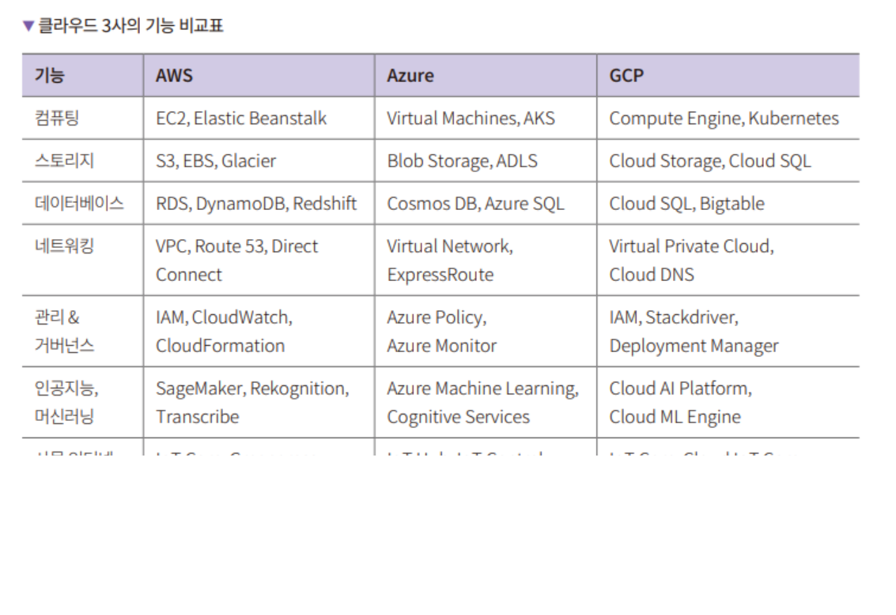  
  
노코드, 태스크 실행, 람다 등 훨씬 더 많은 기능들이 있다. 학습을 위해서는 각 클라우드 서비스의 웹사이트를 참고하는 것이 좋다. 백엔드 개발을 
하고 있다면 필연적으로 사용하게 되는 것이 클라우드 서비스다.  
  
# **자바스크립트 생태계**  
자바스크립트는 1995년에 넷스케이프에서 HTML을 동적으로 표현할 목적으로 만든 모카(Mocha)라는 이름의 스트립트 프로그래밍 언어로 탄생했다. 시작은 
웹브라우저를 위한 언어였다. 자바스크립트의 구조와 기능은 ECMAScript(ECMA-262)에 정의되어 있다. ECMAScript는 스크립트 언어의 기본 규격을 
정의한 국제 표준이다. ECMAScript의 최신 버전은 ECMAScript 2021(ES11)이고 이를 지원하는 최신 웹브라우저는 ECMAScript의 새로운 기능을 지원한다. 
과거에는 브라우저에서만 실행되는 언어로 취급되었지만 Node.js와 같은 런타임 환경이 출현하면서부터는 백엔드에서도 쓸 수 있게 되었다. 2023년 
시점에서 자바스크립트는 프론트엔드, 백엔드, 인프라, 서버리스, 앱 개발 등 안쓰이는 곳이 거의 없는 범용 프로그래밍 언어로 자리잡았다. 프로그래밍 순위를 
매기는 티오베 사이트에서는 2021년부터 7위 자리를 지켜오고 있다.  
  
자바스크립트는 생태계가 아주 튼튼하고 풍성하다. 프로그래밍 언어를 선택할 때 해당 언어의 개발 환경의 성숙도는 탄탄한 생태계를 갖추고 있는지로 
알 수 있다. 패키지 매니저, 빌드 자동화 도구, 코드 편집기, 프레임워크, 백엔드 개발 환경, 인프라 이렇게 6가지 항목을 알아본다.  
  
# **패키지 매니저**  
패키지 매니저는 npm과 yarn(얀)이 대표적이다. npm은 Node.js를 설치하면 자동으로 설치된다. npm은 용량 문제, 패키지 내려받기 속도 문제, 
보안 문제를 가지고 있어서 이런 한계를 개선한 yarn을 사용하기도 하고 사람에 따라서는 심볼릭 링크를 사용해서 npm의 문제를 해결한 pnpm을 사용하기도 
한다.  
  
# **빌드 도구**  
놀랍게도 자바스크립트에는 빌드 도구가 매우 많다. 예전에는 자바스크립트 라이브러리를 사용할 때 (즉 임포트할 때) <script> 태그를 사용했지만 
최근에는 빌드 도구를 사용해 자바스크립트 코드를 하나의 파일 혹은 여러 파일로 뭉쳐주는 번들링 작업을 하고 번들링된 스크립트를 포함시키는 방식을 
일반적으로 사용한다. 이런 빌드 도구 중 가장 유명한 것은 웹팩(webpack)이다. 웹팩은 다양한 모듈 시스템을 잘 지원해준다. 대신 느리다. ES6 이후에는 
표준 모듈 시스템이 있기 떄문에 최근에 만든 빌드 도구들인 ESBuild, Vite 등은 ESM만 지원하며 웹팩에 비해 속도가 빠르고 편리한 기능이 더 
추가되어 있다. 빌드 도구는 아직 표준화가 되지는 않아 많은 소프트웨어가 서로 경쟁하며 더 좋은 빌드 도구가 계속 나오고 있다.  
  
# **개발 도구**  
과거에는 자바스크립트 개발을 하려면 서브라임 텍스트(Sublime Text)같은 단순한 기능만을 가진 범용 도구를 사용했지만 현재는 굉장히 많은 편의 
기능을 제공하는 도구가 자바스크립트를 지원한다. 대표적으로 마이크로소프트가 만든 비주얼 스튜디오 코드가 있다. VSCode는 에디터 자체도 일렉트론으로 
만들어서 자바스크립트의 슈퍼셋인 타입스크립트 코드가 대거 포함되어 있다. 다른 개발 도구로 젯브레인 사의 웹스톰(WebStorm)도 있다. 자바스크립트 
디버깅, 단위 테스팅뿐 아니라 자바스크립트 특화된 기능도 대거 지원한다.  
  
# **웹 프레임워크**  
자바스크립트로 만든 웹 프레임워크는 매우 많다. 프론트엔드 웹 프레임워크로는 리액트와 Vue.js가 널리 쓰인다. 최근에는 스벨트(Svelte)가 신흥 강자로 
떠오르고 있다. 백엔드 웹 프레임워크로는 익스프레스(Express)와 NestJS가 널리 쓰인다. Node.js 초창기에는 익스프레스가 단짝이었다. 최근 NestJS
가 출현하면서 빠르게 서비스를 만들 때는 익스프레스를, 팀으로 협업하면서 규모 있는 서비스를 만들 떄는 NestJS를 채택하는 일이 많아졌다. 그래서 
자바스크립트 백엔드 개발자라면 둘 다 다룰 줄 알아야 한다. 자바스크립트는 프론트엔드, 백엔드뿐 아니라 앱 개발에서도 사용된다. 대표적인 프레임워크로 
리액트 네이티브와 일렉트론이 있다.  
  
# **백엔드 개발 환경**  
자바스크립트는 프론트엔드 언어로 시작했지만 Node.js 이후로 백엔드에서도 많이 사용된다. 가장 유명한 백엔드 런타임 환경은 Node.js다. 다음으로 
최근에 나온 개발 환경인 디노(Deno)가 있다. 디노의 개발자는 Node.js를 만든 라이언 달(Ryan Dahl)이다. Node.js에서 개선하지 못했던 부분들을 
더욱 개선해 만들었다고 말한다. 디노가 상당히 좋은 자바스크립트 런타임인 것은 분명하지만 아직까지는 Node.js가 압도적으로 많이 사용되고 있다. 
최근에는 npm을 지원하는 등 기존 Node.js의 생태계와 호환성을 높여서 Node.js 개발자들도 Deno를 사용하도록 유도한다. 아직 호환성 문제 등 
해결해야 하는 과제가 남아 있다.  
  
# **인프라**  
풀루미(pulumi)는 자바스크립트 코드로 클라우드 환경 기반에서 인프라를 관리하도록 해준다. 개인 용도로 사용하면 무료, 기업용으로 사용하면 유료다.  
  

  

