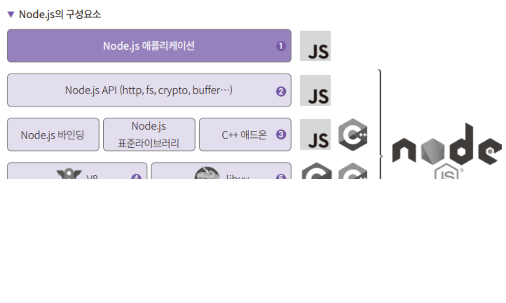
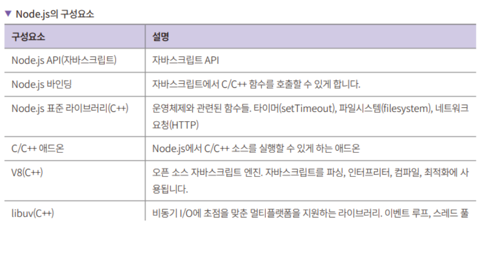
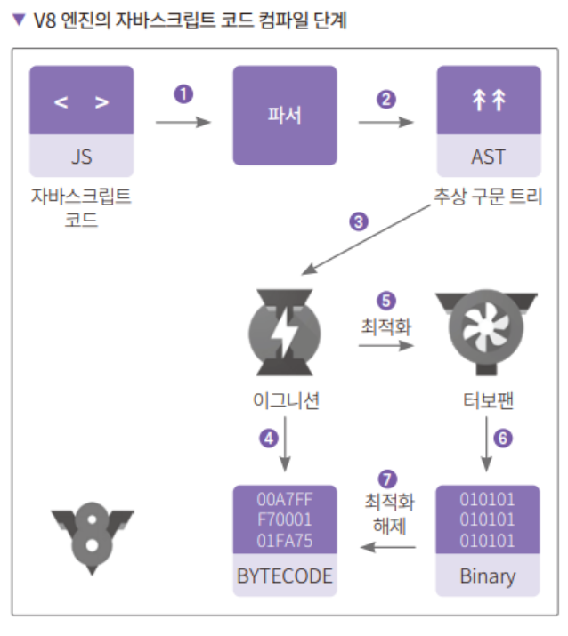

# **Node.js로 백엔드 입문하기**  
# **Node.js 소개**  
Node.js는 서버 측 자바스크립트 런타임 환경이다. Node.js는 브라우저 밖에서 자바스크립트를 사용하는 V8 엔진을 사용한다. Node.js 이전에는 
논블로킹(함수 실행 완료를 기다리지 않고 다음 코드 실행) / 비동기 API를 서버 환경에 구현하는 데 상당한 노고가 필요했다. 동시 실행되는 스레드와 
공유 자원을 프로그래머가 직접 만들고 관리해야 했기 떄문이다. 이런 개발 환경을 논블로킹 감옥이라고 표현했다. 비동기 API를 제공하는 것이 편리하다고 
생각하고 이벤트 기반(Event-Driven) 비동기 환경을 만들고 Node.js라는 자바스크립트 런타임 환경을 구축한다.  
  
2021년 스택오버플로 설문에 따르면 가장 많이 사용되는 웹 프레임워크 기술에서 익스프레스(Node.js 기반 웹 서버)가 3위를 차지할 정도로 Node.js는 
많이 사용된다. Node.js는 I/O에 대한 관점을 완전히 새롭게 해주었다는 점에서는 프로그램이 발전에 중요한 역할을 했다.  
  
# **Node.js는 서버에서 어떻게 자바스크립트를 실행할까?**  
Node.js는 V8 자바스크립트 엔진과 libuv 및 C/C++에 의존성을 가진 자바스크립트 런타임이다. 런타임은 자바스크립트로 된 프로그램을 실행할 수 있는 
프로그램이다. 예를 들어 자바 코드는 자바 실행 환경인 JRE 위에서 실행된다. C# 코드는 CLR이라는 런타임에서 실행된다. 반면 C 언어는 런타임 없이 
코드를 실행한다. C 언어처럼 컴파일한 결과물이 특정 CPU의 기계어인 언어를 네이티브 언어라고 한다.  
  
# **Node.js의 구성요소**  
Node.js의 소스 코드는 C++와 자바스크립트, 파이썬 등으로 이루어져 있다. 구성요소는 다음과 같다(파이썬 코드는 빌드와 테스트에만 사용되므로 
구성요소에서는 제외했다).  
  
  
  
Node.js는 각 계층이 각 하단에 있는 API를 사용하는 계층의 집합으로 설계되어 있다. 즉 사용자 코드(자바스크립트)는 Node.js의 API를 사용하고 
Node.js API는 Node.js에 바인딩되어 있는 소스이거나 직접 만든 C++ 애드온을 호출한다. C++에서는 V8을 사용해 자바스크립트를 해석(JIT 컴파일러) 
및 최적화하고 어떤 코드냐에 따라 C/C++ 종속성이 있는 코드를 실행한다. 또한 DNS, HTTP 파서, OpenSSL, zlib 이외의 C/C++ 코드들은 libuv의 
API를 사용해 해당 운영체제에 알맞는 API를 사용한다.  
  
Node.js의 구성요소 중 특히 V8과 libuv가 중요하다. V8은 자바스크립트 코드를 실행하도록 해주고 libuv는 이벤트 루프 및 운영체제 계층 기능을 
사용하도록 API를 제공한다.  
  
  
  
# **자바스크립트 실행을 위한 V8 엔진**  
V8은 C++로 만든 오픈 소스 자바스크립트 엔진이다. 엔진은 사용자가 작성한 코드를 실행하는 프로그램을 말한다. 엔진은 파서, 컴파일러, 인터프리터, 
가비지 컬렉터, 콜 스택, 힙으로 구성되어 있다. V8 엔진은 자바스크립트를 실행할 수 있는 엔진이며 인터프리터 역할을 하는 이그니션과 컴파일러 역할을 
하는 터보팬을 사용해 컴파일한다.  
  
