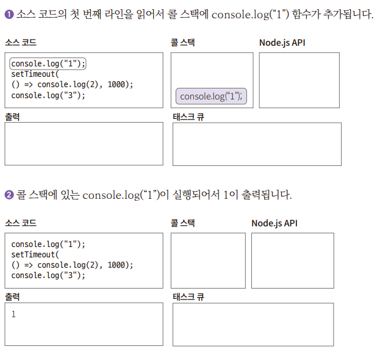

# **Node.js로 백엔드 입문하기**  
# **Node.js 소개**  
Node.js는 서버 측 자바스크립트 런타임 환경이다. Node.js는 브라우저 밖에서 자바스크립트를 사용하는 V8 엔진을 사용한다. Node.js 이전에는 
논블로킹(함수 실행 완료를 기다리지 않고 다음 코드 실행) / 비동기 API를 서버 환경에 구현하는 데 상당한 노고가 필요했다. 동시 실행되는 스레드와 
공유 자원을 프로그래머가 직접 만들고 관리해야 했기 떄문이다. 이런 개발 환경을 논블로킹 감옥이라고 표현했다. 비동기 API를 제공하는 것이 편리하다고 
생각하고 이벤트 기반(Event-Driven) 비동기 환경을 만들고 Node.js라는 자바스크립트 런타임 환경을 구축한다.  
  
2021년 스택오버플로 설문에 따르면 가장 많이 사용되는 웹 프레임워크 기술에서 익스프레스(Node.js 기반 웹 서버)가 3위를 차지할 정도로 Node.js는 
많이 사용된다. Node.js는 I/O에 대한 관점을 완전히 새롭게 해주었다는 점에서는 프로그램이 발전에 중요한 역할을 했다.  
  
# **Node.js는 서버에서 어떻게 자바스크립트를 실행할까?**  
Node.js는 V8 자바스크립트 엔진과 libuv 및 C/C++에 의존성을 가진 자바스크립트 런타임이다. 런타임은 자바스크립트로 된 프로그램을 실행할 수 있는 
프로그램이다. 예를 들어 자바 코드는 자바 실행 환경인 JRE 위에서 실행된다. C# 코드는 CLR이라는 런타임에서 실행된다. 반면 C 언어는 런타임 없이 
코드를 실행한다. C 언어처럼 컴파일한 결과물이 특정 CPU의 기계어인 언어를 네이티브 언어라고 한다.  
  
# **Node.js의 구성요소**  
Node.js의 소스 코드는 C++와 자바스크립트, 파이썬 등으로 이루어져 있다. 구성요소는 다음과 같다(파이썬 코드는 빌드와 테스트에만 사용되므로 
구성요소에서는 제외했다).  
  
  
  
Node.js는 각 계층이 각 하단에 있는 API를 사용하는 계층의 집합으로 설계되어 있다. 즉 사용자 코드(자바스크립트)는 Node.js의 API를 사용하고 
Node.js API는 Node.js에 바인딩되어 있는 소스이거나 직접 만든 C++ 애드온을 호출한다. C++에서는 V8을 사용해 자바스크립트를 해석(JIT 컴파일러) 
및 최적화하고 어떤 코드냐에 따라 C/C++ 종속성이 있는 코드를 실행한다. 또한 DNS, HTTP 파서, OpenSSL, zlib 이외의 C/C++ 코드들은 libuv의 
API를 사용해 해당 운영체제에 알맞는 API를 사용한다.  
  
Node.js의 구성요소 중 특히 V8과 libuv가 중요하다. V8은 자바스크립트 코드를 실행하도록 해주고 libuv는 이벤트 루프 및 운영체제 계층 기능을 
사용하도록 API를 제공한다.  
  
  
  
# **자바스크립트 실행을 위한 V8 엔진**  
V8은 C++로 만든 오픈 소스 자바스크립트 엔진이다. 엔진은 사용자가 작성한 코드를 실행하는 프로그램을 말한다. 엔진은 파서, 컴파일러, 인터프리터, 
가비지 컬렉터, 콜 스택, 힙으로 구성되어 있다. V8 엔진은 자바스크립트를 실행할 수 있는 엔진이며 인터프리터 역할을 하는 이그니션과 컴파일러 역할을 
하는 터보팬을 사용해 컴파일한다.  
  
  
  
자바스크립트 코드는 파서에 전달되어 -> 추상 구문 트리로 만들어진다. 이후 이그니션 인터프리터에 전달되면 -> 이그니션은 추상 구문 트리를 바이트 
코드로 만든다. 최적화가 필요한 경우 터보팬으로 넘긴다. 그러면 터보팬에서 컴파일 과정을 거쳐서 바이너리 코드가 된다. 최적화가 잘 안 된 경우는 
다시 최적화를 해제하고 이그니션의 인터프리터 기능을 사용한다.  
  
이처럼 인터프리터와 컴파일러의 장점을 동시에 가지고 있는 프로그램을 JIT(just-in time) 컴파일러라고 한다. 속도가 빠르며 적재적소에 최적화할 수 
있다는 장점과 컴파일러와 인터프리터가 동시에 실행되어 메모리를 더 많이 쓴다는 단점이 있다.  
  
  
  
# **이벤트 루프와 운영체제 단 비동기 API 및 스레드 풀을 지원하는 libuv**  
V8 에진을 사용하면 서버에서 자바스크립트를 실행할 수 있다.  
  
Node.js는 HTTP, 파일, 소켓 통신 IO 기능 등 자바스크립트에 없는 기능을 libuv라는 C++ 라이브러리를 사용해 해결한다(libuv는 비동기 입출력, 
이벤트 기반에 초점을 맞춘 라이브러리다). 그래서 자바스크립트 언어에서 C++ 코드를 실행할 수 있게 해두었다. 자바스크립트로 C++ 코드를 감싸서 
사용한다(C++ 바인딩이라고 한다).  
  
  
  
libuv는 다양한 플랫폼에서 사용할 수 있는 이벤트 루프를 제공한다(리눅스는 epoll, 윈도우는 IOCP, 맥OS는 kqueue, SunOS는 이벤트 포트). 또한 
네트워크, 파일 IO, DNS, 스레드 풀 기능을 추가로 제공한다. Node.js에서는 C++ 바인딩 기능으로 자바스크립트에서 libuv의 API를 사용한다.  
  
# **Node.js 아키텍처**  
위의 내용을 요약하면 Node.js는 자바스크립트 코드 실행에 필요한 런타임으로 V8 엔진을 사용하고 자바스크립트 런타임에 필요한 이벤트 루프 및 
운영체제 시스템 API를 사용하는 데는 libuv 라이브러리를 사용한다. Node.js 애플리케이션의 코드는 다음과 같은 순서로 실행된다.  
  
  
  
1. 애플리케이션에서 요청이 발생한다. V8 엔진은 자바스크립트 코드로 된 요청을 바이트 코드나 기계어로 변경한다.  
2. 자바스크립트로 작성된 Node.js의 API는 C++로 작성된 코드를 사용한다.  
3. V8 엔진은 이벤트 루프로 libuv를 사용하고 전달된 요청을 libuv 내부의 이벤트 큐에 추가한다.  
4. 이벤트 큐에 쌓인 요청은 이벤트 루프에 전달되고 운영체제 커널에 비동기 처리를 맡긴다. 운영체제 내부적으로 비동기 처리가 힘든 경우(DB, DNS 룩업, 
파일 처리 등)는 워커 스레드에서 처리한다.  
5. 운영체제의 커널 또는 워커 스레드가 완료한 작업은 다시 이벤트 루프로 전달된다.  
6. 이벤트 루프에서는 콜백으로 전달된 요청에 대한 완료 처리를 하고 넘긴다.  
7. 완료 처리된 응답을 Node.js 애플리케이션으로 전달한다.  
  
Node.js의 이벤트 루프 부분은 싱글 스레드이고 운영체제에서 비동기 I/O를 지원하지 않거나 구현이 복잡한 경우는 libuv 내부의 스레드 풀을 사용한다. 
즉 Node.js의 프로세스는 이벤트 루프에 사용하는 싱글 스레드 하나와 비동기 처리를 지원하는 스레드 풀로 구성되어 있다.  
  
# **Node.js의 기술적인 특징**  
Node.js 이전의 자바스크립트는 브라우저에서 주로 실행되는 언어였다. 브라우저에는 V8 같은 자바스크립트 엔진이 들어 있다. 언어 자체가 싱글 스레드이고 
이벤트 기반 아키텍처다. 따라서 자바스크립트 런타임인 Node.js도 자연스럽게 싱글 스레드로 구현되고 이벤트 기반 아키텍처를 구현했다.  
  
# **싱글 스레드**  
자바스크립트 엔진(V8)은 자바스크립트를 실행하는 힙과 콜 스택을 가지고 있다. 그리고 싱글 스레드로 실행된다. 싱글 스레드라는 이야기는 콜 스택이 
하나만 있다는 말이다. 콜 스택이 하나이므로 한 번에 하나의 작업만 가능하다.  
  
  
  
콜 스택 예제  
callstack.js  
  
위 코드에서 발생하는 콜 스택 작동은 하단과 같다.  
  
  
  
# **이벤트 기반 아키텍처**  
Node.js처럼 싱글 스레드로 요청을 처리하는 서버가 있다. 한 번에 하나를 처리하는 서버에 0.1초가 걸리는 요청이 동시에 100개가 온다면 마지막에 요청한 
사람은 10초를 기다려야 응답을 받을 수 있다. 멀티 스레드를 지원하는 언어라면 스레드를 100개 만들어서 동시에 처리할 수 있지만 싱글 스레드인 
자바스크립트는 그렇게 할 수 없다.  
  
  
  
방법은 이벤트 기반 아키텍처를 적용하는 것이다. 콜 스택에 쌓인 작업을 다른 곳에서 처리한 다음 처리가 완료되었을 때 알림을 받으면 스레드가 하나라도 
빠르게 처리할 수 있다.  
  
예를 들어 커피숍을 들 수 있다. 카운터에서 주문을 완료하면 주문은 제조를 하는 직원에게 건네진다. 카운터는 커피가 나올 떄까지 기다리지 않고 다음 
고객의 주문을 받는다. 진동벨을 받은 고객은 진동벨이 울릴 때까지 기다렸다가 울리면 주문한 음료를 받아간다. 이때 줄을 섰던 순서와는 다르게 빠르게 
제조된 음료가 먼저 나올 수 있다.  
  
이런 방식으로 처리하는 것이 이벤트 기반 아키텍처다.  
  
  
  
1. 자바스크립트 코드는 V8의 콜 스택에 쌓이고 I/O 처리가 필요한 코드는 이벤트 루프로 보내게 된다.  
2. 이벤트 루프에서는 말그대로 루프를 실행하면서 운영체제 또는 스레드 워커에 I/O 처리를 맡기게 된다.  
3. 스레드 워커와 운영체제는 받은 요청에 대한 결과를 이벤트 루프로 돌려주고  
4. 이벤트 루프에서는 결괏값에 대한 코드를 콜 스택에 다시 추가한다.  
  
콜 스택과 이벤트 루프 예제  
callstackWithEventloop.js  
  
  
  
  
  
  
  
  
setTimeout()의 두 번쨰 인수로 0을 넣어도 똑같은 결과가 나온다. Node.js API 영역에서 기다리는 시간이 0일뿐 태스크 큐에 추가하고 이벤트 
루프를 통해서 콜 스택에 추가하는 것은 동일하기 때문이다.  
  
Node.js는 이벤트 기반 아키텍처를 구현헀기에 10ms인 요청이 동시에 100개가 오더라도 Node.js는 그 요청을 거의 동시에 처리할 수 있다.  
  
# **이벤트 루프**  
Node.js에서는 이벤트 기반 아키텍처를 구축하는 데 반응자 패턴(reactor pattern)을 사용했다. 반응자 패턴은 이벤트 디멀티플렉서와 이벤트 큐로 
구성된다. 반응자 패턴은 이벤트를 추가하는 주체와 해당 이벤트를 실행하는 주체를 분리(decoupling)하는 구조이다. 반응자 패턴에서 이벤트 루프는 
필수다. Node.js의 이벤트 루프는 libuv에 있다. 각 운영체제의 계층(IOCP, kqueue, epoll, 이벤트 포트)을 추상화한 기능을 제공한다. libuv 
소스 파일의 uv_run() 함수를 살펴보면 다음과 같은 while문을 사용해 반복 실행한다.  
  
  
  
  
이벤트 루프는 여러 개의 FIFO 큐로 이루어져 있다. 각 단계를 돌면서 각 큐에 쌓인 이벤트를 모두 처리한다.  
  
1. 이벤트 루프의 시작 및 각 반복(iteration)의 마지막에 루프가 활성화 상태인지 체크한다.  
2. 타이머 단계에서는 타이머 큐(timer queue)를 처리한다. setTimeout(), setInterval()을 여기서 처리한다.  
3. 펜딩(pending) I/O 콜백 단계에서는 다음 반복으로 연기된 콜백을 처리한다.  
4. 유휴(idle), 준비(prepare) 단계는 내부적으로만 사용된다.  
5. 폴(Poll) 단계에서는 새로운 연결(소켓 등)을 맺고 파일 읽기 등의 작업을 한다. 각 작업은 비동기 I/O를 사용하거나 스레드 풀을 사용한다.  
6. 검사(check) 단계에서는 setImmediate()를 처리한다.  
7. 종료 콜백 단계에서는 콜백의 종료 처리(파일 디스크립터 닫기 등)를 한다.  
  
여기서 nextTickQueue와 microTaskQueue는 조금 특별한 장치다. 번호를 매겨놓지 않은 이유는 각 단계의 사이마다 nextTickQueue와 microTaskQueue에 
있는 작업을 먼저 실행하기 떄문이다. 즉 타이머 단계가 끝나면 nextTickQueue와 microTaskQueue를 실행한다. 또한 펜딩 I/O 콜백 단계가 끝나면 그 사이에 
쌓인 nextTickQueue와 microTaskQueue를 실행한다. 따라서 nextTickQueue와 microTaskQueue에 코드를 추가하면 조금은 우선 순위가 올라간다. Node.js
의 process.nextTick() 함수로 nextTickQueue에 작업을 추가할 수 있다. microTaskQueue에는 Promise로 만든 콜백 함수가 추가된다. Promise는 
비동기 함수를 동기 함수처럼 사용하는 객체이다. nextTickQueue가 microTaskQueue보다 우선순위가 높다. 즉 process.nextTick()으로 작성된 코드가 
Promise로 작성된 코드보다 먼저 실행된다.  
  
이벤트 루프에서 운영체제의 비동기 I/O 기능을 사용하거나 또는 스레드 풀을 사용해서 모든 작업을 비동기로 처리했다. 이벤트 루프에서는 여러 큐를 사용해 
특정 우선순위대로 작업들을 처리해준다.  
  
# **Node.js 과연 쓸 만한가?**  
Node.js를 사용하면 자바스크립트로 고성능 서버를 손쉽게 개발할 수 있다. 그래서 프론트엔드 개발자가 백엔드 개발에 입문하고 싶을 때 자바스크립트를 사용하면 
새로운 언어를 배우지 않고 서버를 개발할 수 있다. 페이팔, 넷플릭스, 우버, 링크드인, 나사, 네이버는 Node.js를 실제 상용 서비스에서 사용한다. 그 외에도 
많은 회사가 Node.js로 서비스를 한다. 우려하지 않아도 될 정도로 Node.js 서버는 견고하다고 보아도 좋다.  
  
CPU 사용량이 많은 작업을 하는 서버가 아니라면 굉장히 적은 메모리로 아주 좋은 성능을 낼 수 있다. 또한 Node.js는 마이크로서비스와 클라우드 환경에도 
적합하다. 메모리를 적게 사용하며 CPU 성능에 크게 좌우되지 않아서 비용을 절약할 수 있기 떄문이다.  
  
다만 Node.js가 장점만 있는 것은 아니다. 랭킹이나 매칭 등 CPU를 많이 사용해야 하는 서비스에는 Node.js가 적합하지 않다. 비동기 프로그래밍에 익숙하지 
않다면 이 또한 허들이 될 수 있다.  
  
  
  
# **나의 첫 Node.js 서버 프로그램**  
# **hello.js 파일 생성 및 실행**  
hello.js 파일  
  
비주얼 스튜디오 코드에서 실행은 Ctrl + F5를 누른 후 Node.js를 선택하면 된다.  
  
- const http = require("http");
require() 함수는 모듈을 읽어노느 함수다. http 모듈을 불러와서 http 변수에 할당했다. 모듈명과 변수명은 다르게 해도 문제는 없지만 특별한 경우가 
아니라면 위와 같이 이름 짓는 것이 관행이다.  
  
- const server = http.createServer(callback);  
createServer()는 서버 인스턴스를 만드는 함수다. 인수로는 콜백 함수를 받는데 콜백 함수에서는 http 서버로 요청이 들어오면 해당 요청을 처리할 
함수를 설정한다. 콜백 함수는 요청 처리에 사용할 요청(req)와 응답(res) 객체를 인수로 받는다.  
  
- log(count);  
전역 변수 count를 사용해 요청에 대한 로그를 간단하게 남긴다.  
  
- res.statusCode = 200  
요청에 대한 상태 코드를 200으로 설정한다.  
  
- res.setHeader("Content-Type", "text/plain")
HTTP header 설정  
  
- res.write("hello\n")  
응답 설정  
  
- setTimeout(() => {res.end("Node.js")}, 2000)  
여기서는 2초 후 Node.js를 응답으로 주고 http 커넥션(연결)을 끝내는 동작을 한다. setTimeout(), setInterval()과 같은 함수는 타이머를 사용한다. 
타이머는 libuv에서 제공하는 기능을 사용하며 이벤트 루프에서 콜 스택을 모니터링하면서 실행할 시점을 정한다.  
  
- server.listen(8000, () => console.log("Hello Node.js"));  
사용할 포트 번호를 8000번으로 지정. 또한 IP가 생략되었으므로 기본값인 localhost 혹은 127.0.0.1로 서버에 접근할 수 있다.  
  
  
  

