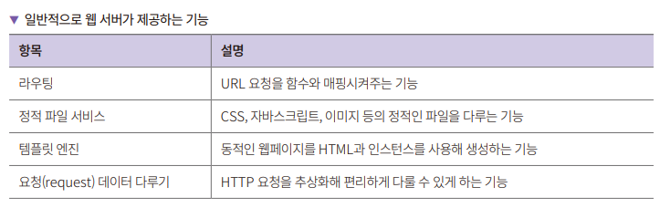
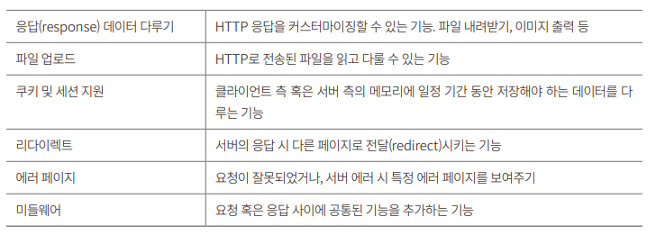
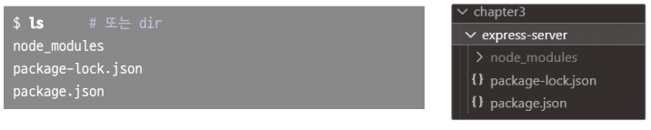

# **Node.js와 익스프레스로 웹 애플리케이션 서버 구현하기**  
# **OK를 반환하는 서버 만들기**  
1. 모든 요청에 "OK"를 반환해주는 서버를 다음과 같이 구현한다.  
code3-1-ok-server.js  
  
예제에서는 server에 값을 할당한 다음 listen()을 했지만 res.end("OK").listen() 같은 형태로 연결해서 사용할 수 있다.   
  
2. 서버를 실행 후 브라우저로 접속해서 OK가 나오면 성공이다.  
  
# **라우터 만들기**  
모든 요청에 OK로 응답하는 서버도 좋지만 일반적인 웹 서버는 URL 경로에 따라서 다른 응답을 준다. 이러한 기능을 라우팅이라고 한다. URL의 경로를 읽어서 
다른 응답을 주도록 코드를 수정한다.  
  
url 모듈을 사용하면 URL 경로를 간단하게 읽어올 수 있다.  
  
1. localhost:3000/user와 localhost:3000/feed라는 두 URL이 있다고 가정하고 두 요청에 대해 다른 응답을 주는 코드를 작성한다.  
code3-2-implement-router.js  
  
url 모듀을 사용해 요청으로 받은 url의 pathname을 얻을 수 있다. parse() 함수의 두 번째 인수로 있는 true는 쿼리 스트링도 함께 파싱할지 여부를 
설정하는 변수다.  
  
한글을 쓰면 출력된 값이 깨진다. 이는 charset이 설정되지 않아서이다. res.setHeader에 charset=utf-8을 추가해주면 한글이 깨지지 않는다.  
res.setHeader("Content-Type", "text/html; charset=utf-8");  
  
만든 url로 접속하면 응답을 받을 수 있다. 실제로 프로덕션 레벨에서 사용하는 라우터는 이보다 훨씬 복잡하다. 그렇지만 요청으로 들어온 정보를 
분석해서 라우팅하는 방법 자체는 같다.  
  
# **createServer() 리팩토링하기**  
현재는 요청에 대한 응답을 createServer() 안에서 직접 컨트롤한다. 이렇게 되면 createServer() 안의 콜백 함수에 모든 코드를 다 추가해야 하므로 
좋지 않다. 라우팅 이후의 처리를 별도의 함수를 만들어서 처리하도록 코드를 리팩토링한다.  
  
1. 라우터와 실행하는 함수 코드를 나눈다.  
code3-3-implement-router.js  
  
라우터 내부의 로직을 함수로 분리했다. 이제 메인 루틴을 깔끔히 유지하면서도 요청별 함수만 요구사항에 알맞게 변경하면 되는 코드가 되었다.  
  
# **동적으로 응답하기**  
앞에서 작성한 서버는 브라우저에서 localhost:3000/user에 접속하면 언제나 같은 결과를 보여 준다. user() 함수를 수정해서 매개변수에 따라 동적으로 
응답이 변경되도록 한다. url의 query 부분에 name과 age 정보를 추가한다.  
  
1. 먼저 user() 함수만 변경한다.  
code3-4-implement-router2.js  
  
url의 query 부분을 user라는 매개변수로 받는다. 응답을 줄 때 user.name, user.age를 사용한다. query를 사용해서 url을 요청하면 동적으로 
변하는 값을 볼 수 있다.  
  
# **라우터 리팩토링하기**  
현재는 분기문에서 모든 요청을 처리한다. 아직은 함수가 user(), feed(), notFound() 총 3개 뿐이다. 만약 이런 함수가 100개가 넘어간다면 유지보수하기가 
매우 힘들 것이다. 함수를 하나 추가할 때마다 분기문에서 실수하지 않도록 조치를 해야 한다. 유지보수성을 높이는 관점에서 라우터를 살짝만 리팩토링한다.  
  
분기문에 사용되는 매개변수가 같은 패턴을 보일 때는 맵 자료구조가 유용하다. 우리가 만든 라우팅 규칙도 분기문에 들어가는 매개변수라 같은 패턴을 
보인다. 그러므로 맵을 사용해서 분기문을 조금 더 깔끔하게 할 수 있다.  
  
1. 라우팅 관련 코드를 맵을 사용해 리팩토링한다.  
code3-5-refactoring-router.js  
  
in 연산자를 사용하여 객체의 키가 존재하는지 검사한다. 자바스크립트의 in 연산자와 맵을 사용해 아주 간단하게 URL 라우팅을 할 수 있게 되었다. 
라우팅에서 아용하는 함수가 많아지게 되고 각 함수에 공통 기능을 적용하고 싶을 땐 익스프레스의 미들웨어를 사용하여 요청에 대한 전후 처리를 할 수 있다.  
  
# **익스프레스 프레임워크 사용하기**  
지금까지 Node.js의 기본 라이브러리를 사용해 웹 서버를 만들었다. 우리가 만든 웹 서버로도 서비스를 할 수는 있겠지만 기능이 많이 부족하다. 실전에서 
사용하는 서버라면 라우터에서 HTTP 메서드로 각각 요청을 받는 기능, 템플릿 엔진 기능, 미들웨어 등의 기능을 제공해야 한다.  
  
  
  
  
기본 라이브러리로 구현하고 유지보수할 수도 있지만 시간이 많이 든다. 다행이 Node.js에는 이런 작업들을 제공하는 오픈 소스 웹 서버가 많다. 그중에 
익스프레스가 가장 널리 사용된다.  
  
# **익스프레스 설치하기**  
익스프레스는 기본 라이브러리가 아니므로 설치를 해야 한다. Node.js와 같이 설치되는 npm으로 설치하면 된다.  
  
1. express-sever 디렉터리를 만들고 이동한다.  
2. express-server 디렉토리에서 npm을 사용해 익스프레스를 설치한다. npm은 nodejs package manager의 약자로 말그대로 Node.js에서 사용하는 
외부 라이브러리 패키지 관리를 쉽게 하는 도구다.  
- npm install express  
  
3. 설치가 완료되면 ls(윈도우에서는 dir) 명령으로 무엇이 설치되었는지 확인한다. 다음과 같이 node_modeuls 디렉터리와 package-lock.json, 
package.json 파일이 보이면 성공이다.  
  
  
  
4. node_modeuls 디렉토리에는 익스프레스를 실행하는 데 필요한 의존성 패키지가 설치된다. 의존성 패키지 정보는 package.json에 들어 있다. 
npm ls 명령어를 입력해 확인한다.  
  

  
