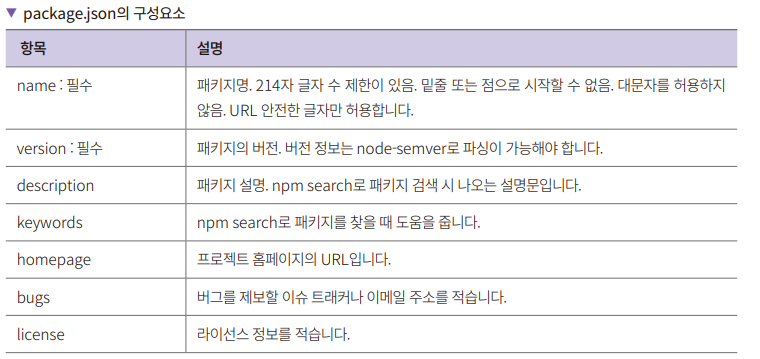
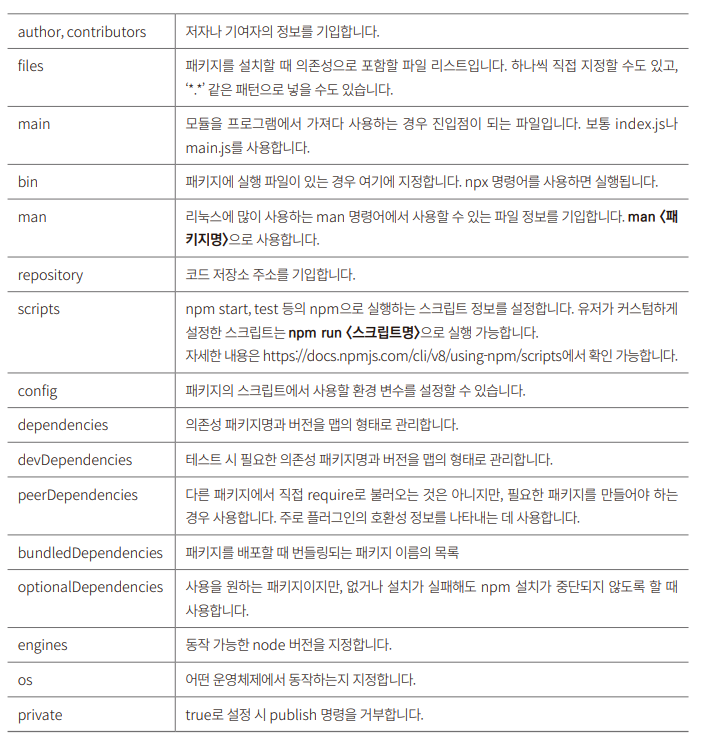

# **npm과 yarn으로 패키지 관리하기**  
# **npm 소개**  
npm(node package manager)은 자바스크립트용 패키지 매니저다. 유저가 만든 패키지를 등록하는 저장소를 의미하기도 하고 CLI(Command Line Interface)
를 의미하기도 한다. Node.js를 설치할 때 함께 설치된다.  
  
npm은 패키지 저장소로서는 2022년 기준으로 세상에서 가장 많은 수의 패키지가 등록되어 있다. 그냥 많은 게 아니라 압도적으로 많다. 자바의 메이븐, NET의 
NuGet, 파이썬의 PyPI, PHP, 루비를 모두 합친 것보다 많은 패키지가 등록되어 있다.  
  
패키지 매니저는 프로젝트에 필요한 의존성 패키지를 관리하는 프로그램을 의미한다. 의존성 패키지는 해당 프로젝트를 실행하는 데 꼭 필요한 라이브러리와 모듈들이다.  
  
예를 들어 3장 express-server 예제에서 npm으로 익스프레스 라이브러리를 설치하고 사용했다. express-server는 익스프레스 라이브러리가 없으면 동작하지 
않기에 익스프레스에 의존성이 있다고 말할 수 있다. npm은 이런 의존성 패키지를 잘 관리할 목적으로 만들었다. 단순하게 의존성 패키지 리스트만 잘 관리하면 
될 것 같지만 npm은 이보다 더 많은 기능을 제공한다.  
  
# **패키지와 모듈**  
Node.js에서 패키지는 package.json으로 정의한 파일 또는 디렉터리를 의미한다. 패키지에는 package.json이 꼭 포함된다. 다음에 정리한 것들 모두가 
패키지가 될 수 있다.  
  
1. package.json 파일이 있는 디렉터리  
2. 1번을 압축한 파일  
3. 2번을 내려받을 수 있는 URL 주소  
4. 3번 정보를 가지고 npm 저장소에 <패키지명>@<버전>으로 등록된 것  
5. 4번을 가리키는 <패키지명>@<태그>  
6. <패키지명>만 있는 경우는 5번에서 latest 태그를 가리킴  
7. 1번을 결과로 주는 깃 URL  
  
결과적으로는 package.json으로 정의한 코드 뭉치가 패키지다.  
  
모듈은 node_modules 디렉터리 아래에 있는 파일 또는 디렉터리를 말한다. node_modeuls에 있는 파일이나 디렉터리는 require() 함수로 읽을 수 있다.  
  
CommonJS는 브라우저 뿐아니라 서버 애플리케이션에서도 모듈 기능을 제공하기 위해 나온 모듈 규약이다. ES6가 나오기 전에 많이 사용되었고 특히 Node.js의 
기본값으로 사용되고 있다. ES module는 ES6의 자바사크립트 모듈의 표준이다. 패키지를 임포트할 떄 CommonJS(CJS)는 require() 함수로, ES Module(ESM)은 
import로 임포트한다. Node.js는 기본적으로 CommonJS 문법을 사용한다. package.json에 type 속성을 module로 설정하면 ESM을 사용할 수 있다. 
Node.js에서 ESM을 사용하면 프론트엔드의 코드를 백엔드에서도 쉽게 가져가 사용할 수 있는 장점이 있다.  
  
node_modeuls에는 npm install 명령으로 설치한 패키지들이 저장된다. 즉 모든 패키지는 모듈이다. 또한 npm에 등록하지 않아도 패키지 포맷만 맞다면 
npm install로 설치할 수 있다.  
  
패키지로 만들면 npm 레지스트리에 등록할 수 있다. 패키지로 만든 코드들은 간단하게 다른 곳에서 설치해 사용이 가능하므로 사설 npm 레지스트리에 공통으로 
사용하는 패키지를 배포해서 사용하기도 한다.  
  
사실 require() 함수를 사용할 때 단순히 현재 디렉터리의 node_modules만 읽는 것은 아니다. module.paths에 있는 경로를 따라서 모듈을 찾는다. 
상위 디렉터리에 있는 패키지를 계속 타고 올라가면서 node_modules를 확인하면서 굉장히 많은 I/O를 수행한다. 이것은 require() 함수가 무거워지는 원인이 
된다.  
  
# **package.json 파일을 만들기**  
sample-package라는 작은 패키지를 하나 만들고 다른 프로젝트에서 설치까지 진행한다.  
  
패키지를 만들려면 package.json이 필요하다. package.json 파일을 수작업으로 만들 수도 있지만 npm init 명령을 사용해 package.json 파일을 만드는 
방식을 추천한다.  
  
1. sample-package 디렉터리를 생성하고 해당 디렉터리에서 npm init -y 옵션을 주어 터미널에서 명령을 수행한다.  
  
2. index.js 파일도 만들고 사칙연산 함수들을 추가한다.  
sample-package/index.js  
  
require() 함수로 모듈을 읽을 때 파일을 위에서부터 읽는다. 따라서 sample-package를 불러오는 시점에 console.log를 실행한다. module.exports는 
require를 사용해 불러왔을 때 반환하는 객체를 저장하는 변수다. module은 현재 모듈을 의미하며 exports는 외부에 노출할 객체를 저장하는 변수다. 
기본값은 비어 있다. 여기에서는 사칙연산을 하는 각 함수를 객체 타입으로 저장했다. sample-package를 설치한 프로젝트에서는 require('sample-package') 
로 module.exports 안에 있는 값을 가져올 수 있다.  
  
3. 다른 프로젝트에서 설치 후 사용한다. sample-test 디렉터리를 만들고 해당 경로에서 npm install ../sample-package를 입력해 설치한다.  
설치 후 sample-test 디렉터리를 보면 node_modules 디렉터리와 package-lock.json 파일이 생성되어 있다.  
  
4. sample-test 디렉터리에 index.js를 만들고 sample-package를 테스트한다.  
sample-test/index.js  
  
npm login과 npm publish 명령을 사용하면 본인이 만든 패키지를 npm 레지스트리에 배포할 수도 있다. sample-package에 사용한 package.json에는 
정말 필수 속성만 기입했다. npm init 명령어를 실행하면 자동으로 생성되는 name, version, description, scripts 속성을 자주 사용한다. 추가로 dependencies와 
devDependencies를 많이 사용한다. package.json의 항목 중 name과 version은 필수다. name은 말그대로 프로젝트명이며 version은 프로젝트의 버전이다.  
  
Node.js 패키지들은 시맨틱 버전을 사용한다. 시맨틱 버전을 사용하지 않으면 패키지를 등록할 수 없다. 시맨틱 버전은 <메이저>.<마이너>.<패치> 형식으로 
표시하는 버전을 말한다. 기존 버전과 호환되지 않으면 메이저 버전을 올리고 기존 버전과 호환되면서 새로운 기능을 추가했다면 마이너 버전을 올리고 기존 버전과 
호환되면서 버그를 수정할 때는 패치 버전을 올린다.  
  
  
  
  
# **패키지 설치, 업데이트, 삭제**  
# **패키지 설치하기**  
