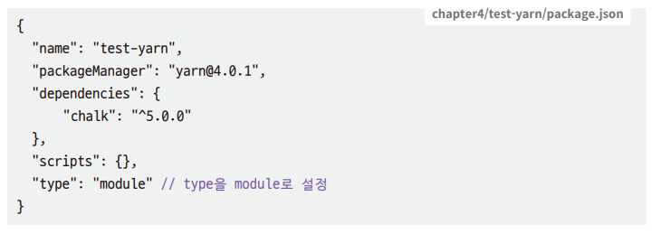

# **npm과 yarn으로 패키지 관리하기**  
# **npm 소개**  
npm(node package manager)은 자바스크립트용 패키지 매니저다. 유저가 만든 패키지를 등록하는 저장소를 의미하기도 하고 CLI(Command Line Interface)
를 의미하기도 한다. Node.js를 설치할 때 함께 설치된다.  
  
npm은 패키지 저장소로서는 2022년 기준으로 세상에서 가장 많은 수의 패키지가 등록되어 있다. 그냥 많은 게 아니라 압도적으로 많다. 자바의 메이븐, NET의 
NuGet, 파이썬의 PyPI, PHP, 루비를 모두 합친 것보다 많은 패키지가 등록되어 있다.  
  
패키지 매니저는 프로젝트에 필요한 의존성 패키지를 관리하는 프로그램을 의미한다. 의존성 패키지는 해당 프로젝트를 실행하는 데 꼭 필요한 라이브러리와 모듈들이다.  
  
예를 들어 3장 express-server 예제에서 npm으로 익스프레스 라이브러리를 설치하고 사용했다. express-server는 익스프레스 라이브러리가 없으면 동작하지 
않기에 익스프레스에 의존성이 있다고 말할 수 있다. npm은 이런 의존성 패키지를 잘 관리할 목적으로 만들었다. 단순하게 의존성 패키지 리스트만 잘 관리하면 
될 것 같지만 npm은 이보다 더 많은 기능을 제공한다.  
  
# **패키지와 모듈**  
Node.js에서 패키지는 package.json으로 정의한 파일 또는 디렉터리를 의미한다. 패키지에는 package.json이 꼭 포함된다. 다음에 정리한 것들 모두가 
패키지가 될 수 있다.  
  
1. package.json 파일이 있는 디렉터리  
2. 1번을 압축한 파일  
3. 2번을 내려받을 수 있는 URL 주소  
4. 3번 정보를 가지고 npm 저장소에 <패키지명>@<버전>으로 등록된 것  
5. 4번을 가리키는 <패키지명>@<태그>  
6. <패키지명>만 있는 경우는 5번에서 latest 태그를 가리킴  
7. 1번을 결과로 주는 깃 URL  
  
결과적으로는 package.json으로 정의한 코드 뭉치가 패키지다.  
  
모듈은 node_modules 디렉터리 아래에 있는 파일 또는 디렉터리를 말한다. node_modeuls에 있는 파일이나 디렉터리는 require() 함수로 읽을 수 있다.  
  
CommonJS는 브라우저 뿐아니라 서버 애플리케이션에서도 모듈 기능을 제공하기 위해 나온 모듈 규약이다. ES6가 나오기 전에 많이 사용되었고 특히 Node.js의 
기본값으로 사용되고 있다. ES module는 ES6의 자바사크립트 모듈의 표준이다. 패키지를 임포트할 떄 CommonJS(CJS)는 require() 함수로, ES Module(ESM)은 
import로 임포트한다. Node.js는 기본적으로 CommonJS 문법을 사용한다. package.json에 type 속성을 module로 설정하면 ESM을 사용할 수 있다. 
Node.js에서 ESM을 사용하면 프론트엔드의 코드를 백엔드에서도 쉽게 가져가 사용할 수 있는 장점이 있다.  
  
node_modeuls에는 npm install 명령으로 설치한 패키지들이 저장된다. 즉 모든 패키지는 모듈이다. 또한 npm에 등록하지 않아도 패키지 포맷만 맞다면 
npm install로 설치할 수 있다.  
  
패키지로 만들면 npm 레지스트리에 등록할 수 있다. 패키지로 만든 코드들은 간단하게 다른 곳에서 설치해 사용이 가능하므로 사설 npm 레지스트리에 공통으로 
사용하는 패키지를 배포해서 사용하기도 한다.  
  
사실 require() 함수를 사용할 때 단순히 현재 디렉터리의 node_modules만 읽는 것은 아니다. module.paths에 있는 경로를 따라서 모듈을 찾는다. 
상위 디렉터리에 있는 패키지를 계속 타고 올라가면서 node_modules를 확인하면서 굉장히 많은 I/O를 수행한다. 이것은 require() 함수가 무거워지는 원인이 
된다.  
  
# **package.json 파일을 만들기**  
sample-package라는 작은 패키지를 하나 만들고 다른 프로젝트에서 설치까지 진행한다.  
  
패키지를 만들려면 package.json이 필요하다. package.json 파일을 수작업으로 만들 수도 있지만 npm init 명령을 사용해 package.json 파일을 만드는 
방식을 추천한다.  
  
1. sample-package 디렉터리를 생성하고 해당 디렉터리에서 npm init -y 옵션을 주어 터미널에서 명령을 수행한다.  
  
2. index.js 파일도 만들고 사칙연산 함수들을 추가한다.  
sample-package/index.js  
  
require() 함수로 모듈을 읽을 때 파일을 위에서부터 읽는다. 따라서 sample-package를 불러오는 시점에 console.log를 실행한다. module.exports는 
require를 사용해 불러왔을 때 반환하는 객체를 저장하는 변수다. module은 현재 모듈을 의미하며 exports는 외부에 노출할 객체를 저장하는 변수다. 
기본값은 비어 있다. 여기에서는 사칙연산을 하는 각 함수를 객체 타입으로 저장했다. sample-package를 설치한 프로젝트에서는 require('sample-package') 
로 module.exports 안에 있는 값을 가져올 수 있다.  
  
3. 다른 프로젝트에서 설치 후 사용한다. sample-test 디렉터리를 만들고 해당 경로에서 npm install ../sample-package를 입력해 설치한다.  
설치 후 sample-test 디렉터리를 보면 node_modules 디렉터리와 package-lock.json 파일이 생성되어 있다.  
  
4. sample-test 디렉터리에 index.js를 만들고 sample-package를 테스트한다.  
sample-test/index.js  
  
npm login과 npm publish 명령을 사용하면 본인이 만든 패키지를 npm 레지스트리에 배포할 수도 있다. sample-package에 사용한 package.json에는 
정말 필수 속성만 기입했다. npm init 명령어를 실행하면 자동으로 생성되는 name, version, description, scripts 속성을 자주 사용한다. 추가로 dependencies와 
devDependencies를 많이 사용한다. package.json의 항목 중 name과 version은 필수다. name은 말그대로 프로젝트명이며 version은 프로젝트의 버전이다.  
  
Node.js 패키지들은 시맨틱 버전을 사용한다. 시맨틱 버전을 사용하지 않으면 패키지를 등록할 수 없다. 시맨틱 버전은 <메이저>.<마이너>.<패치> 형식으로 
표시하는 버전을 말한다. 기존 버전과 호환되지 않으면 메이저 버전을 올리고 기존 버전과 호환되면서 새로운 기능을 추가했다면 마이너 버전을 올리고 기존 버전과 
호환되면서 버그를 수정할 때는 패치 버전을 올린다.  
  
  
  
  
# **패키지 설치, 업데이트, 삭제**  
# **패키지 설치하기**  
npm을 사용해 가장 많이 사용하는 기능은 패키지 설치다. npm install 명령으로 패키지를 설치할 수 있다.  
  
  
  
npm install 대신 npm i 또는 npm add를 사용할 수도 있다. 단순히 별칭 기능이므로 셋 중에서 뭘 사용해도 결과는 같다.  
  
npm은 세계 최대의 패키지 저장소다. 180만 개가 넘는 패키지가 있어서 패키지명이 중복되는 문제가 있다. 패키지 스코프를 사용하면 이 문제를 피할 수 
있다. 패키지 스코프는 일종의 네임스페이스다. @로 이름이 시작하는데 가장 유명한 스코프로 @types가 있다. 타입스크립트의 타입 정의 패키지는 거의 
대부분이 @types 스코프로 시작한다. 스코프를 사용해서 패키지명이 같더라도 안전하게 사용할 수 있게 되었다. 예를 들어 test라는 패키지가 있다고 한다면 
@cat 스코프 밑에 test를 넣고 @rabbit 스코프 밑에 test를 각각 넣으면 패키지명은 같지만 스코프다 다르다. 결국 @cat/test, @rabbit/test로 각각 
사용할수 있기 떄문에 충돌이 발생하지 않는다.  
  
name은 패키지명이다. 패키지명 외에도 태그, 버전, 버전 범위가 필요하다. 없는 경우는 latest 태그를 기본값으로 사용한다.  
  
  
  
-g 옵션으로 설치된 node_modules 디렉터리는 npm root -g 명령으로 찾을 수 있다.  
  
1. 태그 외에 버전, 버전 범위도 붙일 수 있다. 버전 범위에서 사장 최신 버전을 설치한다.  
터미널에서 lodash(함수형 프로그래밍 함수를 모아놓은 모듈)를 설치한다.  
  
  
  
package.json 파일과 package-lock.json 파일을 보면 설치한 라이브러리와 버전 정보가 보인다.  
  
2. 개발 환경에서만 사용하는 패키지는 -D 옵션 혹은 --save-dev 옵션을 사용한다. 가장 많이 사용하는 테스트 패키지 중 하나인 jest를 devDependency에 
추가한다.  
  
npm install jest -D  
  
실행하고 나면 package.json의 devDependencies에 jest가 포함되었다. 버전 정보에 ^기호가 있다. ^는 캐럿이라고 읽는다. devDependencies는 개발 
시에만 사용하는 패키지를 정의하는 곳이다. 다른 곳에서 해당 패키지를 설치할 때는 의존성에 포함되지 않는다.  
  
## **npm install 명령만 사용하기**  
아무 옵션도 없으면 해당 디렉터리의 package-lock.json에 정의되어 있는 패키지들을 설치한다. package.json에 있는 것을 설치한다고 생각하기 쉽지만 
package.json 없이 package-lock.json 파일만 있어도 설치가 된다.  
  
조금 더 정확하게 하면 다음의 순위를 따른다.  
1. npm-shrinkwrap.json  
2. package-lock.json  
3. yarn.lock  

npm-shrinkwrap.json과 package-lock.json은 파일 내부의 포맷은 같으며 npm-shrinkwrap.json은 오래된 npm 버전(npm1.1.2에서 npm4까지)에서 
사용했고 package-lock.json은 npm5 이상에서 사용한다.  
  
## **git 저장소 URL을 설정해 설치하기**  
npm install <git 저장소 주소>  
npm install <git 저장소 주소>#버전  
  
이때 package.json에도 버전 정보가 아니라 깃허브 URL 정보를 기입한다. 해시태그로 버전을 명시하지 않으면 master 혹은 main의 최신 버전을 설치한다.  
  
  
  
# **패키지 업데이트하기**  
패키지 업데이트는 설치보다 명령어가 단순하다. 별칭으로 npm up, npm upgrade를 사용할 수 있다.  
  
  
  
-g 옵션은 install과 마찬가지로 node가 설치되어 있는 디렉터리의 의존성 패키지를 업데이트할때 사용한다.  
  
패키지명이 없으면 package.json에 정의한 의존성 패키지들 전부를 업데이트한다. package.json에 의존성 패키지 버전을 적을 때 앞에 ^또는 ~기호를 
사용할 수 있다. 의존성 버전 설정에 캐럿을 붙이면 메이저 버전 이외에는 모두 업데이트한다.  
  
예를 들어 ^1.0.0은 1.0.0보다 크거나 같고 2.0.0보다는 작은 버전을 의미한다. 즉 1.X.X 버전은 모두 업데이트하겠다는 의미다. 다만 1.0.0 미만인 
떄는 API 변경이 수시로 일어나므로 0.1.0 버전과 0.2.0 버전은 호환이 안 될 수 있다. 그래서 이 경우는 예외를 두게 된다. ^0.1.0은 0.1.0보다 크거나 
같고 0.2.0보다 작은 버전까지 업데이트한다.  
  
물결표인 ~는 틸드라고 읽으며 현재 지정한 버전의 마지막 자리 내 범위만 자동으로 업데이트한다.  
  
- ~0.0.1은 0.0.1보다 크거나 같고 0.1.0보다는 작은 범위에서만 업데이트 한다. 즉 0.0.X 버전까지만 업데이트한다.  
- ~0.3.1이라면 0.3.1보다 크거나 같고 0.4.0보다는 작은 버전까지 업데이트한다.  
- ~1은 1.0.0부터 1.X.X까지 업데이트한다.  
  
시맨틱 버전의 하위 의존성 여부는 해당 패키지를 만드는 사람 마음대로 하는 경우도 많으므로 의존성 업데이트를 한 다음에는 꼼꼼하게 테스트해 문제가 없는지 
확인해야 한다.  
  
# **설치한 패키지 확인하기**  
설치한 패키지의 리스트는 ls 명령으로 확인할 수 있다. 별칭으로 list, la, ll을 대신 사용할 수 있다.  
- npm ls [@스코프/] 패키지명  
- npm list  
- npm la  
- npm ll  
  
기본적으로는 설치한 패키지만 나오는데 --depth 옵션을 사용하면 설치한 의존성 패키지가 의존하는 패키지도 확인할 수 있다.  
- npm ls --depth=1  
  
그 외 옵션으로는 json 포맷으로 출력을 하는 json, 더 많은 정보를 주는 long, dependency 항목만 보여주는 prod, devDependency 항목만 보여주는 
dev, dev와 prod를 값으로 넣을 수 있도록 한 only가 있다.  
  
# **패키지 삭제하기**  
설피한 패키지의 삭제는 uninstall 명령을 사용한다. 삭제 명령 또한 remove, rm, r, un, unlink를 별칭으로 제공한다. 삭제 시 package.json의 
의존성 설정도 함께 삭제되고 package-lock.json 정보도 함께 갱신된다.  
  
- npm uninstall [@스코프/] 패키지명[@버전] [-S|--save|-D|--save-dev|-O|--save-optional]  
  
# **스크립트 기능과 NPX**  
npm은 명령어를 지정해 실행하는 스크립트 기능도 제공한다. 스크립트 기능은 앱 시작(start), 중지(stop), 빌드(build), 배포(deploy), 테스트(test) 
등의 명령어를 터미널에 매번 입력하지 않고 package.json에 정의함으로써 조금 더 간편하게 명령어를 실행하는 기능이다. 보통 스크립트는 node_modules 
디렉터리 아래에 설치된 패키지에 있기 떄문에 경로를 지정해야 하지만 npx를 이용하면 경로를 지정하지 않고 간편하게 사용할 수 있다.  
  
# **npm 스크립트 파일을 정의하기**  
Node.js 프로젝트의 package.json에는 scripts 항목이 있다. scripts에 등록된 항목들은 npm run 명령으로 실행할 수 있다.  
  
1. test-scripts 디렉터리를 생성한다.  
2. test-scripts 디렉터리 안에 package.json 파일을 만든다.  
test-scripts/package.json 참고  
  
3. 터미널에서 해당 디렉터리로 이동 후 npm run hello를 실행한다.  
npm run hello  
  
scripts에 hello로 등록된 명령이 실행된다. 이렇게 npm을 사용해 package.json의 scripts에 선언되어 있는 스크립트들을 실행할 수 있다.  
  
4. scripts에 정의하는 명령 중 start, stop, test, restart는 run 없이 바로 실행할 수 있다.  
package.json을 수정한다.  
   
5. npm test, npm stop, npm start, npm restart를 각각 터미널에서 실행한다.  
6. 스크립트 실행 전과 후에 실행될 스크립트를 지정할 수도 있다. 명령어 앞에 pre 혹은 post를 붙이면 된다. 앞서 만든 json 파일에 prehello, 
posthello 명령어를 정의한다.  
7. npm run hello를 실행한다. scripts에 등록하는 모든 명령어는 같은 원리로 만들 수 있다.  
  
# **NPX로 코드 포매팅 명령어 prettier 실행하기**  
NPX는 Node Package eXecute의 약자다. Node 패키지 실행자(Node Package Runner)라고도 한다. Node.js 패키지는 대부분 프로젝트에 임포트해서 
사용하지만 개발할 떄는 프로젝트 실행, 관리, 테스트 등에 명령행 패키지를 다수 사용한다. 대표적으로 prettier, eslint, jest 같은 포매팅, 문법 검사, 
단위 테스트 도구들이 있다. 이러한 패키지들을 실행하려면 node_modules/.bin/{패키지명} 경로로 명령어를 실행해야 한다. npx를 사용하면 npx {패키지명}처럼 
경로를 생략해 실행할 수 있다.  
  
1. test-npx 디렉터리를 만들고 이동하여 prettier를 설치한다. prettier는 자바스크립트를 자동으로 포매팅하는 CLI 명령어다.  
npm install prettier  
  
2. 설치가 완료되면 test-npx/node_modules/prettier/package.json을 확인한다.  
prettier 프로젝트의 package.json에 있는 bin 설정이 바로 npx 명령어에서 실행하는 파일이다.  
  
3. index.js 파일을 만들고 작성한다. 포매팅 전후를 비교해야 하므로 코딩 규칙을 엉망으로 적용해 작성한다.  
`function getRandomInt(  
 min,  
 max) /* 주석도 포매팅해줍니다. */
{
 return Math.floor(
 Math.random()
 * (max - min)) + min;
}

console.log(
 getRandomInt
 (10, 20));`  
  
4. 터미널에서 npx 명령어로 prettier를 실행한다.  
node_moduels/prettier/bin-prettier.js를 실행  
npx prettier index.js  
  
prettier를 실행해 포매팅된 결과를 index.js에 반영  
npx prettier -w index.js  
  
같은 포매팅을 사용해야 가독성이 높아지므로 파일 저장 시 혹은 저장소에 커미이나 푸시하기 전에 자동으로 적용되도록 하면 유용하다. package.json에 
bin 설정이 있고 실행 파일이 있다면 모두 npx 명령어로 실행할 수 있다. Nods.js로 작성한 패키지 중 {패키지명}-cli 프로젝트들은 대부분 npx로 실행할 수 있다.  
  
# **패키지 잠금**  
패키지 의존성 문제는 개발과는 별개의 일이라고 생각할 수 있다. 구현해야 하는 비즈니스 로직이 끊임 없이 밀려들기 때문이다. 그래서 대부분 패키지 
매니저에 대한 것은 설치, 버전 업, 삭제 등의 기본적인 기능만 공부하고 넘어가게 된다. 하지만 Node.js로 개발을 하면 빈번하게 패키지를 업데이트하거나 
설치하게 된다. 패키지 매니저를 제대로 알지 못하면 이따금 터지는 문제에 고생을 하게 된다. 따라서 패키지 매니저 관련해서는 번거롭더라도 확실히 
알고 넘어가는 것이 좋다.  
  
npm5 버전부터 등장한 package-lock.json은 node_modeuls나 package.json을 변경하는 모든 명령(npm isntall, npm update, npm uninstall)이 
실행되면 함께 변경된다.  
  
이유는 package.json에 버전을 설정할 때 특정 버전이 아니라 버전 범위를 설정하면 패키지를 설치하는 시점에 따라 다른 버전이 설치되기 때문이다. npm의 
패키지는 시맨틱 버전을 지키므로 하위 호환성을 지켜주어 문제가 없는 것 같다는 생각이 들 수도 있다. 하지만 npm에 등록된 패키지들은 엄격하게 관히가 
되고 있지 않는 오픈 소스가 대부분이다. 하위 호환에 대한 검증을 npm에서도 진행하지 않기 때문에 패치 버전으로 변경되었는데도 동작하지 않는 경우가 
생각보다 굉장히 많다.  
  
이 때문에 설치 시 올바르게 동작하는 버전을 고정해야 한다. 5버전 이상의 npm은 패키지를 처음 설치 혹은 업데이트하는 시점과 똑같은 버전을 서치하도록 
package-lock.json에 패키지 의존성 트리 정보를 저장해두고 설치 시 package.json이 아니라 package-lock.json을 확인하고 설치한다. 이를 패키지 
잠금이라고 한다.  
  
1. ora라는 터미널 스피너(뺑글이)를 제공하는 패키지를 설치한다.  
mkdir test-package-lock  
cd test-package-lock  
npm install ora  
  
단 하나의 패키지인 ora만을 설치했는데 출력 결과에는 31개의 패키지가 추가됐고 32개의 패키지의 취약점검사(audit)를 했다고 출력된다. ora가 의존성을 
가지는 패키지들이 있고 또한 각 패키지들이 의존성을 가지는 패키지가 있어서 의존성 트리를 쭉 따라가면서 모두 설치하니 31개가 된 것이다.  
  
2. 의존성 트리를 한 번 확인한다. 의존성 트리를 확인하는 명령어는 npm ls이고 옵션으로 --depth={숫자}를 사용하면 된다. 우선 1단계 의존성을 살펴본다.  
npm ls --depth=1  
  
ora는 bl, chalk 등 9개의 의존성을 가지고 있다. 그리고 각 패키지도 의존성을 가지고 있다. 그리고 의존성의 의존성을 가지는 패키지도 있다. 이것은 
의존성이 없어질 때까지 재귀적으로 반복된다. 내가 필요한 패키지는 하나지만 설치되는 패키지가 30개가 넘어가는 이유가 이것 때문이다. 사실 이 부분은 
Node.js의 문제이기도 하다.  
  
3. depth값을 한 단계 올린다. 의존성 트리가 깊어지면 서로 다른 패키지인데 같은 패키지를 의존성으로 가지는 경우가 생기게 된다.  
출력 결과 중 deduped는 중복된 부분을 삭제했다는 뜻이다. is-unicode-supported 패키지는 ora도 의존성을 가지고 있는데 log-symbols도 의존성을 가지고 
있다. 중복된 패키지를 모두 내려받으면 node_modules 용량이 매우 커지게 되므로 중복이 있으면 하나만 받고 나머지는 내려받지 않는다.  
  
4. 의존성 트리의 depth값을 4까지 하면 모든 의존성을 확인할 수 있는데 그러면 inherits, is-unicode-supported 이렇게 둘이 중복된다.  
중복된 의존성 패캐지들을 의존성 패키지 내부의 node_modules에 두는 것이 아니라 ora 바로 아래에 두고 사용할 수 있게 최상위로 올려서 해결한다. 
버전이 다른 경우는 중복이 아니므로 설치해야 한다. 예를 들어 chalk는 ora에 4.1.2 버전으로, log-symbols에 5.0.0 버전으로 의존성이 결려 있다면 
4.1.2 버전은 node_modules 바로 아래에 설치하고 5.0.0 버전은 node_modules/log-symbols/node_modules/chalk에 설치한다. 이 경우 chalk 5.0.0 
라이브러리의 의존성은 설치하지 않는데 npm install할 때 해당 모듈이 필요한지 npm에서 알아서 판단해 설치한다. 이 경우 chalk 5.0.0 라이브러리의 의존성은 
설치하지 않는데 npm install할 때 해당 모듈이 필요한지 npm에서 알아서 판단해 설치한다. 정말로 필요한지는 node_modules/log-symbols에서 npm install로 
설치를 하고 npm ls --depth=5를 수행하면 된다. 무수히 많은 extraneous(상관없는)와 deduped(중복 제거됨)을 볼 수 있다.  
  
ora의 의존성 트리 중 중복되는 곳과 각각 다른 버전이 있는 것을 그림으로 나타내면 다음과 같다. 그림에 모든 의존성을 표시하지는 않았다.  
  
  
  
위와 같이 복잡하게 얽혀 있는 의존성을 모두 해결해 node_modules에 설치한 그림은 다음과 같다. 트리 구조로 복잡하게 얽혀 있던 것을 하나로 모아서 
평평하게 관리할 수 있게 했다. 문제는 패키지를 불러올 때 참고하는 node_modules가 하나가 아니라는 점이고 그것을 실행하는 알고리즘이 매우 복잡하다는 
것이다.  
  
또 한 가지 문제점은 이렇게 중복된 의존성 패키지를 위로 끌어올리는(hosting) 전략은 package.json에는 정의하지 않은 의존성 패키지를 사용할 수 있게 
해준다. ora의 경우라면 inherits@2.0.4를 그냥 사용할 수 있다. 이를 유령 의존성(phantom dependency)이라고 한다. 정의하지 않았는데 사용할 수 
있는 것도 직관적이지 않다는 부분에서 좋지 않다.  
  
  
  
ora는 굉장히 간단한 구조의 패키지를 가지고 있다. 그런데 간단한 구조의 프로젝트에서 이정도의 복잡도라면 더 복잡한 구조의 프로젝트는 굉장히 복잡하게 
될 것이 자명하다. 그러므로 Node.js 개발 시에는 꼭 필요한 패키지가 아니라면 설치하지 않는 것이 좋고 너무 많은 의존성을 가진 패키지는 꼭 필요하지 
않다면 사용하지 않는 것이 좋다. 패키지 의존성을 최소화하는 것도 Node.js 개발에서는 중요하다.  
  
package.json에서는 ora^6.0.1을 설치했다고 나온다. ^기호를 사용했으니 6.x.x 버전까지는 npm update를 사용하거나 다른 머신에 새로 설치할 때 버전이 
변경될 것을 예상할 수 있다.  
  
npm install을 하면 package-lock.json 파일이 생긴다.  
  
  
  
name은 package.json에 있는 것과 같다. lockfileVersion은 주로 1 아니면 2가 나온다. 1은 npm 버전 5, 6에서 사용한다. npm 버전 7 이후에는 
2 또는 3이 나온다. 의존성 설정 부분은 크게 package 부분과 dependencies 부분으로 나뉜다. npm 버전 7에서는 package 부분만 필요하다. 
dependencies는 npm5와 6에서의 호환성을 지키기 위해 남아 있다.  
  
또한 lockfileVersion이 3인 경우도 있는데 npm 버전이 7 이상이고 하위 호환이 필요 없는 경우 사용한다. 아직까지 많이 사용되고 있지는 않다. 
또한 npm 버전이 7 이상인 경우 숨겨진 잠금 파일인 .package-lock.json 파일이 node_modeuls 디렉터리 밑에 있다. 기존 package-lock.json과 
구성이 거의 같으나 하위 호환을 고려하지 않아도 되므로 dependencies 부분이 삭제되어 있다.  
  
큰 구성은 다음과 같다.  
  
  
  
npm 7 이상에서 참조하는 의존성 패키지 정보다. node_modules/{패키지명}으로 되어 있는 부분은 node_modules 디렉터리 구조와 동일하며 각 패키지 
설치를 위한 정보를 제공한다. 추가 정보로 engines(Node.js 호환 버전 설정), funding(프로젝트 펀딩 정보) 정보가 있다.  
  
dependencies는 npm5, 6에서 사용하는 의존성 패키지 정보다. engines, funding 이외의 정보는 같다.  
  
npm install은 package.json 정보를 참고하여 의존성 패키지를 설치한다. npm install 실행 시 package.json을 참고하여 package-lock.json 파일을 
생성한다. package-lock.json 파일의 생성 시점에 따라 마이너 버전이 업데이트되는 등의 이유로 의도한 바와는 다른 패키지 버전이 설치되는 경우가 있다. 
이런 문제가 생기지 않게 하려면 package.json이 아니라 package-lock.json 파일만 참고해서 의존성 패키지를 설치하면 된다. npm ci는 정확하게 
이러한 용도로 사용하는 명령어다. ci는 clean install의 약자다. 사용법은 다음과 같다.  
  
npm ci  
  
npm ci 명령어 사용 시 package.json과 package-lock.json 버전이 일치하는지 확인한다. 맞지 않으면 에러를 발생시킨다. 또한 의존성 패키지 모듈이 
저장되어 있는 node_modules 디렉터리를 삭제 후 모든 의존성 패키지를 다시 설치한다. 그러므로 개별 의존성 패키지를 설치하는 용도로는 맞지 않다. 
npm install, update는 package.json을 변경하는 경우가 있지만 npm ci는 절대로 package.json을 변경하지 않는다. npm ci 명령이 적합한 곳은 
개발에서 사용한 패키지 그대로 테스트 서버나 프로덕션 환경에 사용할 때이다.  
  
# **npm의 대안 yarn**  
npm을 사용한 패키지 관리가 쉬운 일은 아니다. 추가로 npm은 용량 문제, 패키지 내려받기 속도 문제, 보안 문제를 갖고 있다. yarn은 이러한 문제들을 
해결할 목적으로 2016년에 페이스북에서 만든 패키지 관리 프로그램이다.  
  
yarn은 버전 1과 yarn berry라고 부르는 버전 2가 있다. 버전 1은 npm과 거의 유사하며 패키지 설치가 조금 더 빠른 정도다. 반면 버전 2는 PnP(Plug'n'Play) 
전략을 사용하며 node_modules를 사용하지 않고 의존성 패키지를 관리한다. PnP 전략은 패키지를 적절한 위치에 꽂으면(Plug) 바로 실행(Play)하도록 
단순화하는 데 있다. 이를 위해 node_modules 디렉터리를 사용하지 않고 의존성 찾기는 .pnp.cjs에 정리하고 실제 의존성 패키지 파일은 압축 파일의 
형태로 .yarn 디렉터리 아래의 cache 디렉터리에 저장한다. cache 디렉터리 안에 있는 패키지들은 트리 구조가 아니라 모두 끌어올림되어 평평하게 
저장된다. PnP 전략을 사용해 의존성 패키지를 코드 저장소에 바로 저장하면 추후에 서버 배포 시 패키지 설치를 하지 않아도 된다. 이것을 제로 인스톨(zero install) 
이라고 한다. 제로 인스톨을 하면 서버에 소스 코드를 배포할 때 패키지도 같이 설치가 된다. 그러면 패키지 설치 시점에 따라 버전이 달라져서 버그가 
발생하는 일도 없어지게 된다.  
  
PnP를 사용함으로써 얻는 이점이 또 하나 있는데 서버의 기동 속도가 빨라진다는 점이다. 애플리케이션이 동작하려면 require로 불러오는 의존성 
패키지가 어디 있는지 다 파악을 해야 해서 많은 파일 탐색 동작이 일어난다. PnP를 사용하는 yarn2에서는 기동할 때 의존성 패키지가 어디에 있는지 
파일시스템을 순회하면서 찾을 필요가 없으니 의존성 패키지 위치를 찾는 시간 만큼 빨리 기동된다.  
  
1. test-yarn 디렉터리를 만들고 yarn2를 활성화한다.  
  
  
  
코어팩(corepack)을 활성화헀다. 코어팩은 Node.js 프로젝트에 npm 이외의 패키지 매니저를 사용하는 기능이다. yarn과 pnpm을 지원한다. 혹시나 
Node.js 버전이 낮아서 에러가 난다면 npm i -g corepack으로 설치한다.  
  
코어팩 활성화 후 yarn2 버전으로 초기화한다. 결과로 나오는 부분은 자동으로 생성된 package.json이다. 디렉터리명을 프로젝트명으로 사용했고 
packageManager 값으로 yarn@4.0.1을 지정했다.  
  
사람들이 yarn2라고 말하는 것은 버전을 의미하는 것이 아니라 새로운 코드베이스를 사용한 버전을 의미한다. yarn2는 yarn berry라는 코드명으로 
새로운 저장소에 저장되어 있으며 이것은 yarn2.x와 yarn3.x를 포함한다.  
  
2. test-yarn 디렉터리에 어떤 파일들이 생성되었는지 확인한다.  
  
결과로 .editorconfig, .git, .gitignore, .yarn, .yarnrc.yml, README.md, package.json, yarn.lock 파일이 생성되었다. .yarnrc.yml은 
yarn에 관리된 환경 설정이 들어있는 파일이고 .yarn은 의존성 패키지의 압축 파일을 저장하는 디렉터리다. package.json은 프로젝트와 패키지 관리를 
위한 파일이며 yarn.lock은 package-lock.json과 같이 패키지 잠금을 위해 생성하는 파일이다.  
  
yarn의 패키지 설치 명령어는 yarn add다.  
  
  
  
  
3. yarn으로 터미널에 색을 표시하는 chalk 패키지를 설치한다. 실행 후에는 package.json이 업데이트되고 .yarn 아래의 cache 디렉터리에 chalk 
패키지의 압축 파일이 추가된다.  
  
yarn add chalk  
  
.yarn 아래의 cache 디렉터리를 확인해보면 디렉터리 하나 없이 아주 깔끔하게 확장자가 zip인 압축 파일들로만 구성되어 있음을 확인할 수 있다.  
  
4. chalk를 테스트할 main.js 파일을 만들고 실행한다.  
test-yarn/main.js  
  
5. yarn2로 생성한 프로젝트는 node_module이 없으므로 node 명령어로 실행되지 않는다. yarn node 명령어로 실행할 수 있다. 실행하면 에러가 나온다.  
yarn node main.js  
  
6. 에러가 난 이유는 chalk에서 모듈 시스템으로 ES module을 사용했기 떄문에 pacakge.json에 type을 module로 설정해야 한다. 설정한 뒤 다시 
실행하면 또 에러가 발생한다(yarn 4.0에서 문제가 해결되었다).  
  
  
  
7. 모듈 설정을 제대로 했는데도 다시 에러가 난다. 이유는 chalk가 yarn에서 지원하지 않는 기능을 사용하고 있기 때문이다. chalk의 저장소의 package.json을 
보면 imports라는 속성이 있다.  
  
imports는 다른 패키지의 소스를 포함시키는 설정이다. 이 설정은 yarn2에서 지원을 하지 않는다. 왜냐하면 의존성 패키지의 버전을 정확하게 알 수 있는 
방법이 없기 떄문이다. 해결을 하려면 imports를 삭제하고 imports에 있는 패키지들을 포함하는 소스도 같이 수정해야 한다.  
  
  
  
8. 깃허브에서 chalk를 포크(fork)받아서 나의 저장소에 chalk 프로젝트를 생성한다. package.json에 있는 imports 설정을 삭제하고 dependencies에 
ansi-styles와 supports-color 의존성을 추가한다.  
  
  
  
  
9. source/index.js에서 #ansi-styles와 #supports-color를 가져오는 부분도 수정한다.  
  
  
  
10. 이렇게 고친 다음 chalk로 PR을 보내서 수정을 요청할 수 있지만 github 주소만 있으면 패키지 설치가 가능하다. 수정된 버전의 chalk을 설치한다.  
  
  
  
11. 이제 다시 yarn node로 main.js를 실행하면 정상적으로 출력된다.  
  
yarn을 사용하면 매우 깔끔하게 패키지 관리를 할 수 있다. 다만 chalk의 사례에서 보듯이 yarn에서 지원하지 않는 기능을 사용하는 패키지도 있으므로 이 
부분을 잘 확인해야 한다.