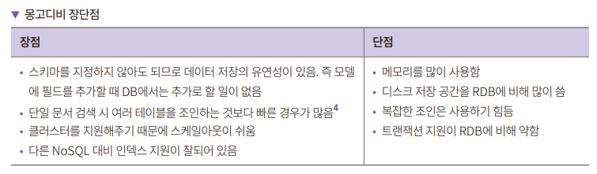

# **NoSQL 데이터베이스 몽고디비 사용하기**  
# **몽고디비 소개**  
몽고디비는 NoSQL 데이터베이스다. NoSQL 데이터베이스는 데이터 모델에 따라서 키-밸류(Key-Value), 컬럼, 도큐먼트, 그래프 타입으로 분류할 수 있다. 
그중 몽고디비는 도큐먼트 타입이다.  
  
- 키-밸류 타입은 키를 기준으로 데이터를 조회하고 값으로 데이터를 저장한다.  
- 도큐먼트 타입은 JSON과 유사한 형식의 객체를 담은 데이터를 저장한다.  
- 그래프 타입은 노드를 사용하여 데이터를 저장하고 에지를 사용해 데이터 관계를 저장한다.  
  
# **데이터베이스 기본 용어**  
- 테이블: 특정 주제에 대한 행과 열로 이루어진 데이터의 모음.  
- 로우: 관계형 데이터베이스의 테이블에서 단일 구조 데이터 항목. 레코드라고도 부른다.  
- 컬럼: 관계형 데이터베이스의 테이블에서 특정한 자료의 값 혹은 테이블에서의 열  
- 기본키: 데이터 식별 시 필요한 키.  
- 왜래키: 두 테이블을 연결하는 데 사용하는 키.  
- RDB: 관계형 데이터베이스.  
- 스키마: 데이터베이스 테이블의 명세(길이, 자료형 등)를 기술한 데이터.  
- 모델: 데이터베이스의 특정 테이블과 테이블에 있는 컬럼들의 형태를 정의한 클래스.  
- 컬렉션: 몽고디비에서 사용하는 용어. 도큐먼트의 집합을 컬력센이라고 한다. 관계형 데이터베이스의 테이블과 동일한 의미.  
- 조인: 두개 이상의 테이블 또는 컬렉션을 조합하여 데이터를 보여주는 기법.  
- 트랜잭션: 데이터 변경을 수행하는 작업 단위.  
  
## **알아두면 좋은 용어**  
- 클러스터: 데이터 처리량을 높일 목적으로 데이터를 여러 서버(샤드)에 저장하는 기법.  
- 샤드: 큰 데이터베이스를 작은 단위로 분할하는 기능을 의미. 샤드를 사용하여 데이터를 작은 단위로 분할하여 노드(데이터를 가지고 있는 서버)에 분산시켜서 
저장할 수 있다. 샤드를 사용하면 대규모 데이터베이스를 다루는 시스템에서 성능과 확장성을 향상시킬 수 있다.  
  
# **몽고디비 특징**  
몽고디비에서 도큐먼트는 BSON이라는 데이터 포맷이다. BSON은 Binary JSON의 의미로 JSON을 바이너리 형식으로 저장하는 형태다. 또한 기존 JSON에는 지원하지 
않는 자료형인 Date와 BinData(바이너리데이터) 타입을 지원한다. JSON과 비슷한 형태이므로 이해하기 쉽고 바이너리로 저장하기 때문에 용량이 문자열보다는 
작고 성능이 좋다.  
  
  
  
몽고디비는 JSON과 유사한 BSON을 사용하므로 자바스크립트와 호환성이 좋다. 몽고디비에서 데이터를 조회할 때 사용하는 쿼리도 자바스크립트를 사용한다. 
최근에는 인기가 조금 식긴 했지만 예전에는 MEAN 스택이라고 해서 몽고디비, 익스프레스, 앵귤러, 엔진엑스를 사용하는 기술 스택이 인기가 있었다. 몽고디비는 
데이터베이스, 익스프레스는 백엔드, 앵귤러는 프론트엔드, 엔진엑스는 웹 서버다. MEAN 스택의 핵심 언어는 자바스크립트다. 몽고디비는 자바스크립트 친화적이다.  
  
