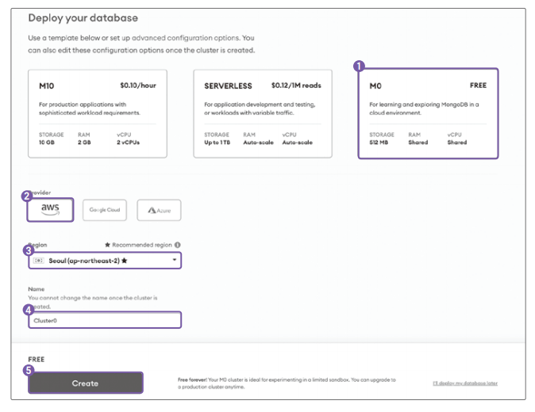

# **NoSQL 데이터베이스 몽고디비 사용하기**  
# **몽고디비 소개**  
몽고디비는 NoSQL 데이터베이스다. NoSQL 데이터베이스는 데이터 모델에 따라서 키-밸류(Key-Value), 컬럼, 도큐먼트, 그래프 타입으로 분류할 수 있다. 
그중 몽고디비는 도큐먼트 타입이다.  
  
- 키-밸류 타입은 키를 기준으로 데이터를 조회하고 값으로 데이터를 저장한다.  
- 도큐먼트 타입은 JSON과 유사한 형식의 객체를 담은 데이터를 저장한다.  
- 그래프 타입은 노드를 사용하여 데이터를 저장하고 에지를 사용해 데이터 관계를 저장한다.  
  
# **데이터베이스 기본 용어**  
- 테이블: 특정 주제에 대한 행과 열로 이루어진 데이터의 모음.  
- 로우: 관계형 데이터베이스의 테이블에서 단일 구조 데이터 항목. 레코드라고도 부른다.  
- 컬럼: 관계형 데이터베이스의 테이블에서 특정한 자료의 값 혹은 테이블에서의 열  
- 기본키: 데이터 식별 시 필요한 키.  
- 왜래키: 두 테이블을 연결하는 데 사용하는 키.  
- RDB: 관계형 데이터베이스.  
- 스키마: 데이터베이스 테이블의 명세(길이, 자료형 등)를 기술한 데이터.  
- 모델: 데이터베이스의 특정 테이블과 테이블에 있는 컬럼들의 형태를 정의한 클래스.  
- 컬렉션: 몽고디비에서 사용하는 용어. 도큐먼트의 집합을 컬력센이라고 한다. 관계형 데이터베이스의 테이블과 동일한 의미.  
- 조인: 두개 이상의 테이블 또는 컬렉션을 조합하여 데이터를 보여주는 기법.  
- 트랜잭션: 데이터 변경을 수행하는 작업 단위.  
  
## **알아두면 좋은 용어**  
- 클러스터: 데이터 처리량을 높일 목적으로 데이터를 여러 서버(샤드)에 저장하는 기법.  
- 샤드: 큰 데이터베이스를 작은 단위로 분할하는 기능을 의미. 샤드를 사용하여 데이터를 작은 단위로 분할하여 노드(데이터를 가지고 있는 서버)에 분산시켜서 
저장할 수 있다. 샤드를 사용하면 대규모 데이터베이스를 다루는 시스템에서 성능과 확장성을 향상시킬 수 있다.  
  
# **몽고디비 특징**  
몽고디비에서 도큐먼트는 BSON이라는 데이터 포맷이다. BSON은 Binary JSON의 의미로 JSON을 바이너리 형식으로 저장하는 형태다. 또한 기존 JSON에는 지원하지 
않는 자료형인 Date와 BinData(바이너리데이터) 타입을 지원한다. JSON과 비슷한 형태이므로 이해하기 쉽고 바이너리로 저장하기 때문에 용량이 문자열보다는 
작고 성능이 좋다.  
  
  
  
몽고디비는 JSON과 유사한 BSON을 사용하므로 자바스크립트와 호환성이 좋다. 몽고디비에서 데이터를 조회할 때 사용하는 쿼리도 자바스크립트를 사용한다. 
최근에는 인기가 조금 식긴 했지만 예전에는 MEAN 스택이라고 해서 몽고디비, 익스프레스, 앵귤러, 엔진엑스를 사용하는 기술 스택이 인기가 있었다. 몽고디비는 
데이터베이스, 익스프레스는 백엔드, 앵귤러는 프론트엔드, 엔진엑스는 웹 서버다. MEAN 스택의 핵심 언어는 자바스크립트다. 몽고디비는 자바스크립트 친화적이다.  
  
# **몽고디비 아틀라스 설정하기**  
mongodb.com에 있는 몽고디비 서버군으로 클라우드로 사용할 수 있는 몽고디비 아틀라스(MongoDB Atlas), 무료 설치 버전인 커뮤니티 서버(Community Server), 
커뮤니티 서버에 추가적인 기능과 서프트를 제공하는 유료 설치 버전 엔터프라이즈 서버(Enterprise Server)가 있다.  
  
가장 빠르고 간편하게 사용할 수 있는 몽고디비 아틀라스를 설정한다.  
  
1. https://www.mongodb.com/atlas에 접속해 Try Free 버튼을 클릭한다.  
2. 원하는 방식으로 안내에 따라 가입한다.  
3. 회원가입 후 약관에 동의하고 Submit 버튼을 눌러 다음으로 진행한다.  
4. 설문조사를 스킵하고 다음으로 진행한다.  
5. 다음으로 사용할 데이터베이스를 선택한다. 무료 플랜은 메모리와 CPU를 공유하며 최대 저장 공간은 512MB다. 무료 플랜인 M0을 선택하고 Provider로는 AWS를 
선택한다. Region은 Seoul (op-northeast-2)를 선택한다. Name은 그대로 두고 Create 버튼을 클릭한다.  
  
  
  
6. 몽고디비 접속 설정을 하는 페이지가 보인다.  
  
  
  
1번은 몽고 디비를 접속할 때 아이디/패스워드 기반으로 할지, 인증서 기반으로 할지 선택할 수 있다. Username and Password를 선택한다. 2번 항목에 유저명과 
패스워드를 입력한다. 3번 버튼 Create User를 눌러서 유저를 생성한다. 그러면 다음과 같이 유저명과 인증 타입 부분이 추가된다.  
  
  
  
4번 항목에 기본적으로는 로컬 환경에서 접속이 선택되어 있다. 5번 항목 Add My Current IP Address를 눌러서 로컬 환경의 IP를 등록한다. 그러면 다음과 
같이 IP가 추가된다.  
  
  
  
6번 항목 Finish and Close 버튼을 클릭해 설정을 마무리한다. 버튼을 클릭하면 안내 팝업이 뜬다. Database Access나 Network Access는 왼쪽 메뉴에서 
나중에도 접근이 가능하므로 설치가 잘 되었는지 Go to Databases를 클릭해 확인한다.  
  
7. 데이터베이스 관련 설정을 모두 마치면 데이터베이스 상태를 확인할 수 있는 페이지로 이동된다. Connect 버튼을 눌러서 접속 정보를 확인한다.  
  
  
  
8. 클러스터에 접속하는 방법은 3가지다. 첫 번째는 몽고디비 셸을 사용하는 방법, 두 번째는 애플리케이션에서 몽고디비 드라이버를 사용하는 방법, 세 번째는 
몽고디비 콤파스(MongoDB Compass) GUI 프로그램을 사용하는 방법이다. 우리는 Node.js 프로그램에서 접속이 가능한지 궁금하니 두 번째 방법인 애플리케이션에서 
몽고디비 드라이버를 사용해 접속이 되는지 확인한다. Connect your application을 클릭한다.  
  
  
  
9. 1번 항목에는 Node.js가 자동으로 선택되어 있다. 2번 항목에 있는 부분을 클릭해 모든 소스 코드가 보이도록 한다. 3번 아이콘을 클릭해 소스를 복사한다.  
  
  
  
10. try-mong 디텍터리를 생성 후 아래에 test-connection.js 파일을 생성하고 복사한 코드를 붙여넣는다.  
  
  
  
몽고디비 연결 정보 uri는 프로토콜이 mongodb+srv다. 몽고디비 아틀라스 연결 시 사용하며 드라이버에서는 <호스트명> + <도메인네임>으로 DNS에 서버 
주소를 질의한다. myFirstDatabase는 데이터베이스 이름이다. 몽고디비에서는 데이터베이스를 먼저 만들지 않아도 사용할 수 있다. retryWrites=true 옵션은 
네트워크 오류가 발생하거나 정상적인 연결을 찾을 수 없을 때 쓰기 작업을 자동으로 재시도하는 옵션이며 w=majority 옵션은 쓰기를 시도할 때 다수(majority)의 
인스턴스에 쓰기 요청을 전달하고 성공 확인을 받는다. 데이터베이스(클러스터)가 3대라면 최소 2대의 승인이 있어야 쓰기가 가능하다는 뜻이다. 1대가 아니고 
전부도 아닌 다수 옵션을 사용하는 이유는 1대에만 쓰기가 됐는지 확인한다면 쓰기 요청을 받은 장비에 장애가 날 경우 데이터가 유실될 수 있다. 모든 서버에 
쓰기가 되었는지 확인하는 경우에는 1대라도 장애가 나면 쓰기가 실패한다. 이러한 이유로 최소한의 서버가 문제가 생기는 경우에도 디비 서버로의 요청이 정상 
작동하도록 다수의 서버 옵션을 선택한다.  
  
2번 항목은 MongoClient 객체를 생성하는 코드다. connect() 함수를 사용해 몽고디비에 접속을 시도한다. 4번 항목은 test 데이터베이스에 있는 devices 
컬렉션 정보를 가져오는 코드다. 컬렉션은 RDB의 테이블과 유사한 역할을 한다.  
  
11. 코드를 실행한다.  
node test-connection.js  
  
12. 실행 결과로 몽고디비 모듈이 없다는 에러가 난다. 몽고디비 패키지를 설치하고 다시 실행한다.  
npm i mongodb  
node test-connection.js  
  
결과에는 아무것도 나오지 않는다. 몽고비디와 커넥션은 맺었지만 아무런 정보도 호출하지 않았기 때문이다.  
  
13. 데이터베이스 정보를 출력하도록 소스 코드를 수정한다.  
try-mongo/test-connection.js  
  
admin() 함수는 admin DB의 인스턴스를 가져 올 수 있게 해준다. admin DB 인스턴스에는 listDatabases() 함수가 있고 해당 함수를 실행하면 데이터베이스들의 
정보를 반환해준다. 아직은 아무런 데이터가 없어서 데이터베이스에는 admin과 local만 있다. admin, local은 기본적으로 생성되어 있는 데이터베이스다. run() 
함수에서는 데이터베이스 목록을 출력한 다음 마지막에 몽고디비 커넥션을 닫도록 코드를 작성했다.  
  
14. 다시 실행하여 결과를 확인한다.  
  
# **몽고디비 CRUD API 만들기**  
1. try-mongo 디렉터리 아래에 파일을 생서하고 실행한다.  
try-mongo/test-crud.js  
  
MongoClient 인스턴스를 생성해 client 변수에 담는다. useNewUrlParser 옵션은 몽고디비 드라이버 3.0 버전 이후로 생긴 새로운 URL 파서를 사용한다는 
옵션이다. 몽고디비 아틀라스를 연결할 때는 해당 옵션을 사용해야 한다. client.connect() 함수를 사용해 서버에 연결을 시도한다.  
  
client.db('test')는 test 데이터베이스를 사용한다는 뜻이고 collection('person')은 person 컬렉션을 사용한다는 뜻이다. 데이터베이스가 생성되어 
있지 않으면 새로 생성한다. 문서를 하나 추가할 때는 insertOne() 함수를 사용하며 인수로는 JSON 형식의 객체를 넣으면 된다. 문서 찾기에는 find() 
함수를 사용한다. 인수로는 객체의 속성과 찾고자 하는 값을 넣어주면 된다. 결괏값이 여러 개일 수 있으므로 toArray() 함수를 사용해 배열로 반환해준다.  
  
문서를 갱신할 떄는 갱신할 도큐먼트를 찾는 데 사용할 JSON 객체를 첫 번째 인수로 넣고 두 번째 인수에는 $set의 값으로 업데이트할 값을 넣는다. $set은 
몽고디비의 연산자로 값을 필드에 지정할 떄 사용한다.  
  
  
  
2. 터미널에서 코드를 실행해본다.  
  
# **몽고디비 콤파스로 데이터 확인하기**  
GUI 프로그램을 사용하면 더 간편하게 데이터를 확인할 수 있다.  
  
1. https://www.mongodb.com/try/download/compass에 접속한다. 좌측 메뉴에서 MongoDB Compass를 클릭한 후 stable 버전을 선택하고 Platform은 
맞는 OS를 선택한 후 Download 버튼을 눌러서 콤파스 패키지를 설치한다.  
  
2. 몽고디비에 접속하려면 몽고디비 서버의 주소가 필요하다. 몽고디비 아틀라스에서 Connect -> Connect using MongoDB Compass -> 복사 아이콘을 눌러 
서버 주소를 복사한다.  
  
3. 몽고디비 콤파스 프로그램을 켜서 접속한다. 키면 New Connection이라고 쓰여진 박스가 보인다. 몽고디비 아틀라스 주소를 붙여넣고 password 부분을 실제 
패스워드로 변경한다. Connect 버튼을 클릭한다.  
  
그러면 다음과 같은 화면이 나온다.  
  
  
  
번 항목에서 데이터베이스 및 컬렉션을 볼 수 있고 2번 항목 Databases를 선택하면 데이터베이스별 정보를 볼 수 있다. 데이터 크기, 컬렉션 개수, 인덱스 
개수 등을 확인할 수 있다. 하단에 있는 MONGOSH를 선택하면 CLI로 몽고디비를 조작할 수 있는 mongosh을 사용할 수 있다. test를 클릭한다. 다음으로 
컬렉션(person)을 선택한다.  
  
그러면 Document 데이터가 다음과 같이 보인다.  
  
  
  
# **몽구스를 사용해 CRUD 만들기**  
Node.js와 몽고디비를 사용할 때 네이티브 몽고디비 드라이브만큼 많이 사용하는 몽구스(Mongoose)를 알아보자. 몽구스는 네이티브 드라이버인 mongodb 패키지보다 
조금 더 편리한 기능을 제공하는 라이브러리다. 대표적으로 객체를 도큐먼트로 매핑하는 기능이 있다. 그래서 ODM(Object Document Mapper)으로 부르기도 한다. 
몽고디비 자체에는 스키마를 지정하는 기능이 없지만 몽구스를 사용하면 스키마를 지정할 수 있다. 스키마가 있으니 필드 타입 지정 및 유효성 검증 등을 
추가로 편하게 할 수 있게 된다.  
  
# **몽구스 설치하기**  
1. test-mongoose 디렉터리를 만들고 npm install을 사용하여 설치한다.  
npm install mongoose  
  
# **몽구스로 스키마 만들기**  
1. 스키마는 Schema의 인스턴스로 만들게 된다. 기존 몽고디비 예제에서 사용했던 Person 객체를 스키마로 만든다. 스키마는 컬렉션과 매핑된다.  
  
test-mongoose/person-model.js  
  
  
  
  
타입만 주는 경우는 name: String과 같이 바로 사용할 수 있으며 타입 이외에 부가적인 속성(예를 들어 필수 속성인지 여부를 나타내는 required)는 
다음 표를 참고하라.  
  
  
  
  
mongoose.model(이름, 스키마) 함수는 이름 그대로 mongoose 모델 객체를 만드는 함수이며 mongoose 모델은 몽고디비 컬렉션과 연동되어 CRUD를 수행할 
수 있다. module.exports로 내보내기를 했기 떄문에 다른 파일에서 require() 함수로 불러오기를 할 수 있다.  
  
# **몽구스와 익스프레스로 CRUD API 만들기**  
1. CRUD를 테스트할 익스페리스 API 코드를 작성한다.  
test-mongoose/mongoose-crud.js  
  
몽구스에서 쿼리에 필터를빈 객체인 {}로 넣으면 모든 값을 불러오게 되어서 문제가 되는 경우가 있다. 이 경우 에러를 내도록 하는 설정이 strictQuery 설정이다. 
Mongoose6에서는 기본값이 true이며 7에서는 false이다. 명시적으로 설정해주지 않으면 서버 기동 시 경고가 발생하므로 설정한다.  
  
bodyParser.json() 미들웨어를 추가해야만 HTTP에서 Body를 파싱할 수 있다.  
  
mongoose에서 몽고디비와 커넥션을 맺을 때 connect(uri, option)함수를 사용한다. 몽고디비 아틀라스를 사용할 때는 useNewUrlParser 옵션을 사용하는 것이 
좋다. 사용하지 않아도 서버 기동에는 문제가 없다.  
  
find() 메서드 시그니처는 find(filter, projection, option)으로 filter는 json 형식으로 키값을 넣는다. find()로 비어 있으면 필터링 없이 모든 
데이터를 가져온다. projection은 결과에 표시할 데이터 필드를 명시한다. find({}, {name: 1}) 형식이며 1은 포함시킨다는 의미이고 0을 넣으면 해당 필드를 
제외한 필드들을 결괏값으로 사용한다는 의미다. option으로 sort, limit, skip을 사용할 수 있다. 다른 인수들과 마찬가지로 JSON 형식으로 넣으면 된다.  
  
1. sort: 결과 문서를 정렬할 필드와 정렬 순서(1은 오름차순, -1은 내림차순)를 지정한다.  
JSON 형식 예: Person.find({}, {sort: {name: 1}});  
2. limit: 결과 문서 수를 지정한다.  
JSON 형식 예: Person.find({}, {limit: 10});  
3. skip: 결과 문서 중 앞에서 제외할 문서 수를 지정한다.  
JSON 형식 예: Person.find({}, {skip: 5});  
  
모델의 메서드 중 findOne() 메서드는 find()와 인수로 받는 값들이 같다.  
  
문서 추가 시에는 new 키워드로 모델을 생성한 다음 save() 메서드를 호출하면 DB에 저장한다. 다음과 같이 create() 메서드를 사용해도 된다.  
  
const result = await Person.create(req.body);  
  
문서 수정 시 하나만 수정하는 경우 findOneAndUpdate()를 사용하거나 updateOne()을 사용할 수 있다.인수가 findOneAndUpdate()와 거의 같다. 
option 부분이 조금 다르고 결괏값이 문서가 아니라 update 동작의 결괏값이 나오는 부분이 다르다. 다음은 updateOne을 사용한 코드다.  
  
Person.updateOne({ email: req.params.email }, { $set: req.body })  
  
여러 개를 동시에 수정할 때는 updateMany()를 사용한다. 인수는 updateOne()과 동일하다.  
  
데이터를 삭제하는 함수도 3가지다. 하나만 삭제하고 문서를 결괏값으로 받고 싶을 때는 findOneAndDelete(), 하나만 삭제할 때는 deleteOne(), 여러 개를 
삭제할 때는 deleteMany()를 사용한다. 인수로는 문서를 찾아서 삭제하는 필터만 JSON 형식으로 넣어주면 된다. 예제에서는 이메일에 해당하는 모든 문서를 삭제한다.  
  
2. 터미널에서 몽구스 CRUD 로직이 있는 익스프레스 서버를 실행한다.  
node mongoose-crud.js  
  
# **REST 클라이언트로 API 테스트하기**  
기존까지 curl로 테스트를 했지만 이번에는 VSCode의 REST 클라이언트를 사용해 테스트를 진행한다. .http 파일로 코드를 작성하면 테스트에 사용한 코드가 
남아 있게 된다. 그러면 코드 저장소에 저장해 다시 재활용할 수 있어 편리하다. 또한 VSCode 이외의 편집기에서도 동작하므로 익혀두면 유용하다.  
  
1. VSCode의 EXTENSIONS에서 rest client를 검색하고 install을 눌러서 설치한다.  
  
2. 설치가 되었으면 test-mongoose 디렉터리 아래에 person.http 파일을 하나 생성하고 다음과 같이 mongoose crud 테스트 코드를 작성한다. 파일 하나에 하나 
이상의 테스트 요청을 작성할 수 있고 각 요청은 3개 이상의 #으로 구분한다.  
  
test-mongoose/person.http  
  

  
