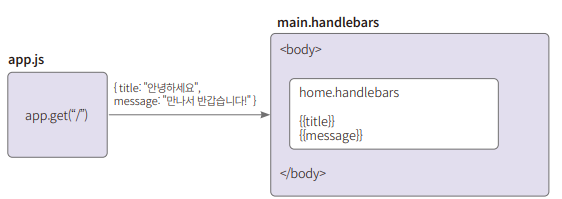

# **페이지네이션되는 게시판 만들기**  
# **프로젝트 구조 소개**  
프로젝트 구조는 N 계층 아키텍처를 따른다. MVC 패턴으로도 불리는 아주 유명하고 많이 쓰이는 구조다. 뷰는 유저가 보는 화면을 말한다. HTML 템플릿 엔진은 
핸들바(handlebars)로 작성한다. 컨트롤러는 따로 디렉터리를 구분하지는 않고 app.js안에 라우터 함수들로 분리한다. 서비스는 post-service.js 하나만 
만든다(원한다면 다양한 서비스를 만들 수 있다). 구조상으로는 모델에서 데이터베이스와 통신하게 되어 있지만 명시적으로 모델을 만들지는 않고 몽고디비 라이브러리의 
컬렉션 객체가 모델 역할을 한다.  
  
  
  
# **게시판 프로젝트 셋업**  
프로젝트를 생성하고 익스프레스, 핸들바, 몽구스 패키지를 설치한다.  
  
# **Node.js 프로젝트 초기 설정**  
1. board 디렉터리를 만들고 npm init로 초기화한다.  
npm init -y  
  
# **익스프레스 설치 및 프로젝트 디렉터리 구조 잡기**  
1. 익스프레스 패키지를 설치한다.  
npm i express@4.17.3  
npm i mongodb@4.13.0  

2. 게시판 프로젝트의 디렉터리 구조를 잡는다.  
익스프레스는 마이크로 프레임워크다. 익스프레스 홈페이지에서는 미니멀리스트 웹 프레임워크로 소개한다. 표현은 다르지만 최소 기능을 가지면서 필요한 기능을 
플러그인으로 확장하는 프레임워크를 의미한다는 사실은 같다. 보통 모든 기능을 제공하는 풀스택 프레임워크들은 디렉터리 구조를 강제한다. 대표적으로 장고를 
들 수 있다. 반면 마이크로 프레임워크는 디렉터리 구조를 강제하지 않는다. 사용자에게 자유도를 주어 좋은 면도 있지만 좋은 디렉터리 구조를 사용자가 직접 
고민해야 한다.  
  
여기서는 서버 개발에서 가장 보편적으로 사용되는 3계층 구조(3 tier) 아키텍처를 적용한다. 3계층 구조는 웹 프레임워크에서 주로 사용하는 MVC 패턴을 
적용하기에도 좋다.  
  
3계층 구조는 다음과 같이 컨트롤러, 서비스, 데이터 액세스 계층을 갖는다. 컨트롤러 계층에서는 뷰에서 넘어온 요청을 받아서 권한 체크, 유효성 검증 등을 
한 후에 서비스 계층으로 넘긴다. 서비스 계층에서는 비즈니스 로직을 처리한다. 서비스로 비즈니스 로직을 분리하면 각각 다른 컨트롤러에서 같은 서비스를 
재사용할 수 있게 된다. 서비스에서 DB에 데이터를 저장할 때는 데이터 엑세스 계층과 데이터를 주고받는다. 이 경우 정의해둔 모델을 넘기는 것이 일반적이다.  
  
  
  
익스프레스에서 컨트롤러 역할은 라우터가 한다. 서비스 계층은 비즈니스 로직을 구현하는 부분이므로 각 프로젝트에서 해당 역할을 하는 클래스 또는 함수를 
작성해야 한다. 몽고디비 모듈이 데이터 액세스 계층 역할을 해주게 된다. 필요에 따라서 데이터 액세스 계층을 따로 작성하는 경우도 있다.  
  
3계층 아키텍처는 서버의 관점에서 데이터와 파일을 어떻게 관리할지 정리한 것이지만 게시판 프로젝트에서는 웹페이지도 있다.  
  
  
  
디렉터를 각 계층별로 만든다. 뷰 관련 파일은 views 디렉터리, 컨트롤러 관련 파일은 controllers 디렉터리, 서비스 관련 파일은 services 디렉터리를 
사용한다. 다만 이번 장에서 다루는 API들이 많지 않으므로 라우터와 컨트롤러 코드는 app.js에 모두 작성한다. 마지막으로 각 모듈에서 사용할 설정 파일이 
필요한 경우도 있다. 설정 파일을 모아놓을 configs 디렉터리도 생성한다.  
  
3. 프로젝트의 디렉터리 구조는 다음과 같다. 디렉터리와 파일을 생성한다.  
  
  
  
# **핸들바 템플릿 엔진 설치 및 설정하기**  
API만 만드는 것이라면 템플릿 엔진이 필요 없다. 뷰로 웹페이지를 보여주므로 템플릿 엔진을 설정해야 컨트롤러에서 넘기는 데이터를 웹페이지에 제대로 표현할 
수 있다.  
  
익스프레스에서 사용하는 템플릿 엔진으로는 퍼그(Pug), EJS, 머스태시(mustache)등이 있지만 퍼그는 HTML이 아닌 다른 포맷으로 웹페이지를 작성해야 하므로 
제외한다. EJS는 표션식이 좀 지저분하다. 머스태시는 다양한 언어에서 사용되는 템플릿 엔진과 유사하지만 핸들바에 비해 기능이 적다. 핸들바는 머스태시와 
호환되면서 추가 기능을 제공하므로 핸들바를 사용한다.  
  
1. 핸드바 express-handlebars를 설치한다. 익스프레스용 핸들바 패키지는 express-handlebars와 express-hbs 두 가지가 있다. express-hbs가 조금 
더 많은 기능을 제공하지만 2023년 시점으로 마지막 버전이 2년 전에 공개되었다. 이에 기능은 조금 더 적더라도 관리가 잘되고 있는 express-handlebars를 
사용한다. 많은 차이는 없으므로 둘 중 어느 것을 사용해도 크게 문제는 없다.  
  
npm i express-handlebars@6.0.3  
  
2. 설치가 잘되었으면 설정을 진행한다. app.js 파일을 생성하고 작성한다.  
board/app.js  
  
app.engine은 익스프레스에서 사용할 템플릿 엔진을 등록하는 코드다. handlebars는 파일의 확장자로 사용할 이름이다. hbs 등의 다른 이름으로 변경할 수 있지만 
핸들바 엔진 내부에서 handlebars로 사용하고 있으므로 변경하지 않는다. 파일이 많아지면 변경하는 것도 좋다.  
  
엔진을 설정했지만 웹페이지에서 사용할 템플릿 엔진도 설정해야 한다. 설정 시에는 엔진 설정 시의 이름 "handlebars"로 설정해 준다. 이름을 hbs로 했다면 여기서
도 hbs로 해야한다.  
  
views는 뷰로 사용할 파일들의 디렉터리를 설정하는 코드다. 기본적으로 views로 되어 있지만 node를 실행하는 디렉터리의 상대 경로로 지정된다. 상대 경로로 
되어 있을 때 다른 디렉터리에서 node를 실행하면 문제가 생길 수 있으므로 __dirname을 사용해 절대 경로로 지정한다. __dirname은 node를 실행하는 
디렉터리 경로다.  
  
라우팅 코드의 home은 템플릿 파일의 이름이다. views가 기본 경로이고 handlebars가 확장자이므로 views/home.handlebars 파일에 데이터를 렌더링한다. 
렌더링 시에 title과 message 값이 객체로 들어가게 된다.  
  
3. views 안에 layouts를 만들고 그 안에 main.handlebars 템플릿 파일을 생성한다. 핸들바 템플릿 엔진에서는 기본 형태가 되는 템플릿 파일을 선언하고 다른 
템플릿에서는 내용(body 태그 부분)만 변경하는 것이 기본 설정이다. main 템플릿을 사용하지 않으려면 결괏값의 json의 속성에 layout:false를 추가하면 
된다.  
  
board/views/layouts/main.handlebars  
  
{{{body}}}에 다른 핸들바 템플릿의 코드가 그대로 들어가게 된다.  
  
handlebars.engine에 layoutsDir 항목을 추가하면 기본 레이아웃 디렉터리를 변경할 수 있다.  
app.engine("handlebars", handlebars.engine({ layoutsDir: "views" ));  
  
혹은 기본 레이아웃을 사용하고 싶지 않으면 라우터의 결과 객체에 layout:false를 추가하면 된다.  
res.render("home", { title: "aa", message: "aa", layout: false });  
  
4. body에 삽입할 템플릿을 views 디렉터리 아래에 만든다.  
board/views/home.handlebars  
  
핸들바는 렌더링 시 {{ 변수명 }}으로 되어 있는 부분에 변수의 값을 넣어준다.  
  
  
  
5. node app.js를 실행 후 테스트를 진행한다.  
  
# **화면 기획하기**  
# **리스트 화면 기획**  
  
  
# **글쓰기 화면 기획**  
  
  
# **상세 화면 기획**  
  
  
# **UI 화면 만들기**  
# **리스트 UI 만들기**  
1. 리스트 페이지는 상단의 타이틀, 검색어, 글쓰기 버튼, 글 목록, 페이징 영역으로 나누어 구현한다.  
board/views/home.handlebars  
  
2. 서버를 기동시키기 전에 title을 변경해둔다.  
board/app.js  
  
3. 터미널에서 서버를 기동해 리스트 페이지를 확인한다.  
node app.js  
  
4. 서버가 문제없이 기동되었는지 브라우저로 확인한다.  
  
# **글쓴이 UI 만들기**  
다음으로 글쓰기 페이지를 만든다. app.js에 라우터 함수가 없으므로 라우터 함수도 추가한다.  
  
1. 먼저 템플릿부터 작성한다. board/views/ 디렉터리 아래에 템플릿을 작성한다.  
board/views/write.handlebars  
  
2. app.js에 핸들러 함수를 추가한다.  
board/app.js  
  
3. 서버의 코드가 변경되면 서버를 재기동해야 한다. 서버를 재기동한 뒤 테스트한다.  
  
# **상세페이지 UI 만들기**  
1. board/views 디렉터리 아래에 detail.handlebars 파일을 생성해 작성한다.  
board/views/detail.handlebars  
  
2. app.js에 핸들러 함수를 만들고 서버를 재기동해 화면을 확인한다.  
board/app.js  
  
# **API 만들기**  
몽고디비를 데이터 저장소로 사용한다. 모든 API는 ascyn await를 사용해 구현한다.  
  
# **몽고디비 연결을 위한 유틸리티 만들기**  
API 호출 시 데이터를 저장, 조회, 삭제하려면 데이터베이스와 연결해야 한다. 몽고디비 커넥션을 반환하는 유틸리티 함수를 만들어서 사용한다.  
  
1. configs/mongodb-connection.js 파일을 만들고 다음과 같이 작성한다. 아이디, 패스워드, 아틀라스 서버 주소는 본인의 것으로 적절하게 변경한다.  
board/configs/mongodb-connection.js  
  
주소 마지막에 board가 있는데 기본값으로 선택하는 데이터베이스를 의미한다. 데이터베이스를 명시적으로 생성하지 않으면 첫 데이터가 추가될 때 지정한 데이터베이스도 
자동으로 생성된다.  
  
커넥션 연결 함수는 함수를 호출하는 사람이 몽고디비의 uri값을 몰라도 사용할 수 있게 함수를 한 번 감쌌다. 함수의 결괏값으로 uri와 콜백 함수를 받는 
MongoDB.connection() 함수를 반환한다. 원래는 MongoClient.connect(uri, callback)을 실행해야 하지만 mongodb-conncetion(callback)으로 
감싸서 실행할 수 있다.  
  
MongoClient.connect() 함수는 두 번째 인수로 콜백 함수를 받는다. 콜백 함수의 두 번째 인수로 mongodb에 연결된 MongoClient 객체가 주어진다.  
  
2. mongodb-conncetion.js 코드를 app.js에 추가한다. 마지막 줄의 app.listen()의 경우 기존의 코드를 표시한 부분을 따라 수정하면 된다.  
board/app.js  
  
만들어둔 몽고디비 연결용 함수를 임포트한다. mongodbConnection(콜백 함수)와 같은 형태로 사용한다. 본문 코드에 콜백이 없으므로 콜백 실행 없이 MongoClient 
객체를 반환한다. 불러온 함수를 실행하면 결괏값으로 mongoClient 객체를 받을 수 있다. mongoClient에서 db()를 사용해 데이터베이스를 선택하고 
collection('post)를 사요해 컬렉션을 선택한다. db() 함수에 명시적으로 db('board')를 사용해도 된다. 데이터베이스 설정 파일에서 이미 기본 데이터베이스를 
board로 넣어두었으므로 여기서는 빈 값을 넣으면 된다. collection 변수는 클로벌 변수이다. mongodb 라이브러리 내부에서 커넥션 풀을 관리하고 있으므로 
글로벌 변수로 사용해도 문제가 없다.  
  
# **UI 페이지에서 사용할 핸들바 커스텀 헬퍼 만들기**  
핸들바의 장점이자 단점은 자유도가 높다는 점이다. 핸들바에서 each와 if 등 매우 기본적인 헬퍼 함수는 제공해주지만 그 이외의 것은 모두 만들어서 커스텀 
헬퍼 함수를 구현해 사용해야 한다. 게시판 프로젝트에서 필요한 커스텀 헬퍼 함수는 총 3개다. 각각 리스트 길이를 구하는 함수, 두 값이 같은지 비교하는 함수, 
ISO 데이터 포맷에서 날짜만 뽑아내는 함수가 필요하다. 커스텀 헬퍼를 사용하려면 설정도 조금 변경해야 한다.  
  
1. 헬퍼 함수를 만든다. board/configs 디렉터리에 생성한다.  
board/configs/handlebars-helpers.js  
  
헬퍼 함수 사용 시에는 {{헬퍼 함숩명 변수1 변수2}}와 같이 가장 처음에 함수명을 넣고 다음으로는 변수들을 빈 칸으로 구분해주면 된다. 헬퍼 함수 안에 다시 
헬퍼 함수를 사용해야 하는 경우 {{헬퍼 함수1 (헬퍼 함수2 변수1 변수2) 변수 11}} 처럼 {{}} 기호 안에 () 기호로 감싸준다.  
  
변수 . 과 @root는 각각 현재 겍체와 최상위 객체를 의미한다.  
  
2. 핸들바 커스텀 함수 설정을 진행한다. 기존 app.js에 app.engine으로 설정된 부분을 변경한다.  
board/app.js  
  
handlebars.create() 함수는 handlebars 객체를 만들 때 사용한다. 옵션에서 헬퍼 함수를 추가할 수 있다. helpers: require(...)로 커스텀 헬퍼 
함수를 추가한다. handlebars 객체에 있는 engine을 설정한다.  
  
# **nodemon 설정하기**  
서버 코드를 작성하면서 서버를 재시작하는 경우가 많다. 매번 서버를 껐다가 다시 켜는 것도 많은 코드를 작성할 때면 번거로울 수 있다. 그러므로 코드가 
저장되면 서버를 재시작시켜주는 도구가 있으면 좋다. 그런 용도로 Node.js에는 nodemon이라는 패키지가 있다.  
  
1. npm으로 nodemon 패키지를 설치한다.  
npm i nodemon@2.0.20  
  
설정은 해도 되고 안 해도 되지만 타이핑을 약간 더 줄여주는 효과가 있다.  
  
2. package.json의 script 부분에 코드를 추가한다.  
"start": "npx nodemon app.js"  
  
이렇게 하면 npm start 명령어로 서버를 기동시킬 수 있으며 nodemon에서 파일이 저장될 때마다 서버를 재기동시켜준다.  
  
# **글쓰기 API 만들기**  
POST 메서드 사용 시에는 데이터를 req.body로 넘기는데 해당 데이터를 사용하려면 익스프레스에 미들웨어를 설정해야 한다.  
  
1. 미들웨어 설정을 추가한다.  
board/app.js  
  
2. 글쓰기 API를 위해 app.js에 라우팅 설정을 하나 더 추가하고 글쓰기 로직을 추가한다.  
board/app.js  
  
저장 결과에는 도큐먼트의 식별자로 사용할 수 있는 insertedId값이 있다.  
  
3. 비즈니스 로직은 service 디렉터리 아래에 담는 게 좋다. services/post-service.js 파일을 생성하고 writePost를 작성한다.  
board/services/post-service.js  
  
4. 서버를 띄우고 테스트한다.  
  
# **리스트 API 만들기**  
## **템플릿 수정1: 리스트의 검색창 및 검색 버튼 수정**  
템플릿 파일의 검색창 부분을 수정해 검색어를 넣고 검색 버튼을 클릭 시 검색어 정보를 담아서 서버에 요청하도록 수정한다.  
  
1. home.handlebars 파일의 검색 버튼 부분을 다음과 같이 수정한다.  
board/views/home.handlebars  
  
value에는 서버에서 받은 search 데이터를 넣는다. 기본값은 빈 값이다. 검색 버튼은 클릭 시 이벤트를 추가했다. 자바스크립트를 최소한으로 하기 위해 
onclick 속성에 자바스크립트 함수를 한 줄로 넣었지만 별도의 자바스크립트 함수를 만들어서 추가해도 된다.  
  
## **리스트 API 백엔드 코드 작성**  
리스트 API를 만들면서 페이지네이터를 만들어주는 유틸리티 함수도 함께 만든다.  
  
1. app.js 파일을 만들 때 가장 먼저 만든 라우터 함수인 app.get("/"...) 부분을 다음과 같이 수정한다.  
board/app.js  
  
2. 이제 postService에 list() 함수를 추가한다.  
board/services/post-service.js  
  
몽고디비의 쿼리는 실제로 자바스크립트 문법과 매우 유사하며 SQL에서 사용하는 like와 같은 형식의 검색은 정규표현식을 사용한다. find()는 cursor를 
반환한다. cursor에는 여러 메서드가 있지만 여기서는 받아온 데이터를 배열로 변경하는 toArray() 메서드를 사용해 게시글 데이터를 리스트로 변경한다. 
옵션으로 limit, skip을 주었다. limit가 10이므로 최대 10개의 데이터만 쿼리를 한다. skip은 1ㅍ이지인 경우 1~10까지만 가져오기 위해 사용한다. 
toArray() 함수는 두 가지가 있다. 한 가지는 Promise를 사용하고 다른 것은 콜백을 사용한다.  
  
3. 페이지네이션 유틸을 작성한다.  
board/utils/paginator.js  
  
1부터 10까지 최대 10페이지가 나오도록 하려면 시작부터 끝 페이지까지의 숫자가 들어 있는 리스트를 만들어야 하는데 이를 편리하게 만들 수 있도록 하는 
함수가 lodash.range() 함수다. lodash.range(1, 11)을 실행하면 [1, ... 10]으로 구성된 리스트가 반환된다.  
  
lodash를 사용하려면 설치가 필요하다. 터미널에서 npm i lodash를 입력해서 설치한다.  
  
페이지네이터는 하나의 함수로 이루어져 있다. 변수로 게시물의 총 개수, 현재 페이지, 한 페이지당 표시하는 게시물 개수를 받는다.  
  
## **템플릿 수정2: 리스트 및 페이지네이션 추가**  
1. 리스트 템플릿에 리스트 및 페이지네이션을 추가한다.  
board/views/home.handlebars  
  
서버에서는 home.handlebars를 그릴 때 psots 변수에 게시물의 값들을 담아서 보내준다. posts를 반복해서 렌더링하기 위해 each 내장 함수를 사용했다. 
{{#each posts}}로 시작하고 {{/each}}로 종료한다. each 블록 내부에서는 {{ 변수명 }}으로 post의 객체를 접근할 수 있다. 즉 게시물의 제목을 표시하기 
위해 {{ posts[0].title }}이 아니라 {{ title }}을 사용한다.  
  
with도 내장 헬퍼 함수다. 페이지네이터 내부의 값은 {{ paginator.pageList }} 같은 형태로 사용할 수 있지만 페이지네이터가 가지고 있는 변수가 10개라서 
일일이 써주기보다는 paginator를 생략할 수 있으면 간단하고 좋다. 이를 가능하게 하는 것이 with 함수다. {{#with 변수 }}로 시작하고 {{/with}}로 
종료한다. with 블록 안에서는 paginator를 생략하고 바로 페이지네이터의 변수에 접근할 수 있다.  
  
@root.search는 with 블록 안에서 {{ search }}를 하는 경우 paginator.search를 참조하게 되므로 서버가 보내준 원본의 값을 참조하기 위해 사용한다.  
  
{{#if (eq . @root.paginator.page)}}에서 if 내장 함수를 사용했다. 괄호로 eq . @root.paginator.page가 감싸져 있다. 함수 안에서 함수를 사용하는 
경우 괄호로 감싼다. eq는 우리가 만든 커스텀 함수다. 두 값이 같은지 검사한다. 여기서 .은 pageList를 반복해서 렌더링할 때의 값이다. pageList 안의 
페이지 숫자값이 된다. . 대신 this를 사용할 수도 있다. @root.paginator.page는 with문 밑에 each 안에서 서버가 보내준 값을 참조하기 위해 사용했다. 
즉 코드의 의미는 현재 페이지와 루프로 가져온 페이지가 같으면 다음을 렌더링하라는 뜻이다.  
  
2. 브라우저에서 리스트 페이지에 접속해 테스트한다.  
  
# **상세페이지 API 만들기**  
1. app.js에 상세페이지 라우터 설정을 추가하고 로직을 추가한다.  
board/app.js  
  
2. 데이터를 가져오는 부분은 postService에 getDetailPost() 함수로 추가한다. 결괏값으로 ModifyResult 객체를 반환하는데 lastErrorObject, ok, value 
3개의 속성을 가지고 있다. lastErrorObject는 updatedExisting과 n이라는 이름의 속성을 가지고 있으며 각각 업데이트된 문서가 있는지, 있다면 몇 개인지를 
알려준다. ok는 boolean 타입의 속성으로 게시글 문서의 수정이 성공인지 실패인지를 알 수 있다. 게시글의 데이터는 value에 있으므로 result.value를 템플릿에 
넣어주면 된다.  
board/services/post-service.js  
  
프로젝션은 투영이라는 뜻이며 데이터베이스에서는 데이터베이스에서 필요한 필드들만 선택해서 가져오는 것을 말한다. 가져와야 하는 항목이 빼는 항목보다 많아서 
projection: {password:0}과 같이 패스워드만 항목에서 빼는 프로젝션 설정을 했지만 반대로 빼야 하는 항목이 가져와야 하는 항목보다 많은 경우는 projection: 
{title:1, content:1}과 같은 방식으로 가져와야 하는 데이터만 프로젝션할 수 있다.  
  
findOneAndUpdate() 함수 정의는 db.collection.findOneAndUpdate(filter, update, options)다. filter는 원하는 데이터를 가져오고 update는 
필터를 사용해 찾은 도큐먼트에 갱신할 데이터에 대한 내용을 넣는다. options는 프로젝션, 소팅 등의 항목을 넣을 수 있다.  
  
필터는 단순하게 모든 몽고디비 Document가 가지고 있고 id로 사용하는 값인 _id 필드를 id값을 사용해 찾도록 했다. 업데이트 항목은 $inc: {hits: 1} 
로 되어 있다. $inc는 값을 증가(increase)시키고 싶을 때 사용하는 연산자다. hits: 1은 hist 항목을 1씩 증가시킨다는 의미다. 실무에서는 ip나 device등을 
체크해 어뷰징을 못하게 하는 방법을 사용한다.  
  
3. 템플릿 파일에 본문 내용이 나오도록 변겨한다.  
board/views/detail.handlebars  
  
4. 작성한 글의 상세페이지에 접속하여 테스트한다.  
  
# **글 수정 API**  
## **상세페이지 [수정] 버튼을 눌렀을 때 패스워드 확인**  
화면을 이동하지 않고 패스워드를 확인하려면 Ajax를 사용해야 한다. 예전에는 Ajax를 사용하려면 jquery 등의 라이브러리가 필수였지만 익스플로러를 제외한 
최근의 모든 브라우저는 fetch API를 제공한다. 따라서 패스워드 확인 API를 호출하는 부분을 fetch API를 사용한다.  
  
1. modifyPost() 함수를 다음과 같이 수정한다.  
views/detail.handlebars  
  
## **패스워드 체크 API 작성**  
1. [수정] 버튼 클릭 시 사용하는 패스워드 체크 API를 작성한다.  
board/app.js  
  
2. 아직 postService에 getPostByIdAndPassword() 함수를 구현하지 않았다. 추가한다.  
board/services/post-service.js  
  
updateOne() 함수를 사용해 하나의 도큐먼트만 수정한다. 갱신할 데이터는 $set의 속성값으로 넣어주면 된다.  
  
## **수정 페이지 이동 API 작성**  
수정 페이지 템플릿은 글쓰기 페이지 템플릿을 조금 수정해서 만든다.  
  
1. 글쓰기와 수정 페이지를 구분하기 위해 페이지에 들어갈 때 mode라는 변수에 각각 create, modify라는 값을 주어서 생성인지 수정인지 판단하도록 한다. 
app.js에 코드를 수정한다.  
board/app.js  
  
## **글쓰기 페이지를 수정 페이지로 변경하기**  
1. 글쓰기 페이지의 템플릿 파일을 다음과 같이 수정한다.  
board/views/write.handlebars  
  
2. 상세페이지의 수정을 클릭하여 테스트한다.  
  
# **글 삭제 API**  
1. 템플릿에 만들어둔 deletePost() 함수부터 작성한다.  
board/views/detail.handlebars  
  
2. 다음으로 서버 단에서 삭제 작동을 하는 코드를 작성한다.  
board/app.js  
  
deleteOne()은 조건에 맞는 도큐먼트 하나를 삭제한다. deleteOne() 함수의 결과는 DeleteResult 객체인데 acknowledged(boolean 타입), deletedCount
(숫자 타입)값을 가지고 있다. acknowledged는 삭제가 승인이 되었는지 여부를 알려준다. deleteCount는 삭제한 도큐먼트 개수다. 삭제가 성공이면 값이 1이 
된다. deleteOne() 함수는 콜백 방식과 async await 방식이 있다.  
  
collection.deleteOne() 부분도 post-service로 넣을 수 있지만 함수가 한 줄밖에 되지 않아서 추가하지 않았다. 만약 다른 곳에서 똑같은 코드를 재사용한다면 
그때 post-service.js로 넣으면 된다.  
  
# **댓글 추가 API**  
RDB에서 게시글에 댓글을 추가하려면 일반적으로 댓글용 테이블을 만들고 댓글 테이블에 게시글 ID를 외래키로 사용해 데이터를 추가한다. 저장 시의 스키마가 따로 필요 
없는 몽고디비에서는 테이블(즉 컬렉션)을 새로 만들지 않아도 된다. 게시글의 필드로 댓글을 추가하면 된다. 도큐먼트 하나의 최대 크기는 16MB이므로 큰 편은 아니다. 
하지만 이미지가 없고 글만 쓴다면 한 텍스트당 최대 4바이트를 차지한다. 16MB는 한글로 약 420만 자를 쓸 수 있다.  
  
그러므로 이번 예제에서는 댓글을 게시글 도큐먼트의 필드로 추가한다. 댓글을 추가하려면 상세 페이지 템플릿 수정과 API 추가가 필요하다.  
  
## **상세페이지 템플릿 수정**  
1. 댓글 폼 영역을 다음과 같이 수정한다.  
board/views/detail.handlebars  
  
게시글의 필드로 댓글 데이터를 추가할 것이므로 게시글의 id를 히든 필드로 추가한다.  
  
## **댓글 추가 API 만들기**  
1. 댓글 추가 API를 이어서 작성한다. 이전에 작성한 delete 밑에 작성한다.  
board/app.js  
  
2. 상세페이지로 들어가서 댓글을 테스트한다.  
  
# **댓글 삭제 API**  
1. 댓글 추가 시에 템플릿 영역의 HTML 태그는 이미 만들어놨으니 수정할 필요가 없다. deleteComment() 함수만 추가로 작성한다.  
board/views/detail.handlebars  
  
2. /delete-comment API 작업을 진행한다. 코멘트 삭제 코드를 구현한다.  
board/app.js  
  
게시글 안의 comments 리스트에 찾는 댓글 정보가 있는지 찾아야 하므로 $elemMatch 연산자를 사용한다. $elemMatch 연산자는 도큐먼트 안에 있는 리스트에서 조건에
해당하는 데이터가 있으면 도큐먼트를 결괏값으로 주는 연산자다. 도큐먼트는 도큐먼트의 id로 찾고 댓글은 댓글의 인덱스(idx)와 패스워드가 일치하는지로 찾는다. 
  
3. 상세페이지에서 댓글을 몇 개 더 추가한 다음 잘 삭제가 되는지 테스트한다.  
  

