# **NestJS 시작하기**  
# **왜 NestJS가 필요할까?**  
1부에서 익스프레스를 사용해 웹 서버를 구축하고 서비스를 만들었다. 익스프레스를 사용해서 서버를 구축할 때 먼저 고민했던 부분은 디렉터리 구조다. 별거 
아닌 것 같지만 구조에 따라서 아키텍처가 변경되므로 간단한 문제는 아니다. 익스프레스에서는 router > controller > service 디렉터리 구조로 만들어서 
유저로부터의 요청이 전달되도록 했다.  
  
문제는 익스프레스를 사용하는 모든 사람이 이런 아키텍처 문제를 고민해야 한다는 것이다. 코드 작성자 이외의 사람이 코드를 읽을 때 불편함이 있다. NestJS는 
이러한 문제를 해결한 웹 서버 프레임워크다. NestJS는 서버 개발 시의 아키텍처를 누구든 비슷하게 설계하도록 아키텍처 문제를 해결하는 데 중점을 두고 있다.  
  
# **NestJS 소개**  
NestJS는 자바스크립트 최신 기능을 사용하는 웹 프레임워크다. 좋은 구조로 애플리케이션을 작성해 프로젝트의 복잡성을 잘 관리하는 것을 목표로 한다. NestJS로 
코드를 작성해보기 전에 우선 NestJS가 무엇인지 왜 만들었는지 알아본다.  
  
NestJS는 다음과 같은 특징이 있다.  
1. Node.js에서 실행하는 서버 사이드 프레임워크다.  
2. 타입스크립트를 완벽하게 지원한다.  
3. 자바스크립트의 최신 스펙을 사용한다. 그러므로 바닐라 자바스크립트(외부라이브러리를 사용하지 않는 순수한 자바스크립트)를 사용한다면 babel 사용이 필수다.  
4. HTTP 요청 부분은 추상화된 코드를 제공해 익스프레스와 패스티파이(Fastify)를 사용할 수 있다.  
  
패스티파이(https://www.fastify.io/)는 익스프레스와 하피(Hapi)에 영감을 받은 웹 프레임워크다. 특징은 다음과 같다.  
- 고성능: 초당 최대 3만 개의 요청을 처리할 수 있다.  
- 확장성: hooks, plugins, decorator를 사용해 확장할 수 있다.  
- 스키마 기반: JSON 스키마를 사용해 데이터의 유효성 검증을 할 수 있다.  
- 로깅: 로깅은 매주 중요하지만 비용이 크다. 이에 오버헤드가 매우 적은 pino를 로깅 라이브러리로 사용한다.  
- 개발자 친화적: 성능과 보안에 대한 타협을 하지 않으면서도 사용이 간편하다.  
  
# **익스프레스와 NestJS 비교하기**  
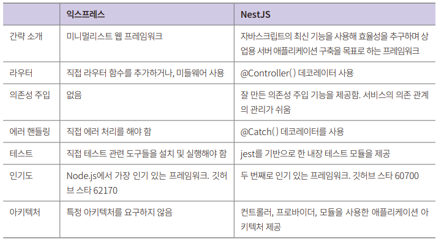  
  
익스프레스는 최소한의 기능을 제공하는 반면 NestJS는 상대적으로 조금 더 많은 기능을 제공한다. NestJS의 목표 중 하나가 자바스크립트로 만드는 웹 서버 
프레임워크의 아키텍처 문제를 효과적으로 해결하는 것이다.  
  
서버 개발에 아키텍처는 쉽게 테스트하고 확장이 용이하고 각 모듈 간의 의존성은 줄이도록 하여 유지보수가 쉽도록 도와준다.  
  
NestJS에서는 컨트롤러, 서비스, 미들웨어를 어디에 두고 어떤 식으로 작성할지 등 개발자의 고민거리를 미리 정리해두었다. 이를 데코레이터 기반으로 제공하고 
있어서 배우기가 쉽다.  
  
# **NestJS 둘러보기**  
NestJS의 핵심 기능으로 의존성 주입을 들 수 있다. 의존성 주입은 모듈 간의 결합도를 낮춰서 코드의 재사용을 용이하게 한다. 즉 모듈 내에서의 코드의 응집도는 
높여서 모듈의 재사용을 꾀하고 모듈 간에는 결합도를 낮춰서 다양한 아키텍처에서 활용할 수 있게 해준다. 이를 위한 장치들로 모듈, 가드, 파이프, 미들웨어, 인터셉터 
같은 모듈과 코드의 의존 관계를 구성하는 프로그래밍적 장치들이 있다.  
  
기존의 Node.js 생태계에서 자주 사용하는 기능을 통합하고 있으며 기본적으로 RDB와 NoSQL의 연동, 세션 처리, 문서화, 테스트 지원, 로깅, 태스크 스케줄링 
등 상업용 서버에서 필요한 대부분의 기능을 제공한다. 새로 필요한 기능이 있다면 모듈이나 커스텀 데코레이터를 만들어서 다른 코드들에 손쉽게 적용하도록 
지원을 한다.  
  
NestJS의 기능들은 다음 그림과 같다.  
  
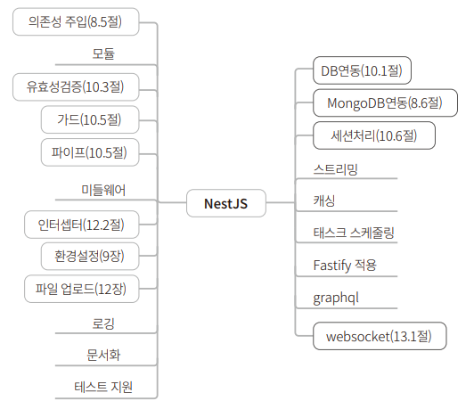  
  
NestJS에서도 데코레이터를 많이 사용한다. 데코레이터를 만드는 것은 까다롭지만 사용이 매우 직관적이고 간편하기 떄문에 NestJS에서는 데코레이터를 적극적으로 
사용하고 있다. 보통의 경우 @함수명을 클래스나 함수의 윗 줄에 명시하고 적절한 매개변수를 추가하면 된다.  
  
HTTP 요청과 관련된 데코레이터.  
  
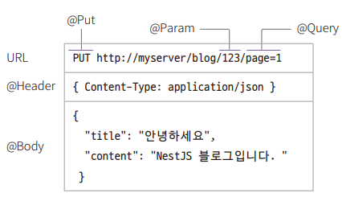  
  
HTTP 부분은 익스프레스를 사용하고 있으므로 익스프레스와 대응되는 데코레이터들이 모두 있다.  
  
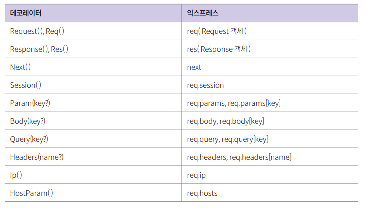  
  
NestJS는 익스프레스를 품고 있기 떄문에 익스프레스 기반의 미들웨어를 거의 대부분 사용할 수 있다. 정확하게는 HTTP 요청과 응답에 익스프레스의 Request와 
Response 객체를 기본으로 사용한다. 성능이 중요하다면 패스티파이로 바꿔 쓸 수도 있다. 이는 아키텍처 구조를 유연하게 잘 만들었기 떄문이다.  
  
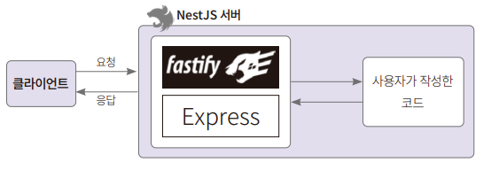  
  
빠른 성능이 필요한 부분에서는 패스티파이를 사용하고 그렇지 않은 부분에서는 막강한 서드파티의 지원을 받는 익스프레스를 쓸 수 있으니 NestJS는 성능과 
확장성, 유연함을 모두 가져갈 수 있다. npm에서 NestJS의 내려받기 수를 살펴보면 사용자가 2배로 늘었다. 꾸준히 성장한다는 뜻이다. 사용처도 계속 늘어나고 
있으며 현재는 오토데스크, 깃랩, 레드햇, IBM, 젯브레인스 등의 기업에서 사용한다. 국내에서는 당근마켓, 배달의민족에서 사용한다.  
  
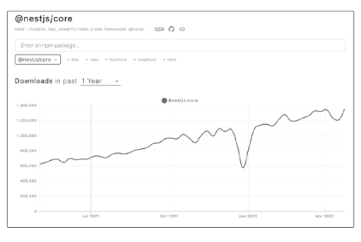  
  
# **NestJS 설치하고 실행하기**  
NestJS는 3가지 방법으로 설치할 수 있다. 첫 번째는 NestJS 구동에 필요한 라이브러리들을 모두 손으로 한땀한땀 설치하고 설정하는 방법이다. 사실 node.js의 
익스프레스에는 설치해야 하는 패키지가 별로 없기 때문에 이 방식을 많이 사용한다. 하지만 NestJS는 설치해야 하는 패키지들이 더 많아서 설정을 더 해야 한다.  
  
그래서 NestJS에서는 간편하게 프로젝틀르 생성하도록 nest-cli 패키지를 제공한다. 설치를 하고 나면 nest 명령어를 사용해 쉽게 프로젝트를 생성할 수 있다. 이것이 
두 번째 방법이다.  
  
마지막은 nest 명령어로 설치하는 저장소를 직접 git clone 명령어로 개발자의 디렉터리에 내려 받은 후 자신에게 맞도록 설정을 변경하는 방법이다.  
  
nest-cli를 사용하는 방법을 대부분 사용할 예정이지만 설정 파일을 알아두기 위해 첫 번째 방법으로 진행한다.  
  
# **의존성 패키지 설치하기**  
1. 프로젝트 디렉터리를 생성하고 의존성 패키지를 설치한다. 디렉터리명은 hello-nestjs로 한다.  
- mkdir hello-nestjs  
  
2. 디렉터리를 만들었다면 필요한 패키지를 설치한다. 행내림 없이 한 줄로 명령을 작성해 실행한다.  
- npm i @nestjs/core @nestjs/common @nestjs/platform-express reflect-metadata typescript  
  
3. 설치가 완료되었다면 package.json을 열어본다.(버전은 설치 시점에 따라 조금씩 다를 수 있다).  
  
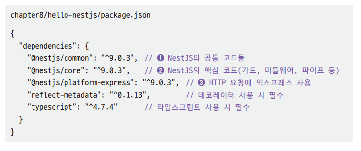  
  
@nestjs/common은 실제 프로젝트에서 사용할 대부분의 코드가 들어 있다. 데코레이터(decoretor)로 사용하는 함수들의 클래스들이 대표적이다. @nestjs/core는 
@nestjs/common에서 사용하는 코드가 들어있다. 가드(guard), 미들웨어(middleware), 파이프(pipe) 등을 만드는 핵심 코드가 있다. @nestjs/platform-express는 
HTTP 요청/응답 부분을 감싸서 익스프레스의 req, res 객체를 사용하는 라이브러리다.  
  
# **타입스크립트 설정하기**  
NestJS는 타입스크립트를 완벽히 지원하기 떄문에 타잆크립트를 사용하면 더 편리하게 개발할 수 있다. 그러므로 지금부터는 타입스크립트로 코드를 작성한다. 
타입스크립트는 자바스크립트에 타입을 추가한 언어라고 생가가하면 되며 자바스크립트로 트랜스파일된다. 그러므로 어떤 식으로 컴파일할지 설정을 추가해야 한다.  
  
1. 타입스크립트를 설정한다. 타입스크립트 설정 파일은 tsconfig.json 파일이며 프로젝트의 루트 디렉터리에 위치시키면 된다. tsconfig.json 파일을 만들고 
작성한다.  
hello-nestjs/tsconfig.json  
  
타입스크립트의 컴파일러 옵션은 compilerOptions에 설정한다. 컴파일 시 모듈 시스템을 선택할 수 있으며 NodeJS의 모듈 시스템은 CommonJS이므로 
CommonJS로 넣어준다. target에는 컴파일 시 사용할 ECMA 버전을 적어준다. ESNEXT를 설정하면 최신 버전으로 컴파일을 해준다.  
  
experimentalDecorators와 emitDecoratorMatadata는 데코레이터 관련 부분이다. NestJS에서는 데코레이터를 매우 매우 많이 사용하므로 꼭 필요한 옵션이라고 
할 수 있다.  
  
experimentalDecorators는 데코레이터를 사용할지 여부다. 타입스크립트 5.0 버전부터 정식으로 지원한다. emitDecoratorMatadata는 타입스크립트를 
자바스크립트로 컴파일 시 데코레이터가 설정된 클래스, 함수, 변수, 객체의 메타 데이터를 함께 넣어줄지 여부를 선택한다. 메타 데이터에는 데코레이터를 달아준 
곳이 함수인지, 클래스인지 변수인지에 대한 여부와 매개변수가 있다면 해당 타입, 그리고 결괏값을 포함한다. 메타 데이터를 넣을 때 의존성 패키지로 설치한 
reflect-metadata가 사용된다. 즉 reflect-metadata와 emitDecoratorMetadata는 함께 설정이 되어야 한다.  
  
# **NestJS의 모듈과 컨트롤러 만들기**  
NestJS는 웹 서버이므로 기본적으로 HTTP 요청/응답을 처리한다. 일반적으로 웹 애플리케이션 서버에서 HTTP 요청/응답을 처리하기까지 몇 단계를 거치게 된다. 
NestJS에서는 HTTP 요청을 보통 가드 -> 인터셉터 -> 파이프 -> 컨트롤러 -> 서비스 -> 리포지토리 순서로 처리한다. 이중에 컨트롤러는 필수다. 클라이언트에서 
온 요청을 코드에 전달해야 하기 떄문이다. 또한 컨트롤러는 모듈에 포함되어 있다. 그러므로 NestJS를 최소한의 코드로 실행시키려면 하나의 모듈과 하나의 
컨트롤러가 필요하다.  
  
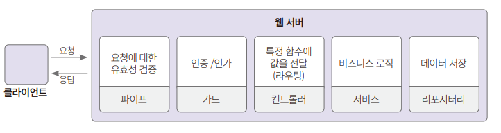  
  
1. scr 디렉터리를 생성하고 모듈과 컨트롤러 코드를 각각 작성한다. 컨트롤러의 코드부터 작성한다.  
hello-nestjs/src/hello.conroller.ts  
  
대부분 필요함 함수는 nestjs/common에 있다. Controller와 Get은 대문자로 시작하긴 하지만 모두 함수이며 데코레이터다. 데코레이터는 클래스, 함수, 변수에 
위나 왼쪽에 붙일 수 있으며 해당 코드의 동작을 변경한다.  
  
앞에 @가 붙어 있으면 데코레이터다. 보통은 클래스와 함수의 앞뒤에 전후 처리를 해주어서 해당 코드의 동작에 부가적인 기능을 추가하는 때 사용한다. 
@Controller 데코레이터는 클래스에 붙이며 컨트롤러로 사용하도록 해준다. 매개변수로 경로를 지정할 수 있다. 현재는 아무것도 붙어 있지 않으므로 <서버 주소>의 
경로가 되며 실습할 떄는 localhost:3000을 사용한다.  
  
컨트롤러 클래스는 Module에 포함되어야 하므로 export를 붙여서 다른 클래스에서 불러올 수 있게 해준다. @Get 데코레이터 함수는 HTTP 요청 중 GET 
방식의 요청을 처리한다. 매개변수로 경로에 대한 패턴을 지정할 수 있다. @Controller와 @Get에 아무런 값이 없으므로 localhost:3000으로 접속 시 값이 
나온다.  
  
2. 모듈 코드를 작성한다.  
hello-nestjs/src/hello.module.ts  
  
@Module은 모듈을 설정할 때 사용하는 데코레이터다. 몇 가지 설정이 있으나 여기서는 controllers만 설정한다. controllers에는 배열로 모듈에 포함된 컨트롤러들을 
설정한다. controllers에는 배열로 모듈에 포함된 컨트롤러들을 설정한다.  
  
# **hello-nest 앱 실행시켜보기**  
1. 컨트롤러와 모듈을 만들었으니 NestJS 앱의 main.js를 만든다.  
hello-nestjs/src/main.ts  
  
어떤 프로그램이든 최초로 실행되는 함수가 필요하다. NestJS의 서버 역시 기동하려면 최초 실행되는 함수, 즉 최초 진입점이 필요하다. NestJS에서는 진입점을 
bootstrap()으로 이름 짓는 것이 관례다. NestFactory는 사실 NestFactoryStatic 클래스이며 create() 함수에 루트 모듈을 넣어서 NestApplication 객체를 
생성한다. NestApplication 객체에는 HTTP 부분을 모듈화한 HTTPAdapter가 있다. 기본적으로는 익스프레스가 사용된다.  
  
listen() 함수는 HTTP 어댑터로 무엇을 쓰느냐에 따라 다르겠지만 여기서는 기본값인 익스프레스의 app.listen() 함수다. NestJS의 애플리케이션을 실행하는 
코드가 익스프레스와 같다.  
  
2. 타입스크립트로 만든 프로그램을 바로 실행하려면 ts-node-dev라는 패키지가 필요하다. 설치하지 않고 실행하면 설치할지 여부를 물어본다.  
npx ts-node-dev src/main.ts  
  
3. 브라우저를 켜서 테스트 한다.  
  
# **NestJS의 네이밍 규칙**  
1. 파일명은 .으로 연결한다. 모듈이 둘 이상의 단어로 구성되어 있으면 대시로 연결한다.  
<모듈명>.<컴포넌트명>.ts  
hello.controller.ts  
my-first.controller.ts  
  
2. 클래스명은 카멜 케이스를 사용한다.  
<모듈명><컴포넌트명>  
HelloController  
  
3. 같은 디렉터리에 있는 클래스는 index.ts를 통해서 임포트하는 것을 권장한다.  
index.ts를 사용하지 않는 경우  
import { MyFirstController } from './controllers/my-first.controller'  
import { MySecondController } from './controllers/my-second.controller'  
  
index.ts를 사용하는 경우  
import { MyFirstController, MySecondController } './controllers';  
  
4. 타입스크립트에서는 인터페이스를 많이 사용한다. 인터페이스는 타입을 정의하는 데 사용되고 구체적인 내용은 클래스를 만들고 인터페이스를 상속하는 방식으로 
작성한다. 인터페이스 작명법으로 앞에 I를 붙이는 방법이 있다. 예를 들어 Series라는 타입을 정의할 때 ISeries 처럼 작명한다. 이 방식은 보기에도 어색한 
부분이 있다. 그래서 NestJS에서는 가능하면 Series 인터페이스를 만들고 그 하위 인터페이스 혹은 클래스를 만든다.  
  
interface Series {}  
interface BookSeries extends Series {}  
class MovieSeries extends Series {}  
  
# **NestJS로 웹 API 만들기**  
다음과 같이 3단계로 블로그를 만든다.  
  
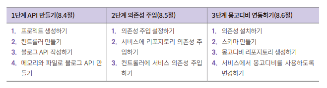  
  
# **프로젝트 생성과 설정**  
지금부터는 nest-cli를 사용해서 프로젝트 설정을 진행한다.  
  
1. nest-cli는 CLI(Command Line Interface) 프로그램이므로 global 옵션을 사용해 어디서든지 사용하도록 해야 한다. 명령창에서 다음의 명령어를 
실행해 nest-cli를 설치해준다.  
  
npm install -g @nestjs/cli  
  
2. 다음으로는 프로젝트를 생성한다. 프로젝트명은 blog로 한다.  
nest new blog  
  
nest new 명령어 사용 시 에러가 나면 nest 대신 npx @nestjs/cli를 사용한다. blog 프로젝트를 만드는 명령어는 다음과 같다.  
npx @nestjs/cli new blog  
  
3. 명령어를 실행하면 어떤 패키지 매니저를 사용할지 물어보는데 npm을 선택한다. 다른 패키지 매니저가 익숙하다면 선택해도 무방하다.  
  
설치가 완료되었다면 프로젝트 디렉터리에 들어가서 어떤 구조인지 살펴보자.  
  
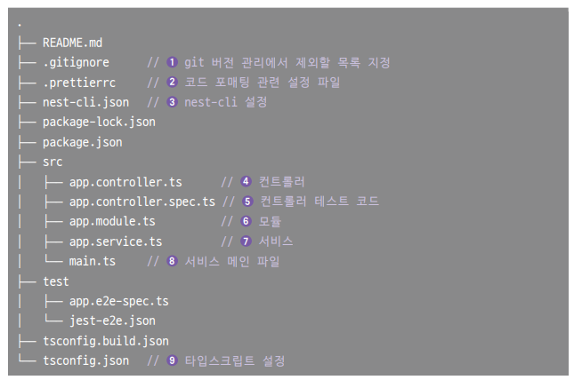  
  
.prettierrc는 코드 포매팅 관련 설정 파일이다. 대부분의 IDE에는 자동 포매팅 기능이 있다. VSCode에서 자바스크립트로 개발할 때 거의 필수로 설치하는 
플러그인이 prettier라는 코드포매팅 플러그인이다. .prettierrc는 코드 포매팅을 어떤 식으로 할지 설정을 하는 파일이다.  
  
nest-cli.json 파일은 nest 명령어를 사용해 프로젝트를 생성하거나 파일을 생성할 때 필요에 따라 수정한다. 한 프로젝트 안에 여러 프로젝트를 함께 포함하는 
모노레포 등의 기능을 사용할 때 설정한다.

컨트롤러와 모듈을 각각 하나의 파일에 만들고 서비스 파일도 각각 따로 만들어주는 것이 정석이다.  
  
app.controller.spec.ts는 컨트롤러 테스트를 위한 파일이다. NestJS에서는 jest와 supertest를 사용한다.  
  
main.ts는 익스프레스에서의 index.js와 같은 서버 기동 시의 시작 파일이 된다.  
  
tsconfig.json및 tsconfig.build.json은 타입스크립트를 위한 설정 파일이다.  
  
4. 프로젝트가 올바르게 설치되었는지 확인한다.  
npm install  
npm run start  
  
README.md를 열어서 보면 실행 가능한 명령어들이 나와있다. 개발 시 사용할 서버 기동 명령어로 npm run start, npm run start:dev, npm run start:prod가 있다. 
npm run start:dev를 사용하면 파일 변경 시 바로 변경을 해주기 때문에 편리하다. npm run start:prod는 프로덕션 환경에서 실행 시 사용한다. 그 외 
테스트 관련된 명령어들이 있다.  
  
# **컨트롤러 만들기**  
NestJS에는 수많은 컴포넌트들이 있다. 그중 컨트롤러는 유저가 보낸 HTTP 요청을 어떤 코드에서 처리할지 정하는 역할을 한다. HTTP 요청 시 헤더, URL 매개변수, 
쿼리, 바디 등의 정보가 있다. 이 정보를 바탕으로 적절한 데코레이터가 붙어 있는 컨트롤러 코드를 실행시킨다. 익스프레스에서 개발할 때는 개발자가 임의로 
컨트롤러, 서비스, 데이터 연결 등의 계층을 정해서 개발을 했지만 NestJS에서 컨트롤러는 <모듈명>.controller.ts라는 파일로 만든다.  
  
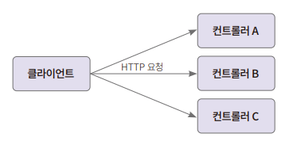  
  
NestJS에서는 모듈 단위로 애플리케이션을 구성한다. 현재는 루트 모듈인 AppModule이 app.module.ts에 정의되어 있다.  
  
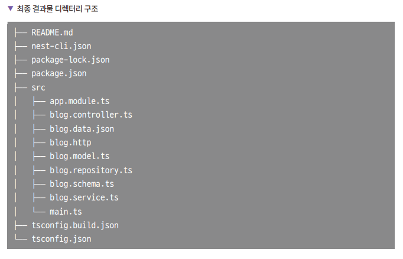  
  
1. src 디렉터리 밑에 main.ts와 app.module.ts를 제외하고는 모두 삭제하고 다시 만든다. main.ts는 hello-nestjs와 모듈명을 제외하고 완전히 같다.  
  
2. app.module.ts 코드를 다음과 같이 수정하고 blog/src 디렉터리 아래에 blog.controller.ts, blog.service.ts 파일을 각각 생성해서 클래스를 만들어둔다.  
blog/src/app.module.ts  
blog/src/blog.controller.ts  
blog/src/blog.service.ts  
  
아직까지는 코드가 실행되지 않는다.  
  
